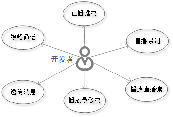
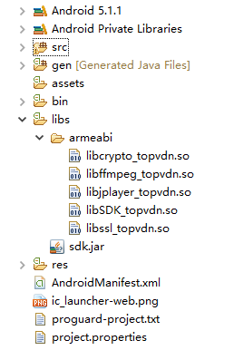
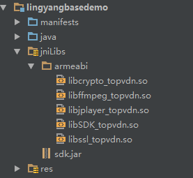

#羚羊云Android SDK使用说明
##一、概述
本SDK可供Android平台下的应用调用，为开发者提供接入羚羊视频云的开发接口，使开发者能够轻松实现视频相关的应用。羚羊视频云在视频传输和云存储领域有着领先的开发技术和丰富的产品经验,设计了高质量、宽适应性、分布式、模块化的音视频传输和存储云平台。SDK为上层应用提供简单的[API接口](http://doc.topvdn.com/api/#!public-doc/SDK-Android/android_api.md)，实现直播推流、直播播放、云端录像播放、消息透传、视频通话等功能。

##二、功能概要


- **直播推流**：将Android系统设备采集到的音视频数据进行编码，通过羚羊云自主研发的QSTP网络协议推送到羚羊云，以供终端用户观看直播或云端存储录像。支持自主设置分辨率、码率、帧率、编码类型等视频参数。

- **播放直播流**：支持播放直播流，网络拉流采用羚羊云自主研发的基于UDP的QSUP协议和基于TCP的QSTP协议，能够达到快速开流、低延时、高清画质的播放效果。

- **播放录像流**：支持播放云端录像流，网络拉流采用羚羊云自主研发的基于TCP的QSTP协议，能够达到快速开流、低延时、高清画质的播放效果。

- **视频通话**：客户端之间通过羚羊云自主研发的QSUP协议建立连接，相互发送接收数据进行视频通话。

- **消息透传**：提供客户端与客户端之间、客户端与服务端之间进行自定义消息格式通讯的能力。

##三、功能特性
| ID | 功能特性 |
|----|----|
| 1  | 支持 H.264 和 AAC 软编（推荐） |
| 2  | 支持 H.264 和 AAC 硬编 |
| 3  | 软编支持 Android Min API 15（Android 4.0.3）及其以上版本 |
| 4  | 硬编支持 Android Min API 18（Android 4.3）及其以上版本 |
| 5  | 支持羚羊云自定义网络协议QSUP进行推流 |
| 6  | 支持羚羊云自定义网络协议QSTP进行推流 |
| 7  | 支持自主设置分辨率、码率、帧率 |
| 8  | 支持前后置摄像头，以及动态切换 |
| 9  | 支持Zoom 操作 |
| 10 | 支持Mute/Unmute |
| 11 | 支持QSTP 推流自适应网络质量动态切换码率或自定义策略 |
| 12 | 支持纯音频推流，以及后台运行 |
| 13 | 支持自动对焦 |
| 14 | 支持闪光灯操作 |
| 15 | Android Min API 15 |
| 16 | 支持羚羊云自定义网络协议QSUP进行播放 |
| 17 | 支持羚羊云自定义网络协议QSTP进行播放 |
| 18 | 提供播放器核心类 IPlayer |
| 19 | 提供 LYPlayer 控件 |
| 20 | 支持画面旋转（0 度，90 度，180 度，270 度） |
| 21 | 支持 MediaCodec 硬件解码 |
| 22 | 可高度定制化的 MediaController |

##四、开发准备
###4.1 接入准备
如果您对我们的产品不熟悉，可通过阅读[《羚羊云SDK接入指南》](http://doc.topvdn.com/api/#!public-doc/integration.md)了解SDK和羚羊云之间的整体服务架构以及如何接入到羚羊云。[点击这里](http://doc.topvdn.com/api/#!public-doc/integration.md)即可进入。

###4.2 SDK的获取
[点击这里获取](https://github.com/AntelopeExpress/public-doc/tree/master/SDK-Android "获取SDK")

###4.3 SDK支持的系统版本
SDK支持的Android版本：4.3及以上的Android版本(api18)。

###4.4 SDK库结构
libs<br>
├── armeabi<br>
│   ├── libffmpeg_topvdn.so （编解码库）<br>
│   └── libjplayer_topvdn.so （播放器）<br>
│   ├── libSDK_topvdn.so （SDK和平台基础库）<br>
│   └── libcrypto_topvdn.so （网络传输加密需要）<br>
│   └── libssl_topvdn.so （网络传输加密需要）<br>
└── sdk.jar (Android sdk jar包）

###4.5 SDK的集成
####4.5.1 Eclipse环境
在eclipse下新建一个工程，对工程进行配置，搭建开发环境。

将sdk包内的文件直接拷贝到你的工程中的libs目录下，拷贝完成后如下图：
 


####4.5.2 Android Studio环境
在android studio下新建一个工程，对工程进行配置，搭建开发环境。

(1)将sdk包内的文件直接拷贝到你的工程中的libs目录下，拷贝完成后如下图：
 


(2)在build.gradle里添加代码：<br>

    dependencies {
        compile files('libs/sdk.jar')
    }

###4.6 SDK DEMO 导入步骤
官网提供的demo是eclipse环境下编写的，用eclipse工具可直接导入使用。在Android Studio环境下需新建一个project，
然后以导入module的方式进行导入使用。
####4.6.1 eclipse 导入
（1）打开eclipse > File > import > Android > Exsiting Android Code IntoWorkspace

（2）点击Browse选择demo所在目录 > 打开 > finish

####4.6.2 Android Studio 导入
（1）打开Android Studio ，新建一个Project

（2）点击File > new > Import Module 

（3）选择demo所在目录 > 打开 > next > finish

###4.7 系统权限设置
    //networking api使用权限
    <uses-permission android:name="android.permission.INTERNET"/>
    //允许应用程序使用摄像头
    <uses-permission android:name="android.permission.CAMERA"/>
    //允许应用程序修改全局音频设置
    <uses-permission android:name="android.permission.MODIFY_AUDIO_SETTINGS"/>
    //允许应用程序录制视频
    <uses-permission android:name="android.permission.RECORD_VIDEO"/>
    //允许应用程序录制音频
    <uses-permission android:name="android.permission.RECORD_AUDIO"/>
    //允许应用程序读取sd卡
    <uses-permission android:name="android.permission.READ_EXTERNAL_STORAGE"/>
    //允许应用程序写入sd卡
    <uses-permission android:name="android.permission.WRITE_EXTERNAL_STORAGE"/>
    //允许应用程序访问网络状态
    <uses-permission android:name="android.permission.ACCESS_NETWORK_STATE"/>
    //摄像头
    <uses-feature android:name="android.hardware.camera"/>
    //摄像头功能
    <uses-feature android:name="android.hardware.camera.autofocus"/>

##五、开发示例
本章节介绍如何调用[SDK的API接口](http://doc.topvdn.com/api/#!public-doc/SDK-Android/android_api.md)来实现直播推流、播放器、消息透传的功能。

###5.1 启动云服务
启动羚羊云服务，该接口函数分配并初始化本地系统资源，登录到羚羊云平台，在平台端进行安全认证。

    /**
     * 开启云服务
     */
    public void startCloudServiceWithFacetime(String userToken) {
        LYService.getInstance().startCloudService(
        	userToken
            , Const.CONFIG
            , new CallBackListener<Long>() {
                @Override
                public void onSuccess(Long aLong) {
                        CLog.v("long-" + aLong);
                        showToast("登录成功" );
                }
                
                @Override
                public void onError(LYException exception) {
                    CLog.v("exception-" + exception.toString());
                    showToast("登录失败"+exception.getMessage());
                }
            }
        );
    }

**注意**：其他接口必须在此接口被调用成功之后才能调用。

###5.2 停止云服务
    //退出是要关闭云服务，节省资源
    LYService.getInstance().stopCloudService();
    
在应用退出的时候调用，释放系统资源。

###5.3 消息透传
当应用客户端使用SDK接入到羚羊云后，可以向同样接入到羚羊云的另外一端的应用客户端，互相传递他们之间协定的网络消息。这些消息对于羚羊云来说是透明的，羚羊云只提供消息传递的通道。

该功能可以有如下应用场景：<br>
(1)在移动终端的应用中读取或更改接入到羚羊云中的私人摄像设备的参数。<br>
(2)在移动终端的应用中监听各个摄像设备的在线状态变化。

    /**
     * 设置云消息监听
     */
    LYService.getInstance().setCloudMessageCallbackListener (
        new LYService.AcceptMessageListener() {
            @Override
            public void accept (LYService.CloudMessage message) {
                CLog.v(message.toString());
            }
        }
    );
**注意**：<br>
(1)消息最大长度为256个字节;<br>
(2)本SDK只提供了监听消息的功能，当对方有消息到来的时候，本方会通过回调函数通知到应用层的SDK调用者，应用层可以对该消息进行处理以及回应该消息至对端的客户端。
推送消息或者回应消息并不属于本SDK的功能范畴，需要调用羚羊云提供的[Web API接口-设备推送消息](http://doc.topvdn.com/api/#!web_api_v2.md#2.3.1_%E8%AE%BE%E5%A4%87%E6%8E%A8%E9%80%81%E6%B6%88%E6%81%AF)。

###5.4 直播推流

直播推流支持云存储功能：在推流的过程中将音视频流存储在羚羊云，以供用户回放录像。 具体方法参照[推流API](http://doc.topvdn.com/api/index.html#!public-doc/SDK-Android/android_api.md#3.2_%E5%BC%80%E5%A7%8B%E7%9B%B4%E6%92%AD%E6%8E%A8%E6%B5%81)
####5.4.1 设置流参数

```
//音视频和摄像机的初始化配置，用户可根据实际需要进行配置。
mSessionConfig = new SessionConfig.Builder()
	.withVideoBitrate(512000)//码率
	.withVideoResolution(480, 640)//分辨率  默认480p
    .withDesireadCamera(Camera.CameraInfo.CAMERA_FACING_BACK)//摄像头类型
	.withCameraDisplayOrientation(90)//旋转角度
	.withAudioChannels(1)//声道 1单声道  2双声道
	.useHardAudioEncode(false)//是否音频硬编
	.useHardVideoEncode(false)//是否视频硬编
	.useAudio(true)//是否开启音频
    .useVideo(true)//是否开启视频
	.build();

```
SessionConfig类配置直播推流的参数，包括是否使用音、视频，是否使用硬编码，视频旋转角度等多种配置，用户可根据需要查看更多进行配置。<br>
**注意**：更多的参数配置详见[API手册](http://doc.topvdn.com/api/index.html#!public-doc/SDK-Android/android_api.md#1.3_SessionConfig%E9%85%8D%E7%BD%AE%E7%9B%B4%E6%92%AD%E6%8E%A8%E6%B5%81%E5%8F%82%E6%95%B0 "Android API")中的数据类型-直播推流相关属性配置。

####5.4.2 设置本地预览布局
```
<com.lingyang.sdk.view.LYGLCameraEncoderView
    android:id="@+id/ly_preview"
    android:layout_width="match_parent"
    android:layout_height="match_parent"/>

LYGLCameraEncoderView mPreview = (LYGLCameraEncoderView)findViewById(R.id.ly_preview);
```
我们对surfaceview封装了的自定义View，用来预览本地采集的图像。

####5.4.3 设置本地预览视图
```
//设置本地预览
mLiveBroadcast.setLocalPreview(mPreview);
####5.5.4 设置推流状态监听
mLiveBroadcast.setBroadcastListener(new BroadcastListener() {
	@Override
	public void onBroadcastStart() {
		showToast("马上开始直播");
	}
	@Override
	public void onBroadcastLive() {
		showToast("正在直播");
	}
	@Override
	public void onBroadcastStop() {
		showToast("停止直播");
	}
	@Override
	public void onBroadcastError(LYException exception) {
		showToast("直播出错" + exception.getCode() + "--"
				+ exception.getMessage());
	}
});
```
####5.4.4 开始推流直播
```
// 开始直播
//IBroadcastOpenAPI.MODE_LIVE  :直播
//IBroadcastOpenAPI.MODE_LIVE_AND_RECORD   :录像直播
			
mLiveBroadcast.startBroadcasting(ILiveBroadcast.MODE_LIVE,
	"3000000185_3356753920_1492163431_cc3acc347784f3e30cd4713acec615b1");
```

####5.4.5 结束推流直播
```
//结束直播
mLiveBroadcast.stopBroadcasting();
//资源释放
mLiveBroadcast.release();
```
**注意**：在调用stopBroadcasting 之后，必须调用release以释放系统资源。

###5.5 播放器

 
####5.5.1 设置播放布局
我们将播放器封装成了界面控件，方便用户直接嵌入到app的主界面中，实现播放器的功能。
 
    <com.lingyang.sdk.player.widget.LYPlayer
        android:id="@+id/ly_player"
        android:layout_width="match_parent"
        android:layout_height="match_parent" />

    LYPlayer mPlayer = (LYPlayer)findViewById(R.id.ly_player);

####5.5.2 设置播放源
 
    //公众摄像机直播观看		
    mPlayer.setDataSource("topvdn://topvdn.public.cn" +
	                      "protocolType=2&connectType=2&token=1003136_3356753920_" +
                          "1492163431_cc3acc347784f3e30cd4713acec615b1");

播放源格式：<br>
  1,QSTP连接URL格式：<br>
    topvdn://relay_ip:port?protocolType=[]&connectType=[]&token=[]<br>
  2,QSUP连接URl格式：<br>
    topvdn://traker_ip:port?protocolType=[]&token=[]<br>
  3,云存储下载URL格式：<br>
    topvdn://topvdn.public.cn?protocolType=[]&token=[]&begin=[]&end=[]&play=[]

<u>protocolType</u>：协议类型，[1]QSUP,[2]QSTP,[3]云存储录像下载<br>
<u>connectType</u>：连接类型，[1]推流端,[2]拉流端<br>
<u>begin、end、play</u>：下载录像需要用到，其他功能可不用，begin表示要下载录像的开始时间，end表示结束时间，play表示开始播放的时间，需要在begin和end的范围之内。时间单位为毫秒。<br>
<u>token</u>：对端设备的访问token，具体内容格式请见[羚羊云token认证机制](http://doc.topvdn.com/api/public-doc/#!token_format.md)的详细介绍。

播放源的URL地址由应用向应用后台获取。
应用后台生成播放源url的方法和步骤如下：

(1)调用[Web API的'查询设备状态'接口](http://doc.topvdn.com/api/#!web_api_v2.md#2.1.1_%E6%9F%A5%E8%AF%A2%E8%AE%BE%E5%A4%87%E7%8A%B6%E6%80%81)获取羚羊云的tracker ip/port或者relay ip/port；

(2)根据[羚羊云token格式](http://doc.topvdn.com/api/#!public-doc/token_format.md)生成token；

(3)按照[羚羊云URL格式解析](http://doc.topvdn.com/api/#!public-doc/url_format.md)生成羚羊云格式的URL。

####5.5.3 设置播放连接状态监听
设置循环执行网络拉流、解码视频帧、及显示视频帧这些过程之前，连接到云服务器的状态监听函数；
```
/**
 * 所有连接完成，开始播放监听
 */
mPlayer.setOnPreparedListener(new OnPreparedListener() {
    @Override
    public void onPrepared(int time) {
        //time 连接过程所消耗的时间
        runOnUiThread(new Runnable() {
            public void run() {}
        }
        );
    }
});
```
OnPreparedListener被触发则表示连接至云服务器已经成功，在回调函数中，可以在播放控件界面上显示连接状态的变化。

####5.5.4 开始播放
```
mPlayer.start();
```
开始播放后会触发OnPreparedListener回调函数;

注：该方法既可以播放直播流，也可以播放云端录像流。播放的类型根据上面所述 “设置播放源”小节的url地址内容来区分。

####5.5.5 结束播放
```
mPlayer.stop();
```

####5.5.6 播放控制
#####视频截图
```
snapPath=”/storage/emulated/0/Topvdn/我的相册/”;
mPlayer.snapshot(snapPath, name, new OnSnapshotListener() {
	@Override
	public void onSnapshotSuccess(String snapPath) {
		showToast("截图成功"+snapPath);
	}
	@Override
	public void onSnapshotFail(LYException e) {
		showToast("截图失败"+e.getMessage());
	}
});
```
#####视频录制
```
//开始录像
recordPath=”/storage/emulated/0/Topvdn/我的录像/record.mp4”;
mPlayer.startLocalRecord(recordPath);
    
/**
 * 录像状态监听
 */
OnLocalRecordListener mLocalRecordListener = new OnLocalRecordListener() {
	@Override
	public void onRecordSizeChange(long size, long time) {
		showToast("正在录像"+time);
	}
	
	@Override
	public void onRecordError(LYException arg0) {
		showToast("录像出错"+arg0.getCode()+"--"+arg0.getMessage());
	}

	@Override
	public void onRecordStart() {
		showToast("开始录像");
	}

	@Override
	public void onRecordStop() {
		showToast("结束录像");
		
	}
};
```
#####声音开关
```
//开启声音
mPlayer.unmute();
//关闭声音
mPlayer.mute();
```

#####获取流媒体参数
```
//动态获取流媒体参数，用户根据需要传参获取，如当前视频帧率。
mPlayer.getMediaParam(IMediaParamProtocol.STREAM_MEDIA_PARAM_VIDEO_RATE);
```

###5.6 视频通话


####5.6.1 设置流参数

```
//音视频和摄像机的初始化配置，用户可根据实际需要进行配置。
mSessionConfig = new SessionConfig.Builder()
	.withVideoBitrate(512000)//码率
	.withVideoResolution(480, 640)//分辨率  默认720p
    .withDesireadCamera(Camera.CameraInfo.CAMERA_FACING_BACK)//摄像头类型
	.withCameraDisplayOrientation(90)//旋转角度
	.withAudioChannels(1)//声道 1单声道  2双声道
	.useHardAudioEncode(false)//是否音频硬编
	.useHardVideoEncode(false)//是否视频硬编
	.useAudio(true)//是否开启音频
    .useVideo(true)//是否开启视频
	.build();

//没有必须配置项，可直接使用默认值
mLiveBroadcast = new LYLiveBroadcast(this, mSessionConfig);
```
SessionConfig类配置直播推流的参数，包括是否使用音、视频，是否使用硬编码，视频旋转角度等多种配置，用户可根据需要查看更多进行配置。<br>
**注意**：更多的参数配置详见[API手册](http://doc.topvdn.com/api/index.html#!public-doc/SDK-Android/android_api.md#1.3_SessionConfig%E9%85%8D%E7%BD%AE%E7%9B%B4%E6%92%AD%E6%8E%A8%E6%B5%81%E5%8F%82%E6%95%B0 "Android API")中的数据类型-直播推流相关属性配置。

####5.6.2 设置本地预览和播放布局

```
<!-- 预览布局 -->
<com.lingyang.sdk.view.LYGLCameraEncoderView
    android:id="@+id/ly_preview"
    android:layout_width="150dp"
    android:layout_height="200dp" />

<!-- 播放器布局 -->
<com.lingyang.sdk.player.widget.LYPlayer
    android:id="@+id/ly_player"
    android:layout_width="150dp"
    android:layout_height="200dp"" />
```

 ####5.6.3 设置本地预览和播放器视图
 
```
// 设置本地预览
mLYFaceTime.setLocalPreview(camera_preview);
// 设置远程播放器
mLYFaceTime.setRemoteView(null, playerview);
```

####5.6.4 建立连接

```
/**
 * 主动连接方
 * 从消息透传通道收到对方的连接串主动发起连接，连接成功自动推流
 */
mLYFaceTime.openRemote(FACETIME_URL159,
    new CallBackListener<Integer>() {
        @Override
    public void onSuccess(Integer t) {
// 连接成功   }
        @Override
    public void onError(final LYException exception) {
// 连接失败   }
            });
```
```
/**
 * 被连接方
 * 设置连接监听和互联监听
 */
LYService.getInstance().setCloudMessageListener(
        new LYService.AcceptMessageListener() {
            @Override
            public void accept(
            LYService.CloudMessage message) {
            if (message.Name.equals("ConnectionAcceptted")) {
                //接受对方连接成功
                        } });
                        
mLYFaceTime.setCallBackListener(new CallBackListener<Integer>() {

        @Override
        public void onSuccess(Integer t) {
            //开始互联
        }

        @Override
        public void onError(LYException exception) {
            //互联失败
        }
```

####5.6.5 退出

```
mLYFaceTime.closeRemote(null);
```

##六、注意事项
(1)用户在调用直播推流、播放器、消息透传的功能接口之前，必须先调用startCloudService接口。否则这些接口不可正常使用。
(2)本SDK只提供了监听消息的功能，并不提供推送消息的功能，推送消息或者回应消息并不属于本SDK的功能范畴，需要调用羚羊云提供的[Web API接口-设备推送消息](http://doc.topvdn.com/api/index.html#!web_api_v2.md#2.3.1_%E8%AE%BE%E5%A4%87%E6%8E%A8%E9%80%81%E6%B6%88%E6%81%AF)。
(3)播放控制功能中视频截图接口所抓取图片的格式为jpg。
(4)本地录像和截图传入的文件夹路径必须是已经被创建的文件夹的路径；获取文件地址不能用file.toString(),要用file.getAbsolutePath()获取绝对路径。
(5)消息透传功能所支持的消息最大长度为256个字节。

##七、常见问题
(1)此版本的SDK是否支持在推流的过程中动态更改码率？

答：暂不支持动态切换码率。不能动态切换分辨率

(2)SDK判断设备是否在线的依据是什么？

答：设备是否在线2分钟更新一次，平台2分钟内检测不到设备在线的心跳，则判断为离线。

(3)SDK中有播放云端录像的接口(和播放直播流是一个接口)，但是没发现查询录像列表的功能。

答：播放云端录像时，录像列表信息有Web API接口提供，SDK不提供。

(4)QSTP协议和QSUP协议分别是什么？

答：QSTP全称quick streaming tcp  protocol，QSUP全称quick streaming udp protocol，是羚羊云针对网络音视频媒体流自主研发的流媒体传协议，具有充分利用节点带宽资源达到高效快速传输的特点。

##八、更新历史

V2.0.0 SDK更新日期 2016.6.2

(1)优化设备直播播放

(2)修复回调接口重复调用bug

(3)功能优化


V1.4.3 SDK更新日期 2016.5.20

(1)jni接口合并，简化内部调用流程，优化内部实现

(2)修复无法接收云消息bug

(3)添加采集角度设置：0,90,180,270


V1.4.2 SDK更新日期 2016.5.6

(1)播放器添加获取流媒体信息接口

(2)修复不设置预览连接崩溃bug

(3)互联模块，被连接方内部实现连接，添加动态设置码率


V1.4.1 SDK更新日期 2016.4.29

(1)SDK整体按功能模块重构：云平台服务，设备直播，音视频互联，播放器

(2)修改，简化调用流程

(3)地址格式修改

(4)截图失败bug修复


## 相关链接
[羚羊云SDK-Android版API](http://doc.topvdn.com/api/index.html#!public-doc/SDK-Android/android_api.md)
[羚羊云SDK接入指南](http://doc.topvdn.com/api/index.html#!public-doc/integration.md)
[羚羊云token认证机制](http://doc.topvdn.com/api/index.html#!public-doc/token_format.md)
[羚羊云推拉流URL格式解析](http://doc.topvdn.com/api/index.html#!public-doc/url_format.md)
[羚羊云WebAPI使用指南](http://doc.topvdn.com/api/#!web_api_v2.md)
