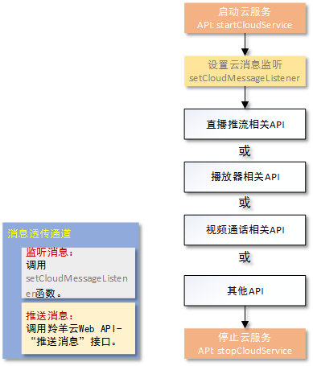

#羚羊云Android SDK示例-基础云服务

## 接口调用流程

#### **(1)**将应用接入到羚羊云
在使用基础云服务的接口之前，用户必须先将自己的应用体系(含应用客户端和应用服务器)[接入到羚羊云](http://doc.topvdn.com/api/index.html#!public-doc/start_joinup.md)。

#### **(2)**接口调用顺序

## 启动云服务
启动羚羊云服务，该接口函数分配并初始化本地系统资源，登录到羚羊云平台，在平台端进行安全认证。

    /**
     * 开启云服务
     */
        LYService.getInstance().startCloudService(
        	userToken
            , CONFIG
            , new CallBackListener<Long>() {
                @Override
                public void onSuccess(Long aLong) {
                        showToast("登录成功" );
                }
                
                @Override
                public void onError(LYException exception) {
                    showToast("登录失败"+exception.getMessage());
                }
            }
        );

**注意**：其他接口必须在此接口被调用成功之后才能调用。

## 停止云服务
    //退出是要关闭云服务，节省资源
    LYService.getInstance().stopCloudService();
    
在应用退出的时候调用，释放系统资源。

## 消息透传
当应用客户端使用SDK接入到羚羊云后，可以向同样接入到羚羊云的另外一端的应用客户端，互相传递他们之间协定的网络消息。这些消息对于羚羊云来说是透明的，羚羊云只提供消息传递的通道。

该功能可以有如下应用场景：
(1)在移动终端的应用中读取或更改接入到羚羊云中的私人摄像设备的参数。
(2)在移动终端的应用中监听各个摄像设备的在线状态变化。

    /**
     * 设置云消息监听
     */
    LYService.getInstance().setCloudMessageListener (
        new LYService.AcceptMessageListener() {
            @Override
            public void accept (LYService.CloudMessage message) {
                CLog.v(message.toString());
            }
        }
    );
**注意**：
(1)消息最大长度为256个字节;
(2)本SDK只提供了监听消息的功能，当对方有消息到来的时候，本方会通过回调函数通知到应用层的SDK调用者，应用层可以对该消息进行处理以及回应该消息至对端的客户端。
推送消息或者回应消息并不属于本SDK的功能范畴，需要调用羚羊云提供的[Web API接口-设备推送消息](http://doc.topvdn.com/api/#!web_api_v2.md#2.3.1_%E8%AE%BE%E5%A4%87%E6%8E%A8%E9%80%81%E6%B6%88%E6%81%AF)。

#### 相关链接
[羚羊云token认证机制](http://doc.topvdn.com/api/index.html#!public-doc/token_format.md)
[羚羊云推拉流URL格式](http://doc.topvdn.com/api/index.html#!public-doc/url_format.md)
[羚羊云WebAPI使用指南](http://doc.topvdn.com/api/#!web_api_v2.md)
