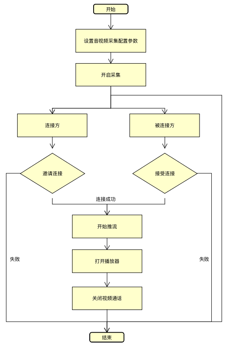

#羚羊云Android SDK示例-视频通话

在使用本示例实现推拉流功能之前，必须先完成[开启羚羊云服务](http://doc.topvdn.com/api/#!public-doc/SDK-C/c_guide_cloudservice.md)接口的调用。



##1. 设置流参数

```
//音视频和摄像机的初始化配置，用户可根据实际需要进行配置。
mSessionConfig = new SessionConfig.Builder()
	.withVideoBitrate(512000)//码率
	.withVideoResolution(640, 480)//分辨率  默认720p
    .withDesireadCamera(Camera.CameraInfo.CAMERA_FACING_BACK)//摄像头类型
	.withCameraDisplayOrientation(90)//旋转角度
	.withAudioChannels(1)//声道 1单声道  2双声道
	.useHardAudioEncode(false)//是否音频硬编
	.useHardVideoEncode(false)//是否视频硬编
	.useAudio(true)//是否开启音频
    .useVideo(true)//是否开启视频
	.build();

```
SessionConfig类配置直播推流的参数，包括是否使用音、视频，是否使用硬编码，视频旋转角度等多种配置，用户可根据需要查看更多进行配置。<br>
**注意**：更多的参数配置详见[API手册](http://doc.topvdn.com/api/index.html#!public-doc/SDK-Android/android_api.md#1.3_SessionConfig%E9%85%8D%E7%BD%AE%E7%9B%B4%E6%92%AD%E6%8E%A8%E6%B5%81%E5%8F%82%E6%95%B0 "Android API")中的数据类型-直播推流相关属性配置。

##2. 设置本地预览和播放布局

```
<!-- 预览布局 -->
<com.lingyang.sdk.view.LYGLCameraEncoderView
    android:id="@+id/ly_preview"
    android:layout_width="150dp"
    android:layout_height="200dp" />

<!-- 播放器布局 -->
<com.lingyang.sdk.player.widget.LYPlayer
    android:id="@+id/ly_player"
    android:layout_width="150dp"
    android:layout_height="200dp"" />
```

##3. 设置本地预览和播放器视图
 
```
// 设置本地预览
mLYFaceTime.setLocalPreview(camera_preview);
// 设置远程播放器
mLYFaceTime.setRemoteView(null, playerview);
```

##4. 建立连接

```
/**
 * 被叫方：
 * 从消息透传通道收到对方发送过来的的连接串主动发起连接，连接成功自动推流
 */
mLYFaceTime.openRemote("topvdn://203.195.157.248:80?token=2147550101_3356753920_1685865782_5e66341ab86fa3becec154f71dd4095f&protocolType=1",
    new CallBackListener<Integer>() {
        @Override
    public void onSuccess(Integer t) {
// 连接成功   }
        @Override
    public void onError(final LYException exception) {
// 连接失败   }
            });
```
```
/**
 * 主叫方：用户需要接入羚羊后台实现消息透传功能，将连接串发给被叫方。
 * 设置连接监听和互联监听
 */
LYService.getInstance().setCloudMessageListener(
        new LYService.AcceptMessageListener() {
            @Override
            public void accept(
            LYService.CloudMessage message) {
            if (message.Name.equals("ConnectionAcceptted")) {
                //对方收到连接串并连接成功
                        } 
            if (message.Name.equals("ConnectionClosed")) {      	 
                //对方已挂断，己方也需断开连接
               mLYFaceTime.closeRemote(null);
                                }});
                        
mLYFaceTime.setCallBackListener(new CallBackListener<Integer>() {

        @Override
        public void onSuccess(Integer t) {
            //开始互联
        }

        @Override
        public void onError(LYException exception) {
            //互联失败
        }
```

##5. 退出

```
mLYFaceTime.closeRemote(null);
mLYFaceTime.release();
```

#### 相关链接
[羚羊云SDK服务架构](http://doc.topvdn.com/api/index.html#!public-doc/start_archit.md)
[羚羊云SDK接入指南](http://doc.topvdn.com/api/index.html#!public-doc/start_joinup.md)
[羚羊云token认证机制](http://doc.topvdn.com/api/index.html#!public-doc/token_format.md)
[羚羊云推拉流URL格式](http://doc.topvdn.com/api/index.html#!public-doc/url_format.md)
