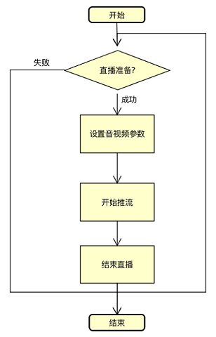

#羚羊云Android SDK示例-直播推流

在使用本示例实现直播推流的功能之前，必须先完成[开启羚羊云服务](http://doc.topvdn.com/api/#!public-doc/SDK-Android/android_guide_cloudservice.md)接口的调用。
本示例仅仅展示了SDK直播推流接口的调用方法和示例，若想实现完整的视频直播应用请参考[羚羊云视频直播应用开发](http://doc.topvdn.com/api/index.html#!public-doc/appfunc_livevideo.md)。



`注`：直播推流支持**云存储**功能：在推流的过程中将音视频流存储在羚羊云，以供用户回放录像。 具体方法参照[推流API](http://doc.topvdn.com/api/index.html#!public-doc/SDK-Android/android_api_livepush.md)。

##1. 设置流参数

```
//音视频和摄像机的初始化配置，用户可根据实际需要进行配置。
mSessionConfig = new SessionConfig.Builder()
	.withVideoBitrate(512000)//码率
	.withVideoResolution(640, 480)//分辨率  
    .withDesireadCamera(Camera.CameraInfo.CAMERA_FACING_BACK)//摄像头类型
	.withCameraDisplayOrientation(90)//旋转角度
	.withAudioChannels(1)//声道 1单声道  2双声道
	.useHardAudioEncode(false)//是否音频硬编
	.useHardVideoEncode(false)//是否视频硬编
	.useAudio(true)//是否开启音频
    .useVideo(true)//是否开启视频
	.build();

```
SessionConfig类配置直播推流的参数，包括是否使用音、视频，是否使用硬编码，视频旋转角度等多种配置，用户可根据需要查看更多进行配置。<br>
**注意**：更多的参数配置详见[API手册](http://doc.topvdn.com/api/index.html#!public-doc/SDK-Android/android_api_datatype.md "Android API")中的数据类型-直播推流相关属性配置。

##2. 设置本地预览布局
```
<com.lingyang.sdk.view.LYGLCameraEncoderView
    android:id="@+id/ly_preview"
    android:layout_width="match_parent"
    android:layout_height="match_parent"/>

LYGLCameraEncoderView mPreview = (LYGLCameraEncoderView)findViewById(R.id.ly_preview);
```
我们对glsurfaceview封装了的自定义View，用来预览本地采集的图像。

##3. 设置本地预览视图
```
//设置本地预览
mLiveBroadcast.setLocalPreview(mPreview);
```

##4. 设置推流状态监听
```
mLiveBroadcast.setBroadcastListener(new BroadcastListener() {
	@Override
	public void onBroadcastStart() {
		showToast("马上开始直播");
	}
	@Override
	public void onBroadcastLive() {
		showToast("正在直播");
	}
	@Override
	public void onBroadcastStop() {
		showToast("停止直播");
	}
	@Override
	public void onBroadcastError(LYException exception) {
		showToast("直播出错" + exception.getCode() + "--"
				+ exception.getMessage());
	}
});
```
##5. 开始推流直播
```
// 开始直播		
mLiveBroadcast.startBroadcasting("topvdn://0.0.0.0:0?protocolType=2&connectType=1&mode=2&" +
    		"token=2147550101_3356753920_1685865782_5e66341ab86fa3becec154f71dd4095f");
```

##6. 结束推流直播
```
//结束直播
mLiveBroadcast.stopBroadcasting();
//资源释放
mLiveBroadcast.release();
```
**注意**：在调用stopBroadcasting 之后，必须调用release以释放系统资源。

#### 相关链接
[羚羊云SDK服务架构](http://doc.topvdn.com/api/index.html#!public-doc/start_archit.md)
[羚羊云SDK接入指南](http://doc.topvdn.com/api/index.html#!public-doc/start_joinup.md)
[羚羊云token认证机制](http://doc.topvdn.com/api/index.html#!public-doc/token_format.md)
[羚羊云推拉流URL格式](http://doc.topvdn.com/api/index.html#!public-doc/url_format.md)
