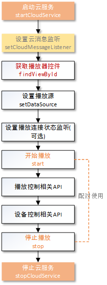

#羚羊云Android SDK示例-播放器

声明：本示例仅仅展示了SDK播放器接口的调用方法和示例，若想实现完整的播放器应用请参考[羚羊云视频直播应用开发](http://doc.topvdn.com/api/index.html#!public-doc/appfunc_livevideo.md)。

## 接口调用流程
在使用本示例实现播放器的功能之前，必须先完成[开启羚羊云服务](http://doc.topvdn.com/api/#!public-doc/SDK-Android/android_guide_cloudservice.md)接口的调用。


 
##1. 获取播放器视图
我们将播放器封装成了界面控件，方便用户直接嵌入到app的主界面中，实现播放器的功能。
``` 
<com.lingyang.sdk.player.widget.LYPlayer
    android:id="@+id/ly_player"
    android:layout_width="match_parent"
    android:layout_height="match_parent" />

//创建播放器对象
LYPlayer mPlayer = (LYPlayer)findViewById(R.id.ly_player);
```
##2. 设置播放源
``` 
//公众摄像机直播观看		
mPlayer.setDataSource("topvdn://topvdn.public.cn" +
                      "protocolType=2&connectType=2&token=1003136_3356753920_" +
                      "1492163431_cc3acc347784f3e30cd4713acec615b1");
```
播放源格式：
  1,QSTP连接URL格式：
    topvdn://relay_ip:port?protocolType=[]&connectType=[]&token=[]<br>
  2,QSUP连接URl格式：
    topvdn://traker_ip:port?protocolType=[]&token=[]<br>
  3,云存储下载URL格式：
    topvdn://topvdn.public.cn?protocolType=[]&token=[]&begin=[]&end=[]&play=[]

<u>protocolType</u>：协议类型，[1]QSUP,[2]QSTP,[3]云存储录像下载
<u>connectType</u>：连接类型，[1]推流端,[2]拉流端
<u>begin、end、play</u>：下载录像需要用到，其他功能可不用，begin表示要下载录像的开始时间，end表示结束时间，play表示开始播放的时间，需要在begin和end的范围之内。时间单位为毫秒。
<u>token</u>：对端设备的访问token，具体内容格式请见[羚羊云token认证机制](http://doc.topvdn.com/api/public-doc/#!token_format.md)的详细介绍。

播放源的URL地址由应用向应用后台获取。
应用后台生成播放源url的方法和步骤如下：
(1)调用[Web API的'查询设备状态'接口](http://doc.topvdn.com/api/#!web_api_v2_deviceinfo.md)获取羚羊云的tracker ip/port或者relay ip/port；
(2)根据[羚羊云token格式](http://doc.topvdn.com/api/#!public-doc/token_format.md)生成token；
(3)按照[羚羊云URL格式解析](http://doc.topvdn.com/api/#!public-doc/url_format.md)生成羚羊云格式的URL。

##3. 设置播放连接状态监听
设置循环执行网络拉流、解码视频帧、及显示视频帧这些过程之前，连接到云服务器的状态监听函数；
```
/**
 * 所有连接完成，开始播放监听
 */
mPlayer.setOnPreparedListener(new OnPreparedListener() {
    @Override
    public void onPrepared(int time) {
        //time 连接过程所消耗的时间
        runOnUiThread(new Runnable() {
            public void run() {}
        }
        );
    }
});
```
OnPreparedListener被触发则表示连接至云服务器已经成功且播放器已经成功打开，在回调函数中，可以在播放控件界面上显示连接状态的变化。

##4. 开始播放
```
mPlayer.start();
```
开始播放后会触发OnPreparedListener回调函数;

注：该方法既可以播放直播流，也可以播放云端录像流。播放的类型根据上面所述 “设置播放源”小节的url地址内容来区分。

##5. 结束播放
```
mPlayer.stop();
```

##6. 播放控制
###6.1 视频截图
```
snapPath=”/storage/emulated/0/Topvdn/我的相册/”;
mPlayer.snapshot(snapPath, name, new OnSnapshotListener() {
	@Override
	public void onSnapshotSuccess(String snapPath) {
		showToast("截图成功"+snapPath);
	}
	@Override
	public void onSnapshotFail(LYException e) {
		showToast("截图失败"+e.getMessage());
	}
});
```
###6.2 视频录制
```
//开始录像
recordPath=”/storage/emulated/0/Topvdn/我的录像/record.mp4”;
mPlayer.startLocalRecord(recordPath);
    
/**
 * 录像状态监听
 */
OnLocalRecordListener mLocalRecordListener = new OnLocalRecordListener() {
	@Override
	public void onRecordSizeChange(long size, long time) {
		showToast("正在录像"+time);
	}
	
	@Override
	public void onRecordError(LYException arg0) {
		showToast("录像出错"+arg0.getCode()+"--"+arg0.getMessage());
	}

	@Override
	public void onRecordStart() {
		showToast("开始录像");
	}

	@Override
	public void onRecordStop() {
		showToast("结束录像");
		
	}
};
```
###6.3 声音开关
```
//开启声音
mPlayer.unmute();
//关闭声音
mPlayer.mute();
```

###6.4 获取流媒体参数
```
//动态获取流媒体参数，用户根据需要传参获取，如当前视频帧率。
mPlayer.getMediaParam(IMediaParamProtocol.STREAM_MEDIA_PARAM_VIDEO_RATE);
```

#### 相关链接
[羚羊云SDK服务架构](http://doc.topvdn.com/api/index.html#!public-doc/start_archit.md)
[羚羊云SDK接入指南](http://doc.topvdn.com/api/index.html#!public-doc/start_joinup.md)
[羚羊云token认证机制](http://doc.topvdn.com/api/index.html#!public-doc/token_format.md)
[羚羊云推拉流URL格式](http://doc.topvdn.com/api/index.html#!public-doc/url_format.md)
