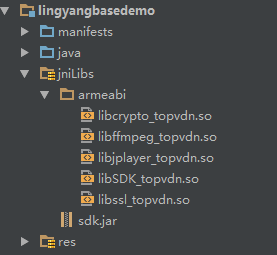

#羚羊云Android SDK集成准备
##1. SDK的获取
[点击这里获取](http://doc.topvdn.com/api/public-doc/SDK-Android/zipdown/ly_sdk_android.zip "获取SDK")

##2. SDK支持的系统版本
SDK支持的Android版本：4.3及以上的Android版本(api18)。

##3. SDK库结构
libs 
├── armeabi 
│   ├── libffmpeg_topvdn.so （编解码库） 
│   └── libjplayer_topvdn.so （播放器） 
│   ├── libSDK_topvdn.so （SDK和平台基础库） 
│   └── libcrypto_topvdn.so （网络传输加密需要） 
│   └── libssl_topvdn.so （网络传输加密需要） 
└── sdk.jar (Android sdk jar包）

##4. SDK的集成
###4.4.1 Eclipse环境
在eclipse下新建一个工程，对工程进行配置，搭建开发环境。

将sdk包内的文件直接拷贝到你的工程中的libs目录下，拷贝完成后如下图：
 

###4.4.2 Android Studio环境
在android studio下新建一个工程，对工程进行配置，搭建开发环境。

(1)将sdk包内的文件直接拷贝到你的工程中的libs目录下，拷贝完成后如下图：
 

(2)在build.gradle里添加代码： 

    dependencies {
        compile files('libs/sdk.jar')
    }

##5 SDK DEMO 导入步骤
官网提供的demo是eclipse环境下编写的，用eclipse工具可直接导入使用。在Android Studio环境下需新建一个project，
然后以导入module的方式进行导入使用。
###5.1 eclipse 导入
（1）打开eclipse > File > import > Android > Exsiting Android Code IntoWorkspace

（2）点击Browse选择demo所在目录 > 打开 > finish

###5.2 Android Studio 导入
（1）打开Android Studio ，新建一个Project

（2）点击File > new > Import Module 

（3）选择demo所在目录 > 打开 > next > finish

##6 系统权限设置
    //networking api使用权限
    <uses-permission android:name="android.permission.INTERNET"/>
    //允许应用程序使用摄像头
    <uses-permission android:name="android.permission.CAMERA"/>
    //允许应用程序修改全局音频设置
    <uses-permission android:name="android.permission.MODIFY_AUDIO_SETTINGS"/>
    //允许应用程序录制视频
    <uses-permission android:name="android.permission.RECORD_VIDEO"/>
    //允许应用程序录制音频
    <uses-permission android:name="android.permission.RECORD_AUDIO"/>
    //允许应用程序读取sd卡
    <uses-permission android:name="android.permission.READ_EXTERNAL_STORAGE"/>
    //允许应用程序写入sd卡
    <uses-permission android:name="android.permission.WRITE_EXTERNAL_STORAGE"/>
    //允许应用程序访问网络状态
    <uses-permission android:name="android.permission.ACCESS_NETWORK_STATE"/>
    //摄像头
    <uses-feature android:name="android.hardware.camera"/>
    //摄像头功能
    <uses-feature android:name="android.hardware.camera.autofocus"/>
