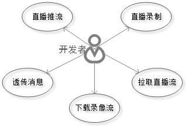

#羚羊云C SDK使用说明
##一、概述
本套SDK采用C语言编写，可供iOS、Android、Windows、linux的应用调用，为开发者提供接入羚羊视频云的开发接口，使开发者能够轻松实现视频相关的应用。羚羊视频云在视频传输和云存储领域有着领先的开发技术和丰富的产品经验,设计了高质量、宽适应性、分布式、模块化的音视频传输和存储云平台。SDK为上层应用提供简单的[API接口](http://doc.topvdn.com/api/#!public-doc/SDK-C/c_api.md)，使用这些接口可以实现推送媒体流、拉取媒体流、消息透传等功能。

##二、功能概要


- **推送媒体流**：通过羚羊云自主研发的QSTP或QSUP网络协议推送到羚羊云，以供终端用户观看直播或云端存储录像。

- **拉取直播流**：网络拉流采用羚羊云自主研发的基于UDP的QSUP协议和基于TCP的QSTP协议，能够达到快速开流、低延时的效果。上层应用可将拉取到的媒体流进行解码播放。

- **下载录像流**：通过羚羊云自主研发的QSTP网络协议下载存储在羚羊云端的录像。

- **消息透传**：提供客户端与客户端之间、客户端与服务端之间进行自定义消息格式通讯的能力。

##三、功能特性
| ID | 功能特性 |
|----|----|
| 1  | 支持羚羊云的QSUP协议进行双向传输 |
| 2  | 音频流支持AAC和OPUS |
| 3  | 视频流支持H264 |
| 4  | 支持羚羊云自定义网络协议QSUP进行推流 |
| 5  | 支持羚羊云自定义网络协议QSTP进行推流 |
| 6  | 支持羚羊云自定义网络协议QSUP进行拉流 |
| 7  | 支持羚羊云自定义网络协议QSTP进行拉流 |
| 8  | 支持AAC和OPUS格式音频数据的发送和接收 |
| 9  | 支持H264格式视频数据的发送和接收 |

##四、开发准备
###4.1 SDK的获取
[点击这里获取](http://doc.topvdn.com/api/public-doc/SDK-C/zipdown/ly_sdk_c.zip "获取SDK")

###4.2 SDK库结构
SDK目录
|--lib      包含羚羊云的静态库libTopvdn.a和动态库libPusher.so

|--include  包含了使用羚羊云C接口SDK需要的头文件

|--demo   包含当前版本SDK的demo程序，编译生成程序后可运行查看SDK功能演示及其效果

**SDK包内库文件如下**：

libPusher.s:平台基础库，包括登录平台，获取转发，p2p连接等；

libTopvdn.a:羚羊云功能实现库，包括功能概要中提供到所有功能，并可根据用户需求进行裁剪；

libstdc++.so.6:标准c++库，若使用gcc编译器，则需要连接此库，否则会编译不通过；

libcrypto.a和libssl.a:羚羊云使用到的加密库，如果需要加密相关功能，则需要链接。

**SDK包内头文件如下**：

common_define.h：此头文件中包含羚羊云一些公共数据类型的定义

LYPlatformAPI.h：此头文件包含羚羊云C接口的声明

###4.3 SDK的集成
####4.3.1 linux环境下在Makefile中配置示例：
INCLUDE_DIR	:= ./include /*配置头文件路径*/

LIB_DIR		:= ./lib     /*配置库文件路径*/

CFLAGS		:= -I$(INCLUDE_DIR)

LDFLAGS		:= -Wl,-rpath=. -lPusher–lTopvdnSDK-lpthread -lssl -lcrypto

####4.3.2 windows环境工程配置（VS2012为例）
1. 新建一个工程。
2. 右键工程，选择“属性”。
3. 选择“C/C++”，点击“常规”，在“附加包含目录”中配置头文件目录。
4. 选择“库管理器”，点击“常规”，在“附件库目录”中配置库路径，然后在附加依赖项中添加libTopvdn.lib

##五、功能集成
本章节介绍如何调用[SDK的API接口](http://doc.topvdn.com/api/#!public-doc/SDK-C/c_api.md)来实现直播推流、播放器、消息透传的功能。

##5.1 &nbsp;启动云服务
启动羚羊云服务，该接口函数分配并初始化本地系统资源，登录到羚羊云平台，在平台端进行安全认证。
```
void popMessage(void *apData, const char *aMessage)
{
	if(!aMessage)
		return;
	cJSON* root = cJSON_Parse(aMessage);
	cJSON* name = cJSON_GetObjectItem(root,"name");
	cJSON* message;
	myMsg tmpMsg = {0,""};
	if(memcmp("ConnectionAcceptted",name->valuestring,strlen(name->valuestring)) == 0)
	{
		//QSUP协议开始推流
		printf("PopMessage ConnectionAcceptted\n");
	}
	//其他详细分支请参考demo
}
//...
char* deviceToken = "537067556_3222536192_1493481600_f0399b369aa760362ac4edd224bae23b";
char* configStr = "[Config]\r\nIsDebug=0\r\nLocalBasePort=8200\r\nIsCaptureDev=1\r\nIsPlayDev=1\r\nU 
dpSendInterval=2\r\nConnectTimeout=10000\r\nTransferTimeout=10000\r\n[Tracker]\r\nCount=3\r\nIP1=121.42.156.148\r\nPort1=80\r\nIP2=182.254.149.39\r\nPort2=80\r\nIP3=203.195.157.248\r\nPort3=80\r\n[LogServer]\r\nCount=1\r\nIP1=120.26.74.53\r\nPort1=80\r\n";
while(1)
{
	//开启云平台服务，并注册消息回调函数,调用此函数之后才能调用云平台的其他函数
    //此处deviceToken和configStr可从应用服务器获取
	ret = LY_startCloudService(deviceToken,configStr,popMessage,NULL);
	if(ret == 0)//返回0表示开启成功
	{
		break;
	}
	printf("StartCloudService failed!  ret = %d  retry...\n",ret );
	sleep(1);
}
```
**注意**：其他接口必须在此接口被调用成功之后才能调用。deviceToken和configStr从羚羊云应用后台或者用户的[应用服务器](http://doc.topvdn.com/api/index.html#!public-doc/integration.md#4._%E7%9B%B8%E5%85%B3%E6%9C%AF%E8%AF%AD%E5%92%8C%E5%90%8D%E8%AF%8D)获取。

##5.2 &nbsp;停止云服务
```
//停止云平台服务，释放相关资源。
LY_stopCloudService();
```
在应用退出的时候调用，释放系统资源。

##5.3 &nbsp;消息透传
当应用客户端使用SDK接入到羚羊云后，可以向同样接入到羚羊云的另外一端的应用客户端，互相传递他们之间协定的网络消息。这些消息对于羚羊云来说是透明的，羚羊云只提供消息传递的通道。

该功能可以有如下应用场景：

(1)在移动终端的应用中读取或更改接入到羚羊云中的私人摄像设备的参数。

(2)在移动终端的应用中监听各个摄像设备的在线状态变化。

在启动云服务时设置popMessage回调，可以监听从云平台传送过来的消息，在popMessage回调函数中您可以处理消息并选择是否回应消息给对方。
```
//监听消息
void popMessage(void *apData, const char *aMessage)
{
	if(!aMessage)
		return;
	
	//处理消息
	//…
}
```
**注意**：

(1)消息最大长度为256个字节;
(2)本SDK只提供了监听消息的功能，当对方有消息到来的时候，本方会通过回调函数通知到应用层的SDK调用者，应用层可以对该消息进行处理以及回应该消息至对端的客户端。
推送消息或者回应消息并不属于本SDK的功能范畴，需要调用羚羊云提供的[Web API接口-设备推送消息](http://doc.topvdn.com/api/index.html#!web_api_v2.md#2.3.1_%E8%AE%BE%E5%A4%87%E6%8E%A8%E9%80%81%E6%B6%88%E6%81%AF)。

##5.4 &nbsp;建立传输通道
任何媒体数据的接收和发送，必须先建立传输通道。需要传入羚羊云自定义格式的URL作为参数进行通道的连接，成功建立连接后，即可通过LY_recvMediaFrame和LY_sendMediaFrame收发数据。
```
char *url="topvdn://203.195.157.248:80?protocolType=1&token=1003469_3222536192_1493481600_5574318032e39b62063d98e6bff50069";
int fd;
while(1)
{
	fd = LY_connect (url,NULL);
	if(fd< 0)
	{
		printf("connect to peer faild\n");
		usleep(300*1000);
		continue;
	}
	break;
}
//连接成功后即可调用接口收发数据
//...
```
URL格式：

  1,QSTP连接URL格式：topvdn://relay_ip:port?protocolType=[]&connectType=[]&token=[]&mode=[]
  2,QSUP连接URl格式：topvdn://traker_ip:port?protocolType=[]&token=[]
  3,云端录像下载URL格式：topvdn://topvdn.public.cn?protocolType=[]&token=[]&begin=[]&end=[]&play=[]

<u>protocolType</u>：协议类型，[1]QSUP,[2]QSTP,[3]云端录像下载
<u>connectType</u>：连接类型，[1]推流端,[2]拉流端
<u>begin、end、play</u>：下载录像需要用到，其他功能可不用，begin表示要下载录像的开始时间，end表示结束时间，play表示开始播放的时间，需要在begin和end的范围之内。时间单位为秒。
<u>token</u>：对端设备的访问token，具体内容格式请见[羚羊云token认证机制](http://doc.topvdn.com/api/#!public-doc/token_format.md)的详细介绍。

**URL的详细格式请参考[羚羊云URL格式解析](http://doc.topvdn.com/api/#!public-doc/url_format.md)。**

##5.5 &nbsp;推送媒体流
首先需要建立连接，即创建传输通道，调用LY_connect创建传输通道，然后才能进行推流。羚羊云支持多路推流，每一路流都有一个int类型的fd唯一标识。（一路即一个传输通道，每个传输通道都可以传输音视频数据）。直播推流使用QSUP协议还是QSTP协议是根据用户调用LY_connectr函数传入的参数决定的，用户在调用LY_sendMediaFrame发送数据的时候无需关心这些选项。
```
int fd;
int ret;
MediaFrame_tframe = {0};
char *url="topvdn://183.57.151.161:1935?protocolType=2&connectType=1&token=537067556_3222536192_1493481600_f0399b369aa760362ac4edd224bae23b&mode=2";
while(1)
{
	fd = LY_connect(url,NULL)//连接推流服务器，返回标识传输通道的fd
	if(fd< 0)
	{
		printf("connect to lingyang cloud relay server failed,retry...\n");
		usleep(300*1000);
		continue;
	} 
	break;
}
frame.frameType = frameType;//帧类型参考include目录下common_define.h
frame.frameBuffer = dataBuffer;
frame.frameLength = frameSize;
frame.frameTime = timeStamp;
ret = LY_sendMediaFrame(fd,&frame);//发送音视频数据，成功返回0，失败返回非0
if(ret != 0)
printf("send frame failed nal %d frameret:%d,frameSize=%d\n",frameType,ret,frameSize);
```
`注`:推流支持云存储功能：在推流的过程中将音视频流存储在羚羊云，以供用户下载并回放录像，只需将url按照[羚羊云URL格式协议](http://doc.topvdn.com/api/index.html#!public-doc/url_format.md)而设置即可实现。

##5.6 &nbsp;拉取直播流
拉取直播的前提是目标设备端已经建立推直播流的通道连接，否则将没有网络数据可拉取。拉取直播流使用连接推流服务器时返回的fd。需要先使用LY_connect建立连接，然后调用接收数据的接口LY_recvMediaFrame接收数据，只是输出参数的帧类型有所区别。
```
void* recvMediaData (void* arg)
{
#define MAX_FRAME 512*1014
	char *url="topvdn://183.57.151.161:1935?protocolType=2&connectType=2&token=537067556_3222536192_1493481600_f0399b369aa760362ac4edd224bae23b";
    int fd = LY_connect(url,NULL);//建立数据通道连接，返回标识传输通道的fd
	if(arg == NULL)
		return;
	int fd = *(int*)arg;
	int ret = 0;
	char *buf;
	MediaFrame_tframe = {0};
	frame.frameBuffer = (char*)malloc(MAX_FRAME);//外面传入buffer接收数据
	extern int recvData = 1;
	while(recvData)
	{
		ret = LY_recvMediaFrame(fd,&frame);//没有数据会阻塞住
		if(ret != 0)
		{
			printf("recv audio failed,fd=%d\n",fd);
		}
        //decode and play
        //收到媒体数据后，用户可调用羚羊云的解码器进行解码播放，也可自行使用其他软解或者硬件解码进行播放。
        //…
		if(frame.frameType == AAC_TYPE_SAMPLE)//AAC音频数据
		{
		}
		elseif (frame.frameType == OPUS_TYPE_SAMPLE)//OPUS音频数据
		{
		}
		elseif(frame.frameType<OPUS_TYPE_SAMPLE)//H264视频数据，根据帧类型进一步判断
		{
		}
	}
	if(frame.frameBuffer)
	{
		free(frame.frameBuffer);
		frame.frameBuffer = NULL;
	}
	printf("recvmedia frame data exit fd=%d\n",fd);
}
```

##5.7 &nbsp;下载录像流
观看录像必须登录到羚羊云平台，通过给出观看录像的时间点，从应用后台拿到该时间点录像的相关信息，然后调用LY_connect连接到服务器，比拉取直播流多了一个传递参数，最后调用LY_recvMediaFrame接收录像数据。

```
char *url="topvdn://183.57.151.161:1935?protocolType=3&token=537067556_3222536192_1493481600_f0399b369aa760362ac4edd224bae23b&begin=1464092317&end= 1464095883&play=1464092317";
char *dataSource;//这个数据从应用后台拿，是json串格式的数据。示例：{"cid": 537067556, "events": [], "request_id": "91be3a8ffc534ad5bc3b3882a4574451", "servers": [{"ip": "183.57.151.208", "port": 80}], "videos": [{"from": 1463587200, "server_index": 0, "to": 1463627550}]} 

while(1)
{
	fd = LY_connect(url,dataSource)//连接录像服务器，返回标识传输通道的fd
	if(fd< 0)
    	{
		printf("connect to lingyang cloud relay server failed,retry...\n");
		usleep(300*1000);
		continue;
	} 
	break;
}
MediaFrame_tframe = {0};
frame.frameBuffer = (char*)malloc(MAX_FRAME_SIZE);//外面传入buffer接收数据

while(recvRecord)
{
	ret = LY_recvMediaFrame(fd,&frame);//没有数据会阻塞住
	if(ret != 0)
	{
		printf("recvrecord framefailed,fd=%d\n",fd);
	}

    //将收到的媒体帧自行解码及播放……
}
if(frame.frameBuffer)
{
	free(frame.frameBuffer);
	frame.frameBuffer = NULL;
}
```

##5.8 &nbsp;断开通道连接
断开fd标识的传输通道 ，此时羚羊云服务还没有关闭。
```
if(LY_disconnect(fd) != 0)//这里的fd是调用函数LY_connect获取到的
{
	printf("disconnect server failed\n");
}
else
{
	printf("disconnect server success\n");
}
```

##六、注意事项
1. libPusher.so中包含cJSON库，用户可直接使用相关函数，不需要再自行编译和链接此库。
2. 此SDK接口是C风格的，但是libPusher.so中使用到了C++的标准库函数，所以如果使用C的编译器编译，请链接SDK包中提供的libstdc++.so.6库

##七、常见问题
1. 什么是`appid`？怎么获取`appid`？
答：`appid`是用户(开发者)在羚羊云创建应用后，由羚羊云分配的唯一字符串，是该应用在羚羊云中的唯一标识。用户拿到appid后才能有效调用羚羊云SDK提供的接口。获取appid请参考本文前面的'[将应用接入到羚羊云](http://doc.topvdn.com/api/index.html#!public-doc/joinup.md)'。

2. 什么是`cid`？怎么获取？
答：`cid`是一个4个字节长度的无符号整型数，是羚羊云用来标识唯一的用户终端设备。获取的方式请参照'[将应用接入到羚羊云](http://doc.topvdn.com/api/index.html#!public-doc/joinup.md)'。

3. 什么是QSUP协议？什么是QSTP协议？两者有什么区别？我该用什么协议？
答：QSUP（Quick Streaming UdpProtocol）和QSTP（Quick Streaming TcpProtocol）协议都是羚羊云自定义的网络传输协议。QSUP是基于UDP的P2P传输协议，如果设备端只需要传送数据给设备的拥有者，可使用此协议，此协议传输延时比RTMP、HTTP等协议更低；QSTP是基于TCP的传输协议，如果需要开启直播给多人观看，或者需要使用云存储功能，则需要使用此协议。

4. 羚羊云SDK支持哪些视频压缩格式和音频压缩格式？
答：目前羚羊云传输通道视频压缩格式支持H264，音频压缩格式支持AAC和OPUS。

5. 羚羊云消息通道最大支持的长度是多少？是否安全？
答：羚羊云目前支持的消息最大长度为256个字节，羚羊云消息通道为透明传输，不会保存任何数据，且会对用户的消息进行加密出来。

6. 羚羊云发送数据接口是否会阻塞？
答：羚羊云发送数据接口是同步接口，发送完数据才会返回，网络较差情况会超时返回，超时时间为5秒。

7. 设备网络较差，连接断开的时候SDK会不会自动重连？
答：使用QSTP协议调用发送数据的接口时，SDK内部会自动重连，重连操作对使用者是透明的；使用QUSP协议时，如果连接断开，则需要主动去调用重连。

8. 网络较差，发送数据较慢时，SDK内部是否有缓存机制？
答：网络环境较差，发送数据较慢时，SDK内部每个通道有1M的缓存队列来缓存数据。

9. 使用羚羊云发送音视频的码流格式是什么样的？
答：SDK发送H264码流，需要带起始头的NALU，每次发送一个NALU，SDK支持SPS PPS SEI I帧以一个NALU为单位进行传输。SDK发送AAC格式的音频要求调用者发送带ADTS头的AAC数据帧，每次发送一帧。

10.	什么是fd，fd的作用？
答：羚羊SDK从版本V2.0后支持多路数据传输，fd为创建传输通道时返回的句柄，唯一标识传输通道。收发数据和断开连接均需要此参数。

##八、更新历史
1. 2016-06 SDK_V2.0.1
羚羊云接口名称改动，所有接口名称添加LY_前缀，在V1.3.1的功能基础上支持多通道推流、拉流，支持用户设置加密秘钥，取消消息透传。

2. 2016-02 SDK_V1.3.1
将羚羊云后台模块独立，支持用户的应用服务器接入，去掉封面图片上传，改由服务器生成封面截图。部分接口名称改动。

3. 2015-10 SDK_V1.0
支持QSUP和QSTP协议传输数据，支持云存储，支持封面图片上传，支持消息透传。

##九、API手册
[羚羊云C API手册](http://doc.topvdn.com/api/index.html#!public-doc/SDK-C/c_api.md)

#### 相关链接
[羚羊云SDK接入指南](http://doc.topvdn.com/api/index.html#!public-doc/start_joinup.md)
[羚羊云token认证机制](http://doc.topvdn.com/api/index.html#!public-doc/token_format.md)
[羚羊云推拉流URL格式解析](http://doc.topvdn.com/api/index.html#!public-doc/url_format.md)
[羚羊云WebAPI使用指南](http://doc.topvdn.com/api/#!web_api_v2.md)
