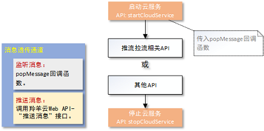

#羚羊云C SDK示例-基础云服务

## 接口调用流程

#### **(1)**将应用接入到羚羊云
在使用基础云服务的接口之前，用户必须先将自己的应用体系(含应用客户端和应用服务器)[接入到羚羊云](http://doc.topvdn.com/api/index.html#!public-doc/start_joinup.md)。

#### **(2)**接口调用顺序
 

##1. 启动云服务
启动羚羊云服务，该接口函数分配并初始化本地系统资源，登录到羚羊云平台，在平台端进行安全认证。
```
void popMessage(void *apData, const char *aMessage)
{
	if(!aMessage)
		return;
	cJSON* root = cJSON_Parse(aMessage);
	cJSON* name = cJSON_GetObjectItem(root,"name");
	cJSON* message;
	myMsg tmpMsg = {0,""};
	if(memcmp("ConnectionAcceptted",name->valuestring,strlen(name->valuestring)) == 0)
	{
		//QSUP协议开始推流
		printf("PopMessage ConnectionAcceptted\n");
	}
	//其他详细分支请参考demo
}
//...
char* deviceToken = "537067556_3222536192_1493481600_f0399b369aa760362ac4edd224bae23b";
char* configStr = "[Config]\r\nIsDebug=0\r\nLocalBasePort=8200\r\nIsCaptureDev=1\r\nIsPlayDev=1\r\nU 
dpSendInterval=2\r\nConnectTimeout=10000\r\nTransferTimeout=10000\r\n[Tracker]\r\nCount=3\r\nIP1=121.42.156.148\r\nPort1=80\r\nIP2=182.254.149.39\r\nPort2=80\r\nIP3=203.195.157.248\r\nPort3=80\r\n[LogServer]\r\nCount=1\r\nIP1=120.26.74.53\r\nPort1=80\r\n";
while(1)
{
	//开启云平台服务，并注册消息回调函数,调用此函数之后才能调用云平台的其他函数
    //此处deviceToken和configStr可从应用服务器获取
	ret = LY_startCloudService(deviceToken,configStr,popMessage,NULL);
	if(ret == 0)//返回0表示开启成功
	{
		break;
	}
	printf("StartCloudService failed!  ret = %d  retry...\n",ret );
	sleep(1);
}
```
**注意**：其他接口必须在此接口被调用成功之后才能调用。deviceToken和configStr从羚羊云应用后台或者用户的[应用服务器](http://doc.topvdn.com/api/index.html#!public-doc/start_archit.md#3._%E7%9B%B8%E5%85%B3%E6%9C%AF%E8%AF%AD%E5%92%8C%E5%90%8D%E8%AF%8D)获取。

##2. 停止云服务
```
//停止云平台服务，释放相关资源。
LY_stopCloudService();
```
在应用退出的时候调用，释放系统资源。

##3. 消息透传
当应用客户端使用SDK接入到羚羊云后，可以向同样接入到羚羊云的另外一端的应用客户端，互相传递他们之间协定的网络消息。这些消息对于羚羊云来说是透明的，羚羊云只提供消息传递的通道。

该功能可以有如下应用场景：
(1)在移动终端的应用中读取或更改私有摄像设备的参数。
(2)在移动终端的应用中监听各个摄像设备的在线状态变化。

在启动云服务时设置popMessage回调，可以监听从云平台传送过来的消息，在popMessage回调函数中您可以处理消息并选择是否回应消息给对方。
```
//监听消息
void popMessage(void *apData, const char *aMessage)
{
	if(!aMessage)
		return;
	
	//处理消息
	//…
}
```
**注意**：

(1)消息最大长度为256个字节;
(2)本SDK只提供了监听消息的功能，当对方有消息到来的时候，本方会通过回调函数通知到应用层的SDK调用者，应用层可以对该消息进行处理以及回应该消息至对端的客户端。
推送消息或者回应消息并不属于本SDK的功能范畴，需要调用羚羊云提供的[Web API接口-设备推送消息](http://doc.topvdn.com/api/index.html#!web_api_v2.md#2.3.1_%E8%AE%BE%E5%A4%87%E6%8E%A8%E9%80%81%E6%B6%88%E6%81%AF)。

#### 相关链接
[羚羊云SDK服务架构](http://doc.topvdn.com/api/index.html#!public-doc/start_archit.md)
[羚羊云SDK接入指南](http://doc.topvdn.com/api/index.html#!public-doc/start_joinup.md)
