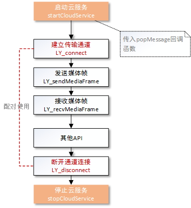

#羚羊云C SDK示例-推流拉流

声明：本示例仅仅展示了SDK推拉流接口的调用方法和示例，若想实现完整的推拉流应用请参考[羚羊云视频直播应用开发](http://doc.topvdn.com/api/index.html#!public-doc/appfunc_livevideo.md)。

## 接口调用流程
在使用本示例实现推拉流功能之前，必须先完成[开启羚羊云服务](http://doc.topvdn.com/api/#!public-doc/SDK-C/c_guide_cloudservice.md)接口的调用。



##1. 建立传输通道
任何媒体数据的接收和发送，必须先建立传输通道。需要传入羚羊云自定义格式的URL作为参数进行通道的连接，成功建立连接后，即可通过LY_recvMediaFrame和LY_sendMediaFrame收发数据。
```
char *url="topvdn://203.195.157.248:80?protocolType=1&token=1003469_3222536192_1493481600_5574318032e39b62063d98e6bff50069";
int fd;
while(1)
{
	fd = LY_connect (url,NULL);
	if(fd< 0)
	{
		printf("connect to peer faild\n");
		usleep(300*1000);
		continue;
	}
	break;
}
//连接成功后即可调用接口收发数据
//...
```
**URL的详细格式请参考[羚羊云URL格式解析](http://doc.topvdn.com/api/#!public-doc/url_format.md)。**

##2. 推送媒体流
首先需要建立连接，即创建传输通道，调用LY_connect创建传输通道，然后才能进行推流。羚羊云支持多路推流，每一路流都有一个int类型的fd唯一标识。（一路即一个传输通道，每个传输通道都可以传输音视频数据）。直播推流使用QSUP协议还是QSTP协议是根据用户调用LY_connectr函数传入的参数决定的，用户在调用LY_sendMediaFrame发送数据的时候无需关心这些选项。
```
int fd;
int ret;
MediaFrame_t frame = {0};
char *url="topvdn://183.57.151.161:1935?protocolType=2&connectType=1&token=537067556_3222536192_1493481600_f0399b369aa760362ac4edd224bae23b&mode=2";
while(1)
{
	fd = LY_connect(url,NULL)//连接推流服务器，返回标识传输通道的fd
	if(fd< 0)
	{
		printf("connect to lingyang cloud relay server failed,retry...\n");
		usleep(300*1000);
		continue;
	} 
	break;
}
frame.frameType = frameType;//帧类型参考include目录下common_define.h
frame.frameBuffer = dataBuffer;
frame.frameLength = frameSize;
frame.frameTime = timeStamp;
ret = LY_sendMediaFrame(fd,&frame);//发送音视频数据，成功返回0，失败返回非0
if(ret != 0)
printf("send frame failed nal %d frameret:%d,frameSize=%d\n",frameType,ret,frameSize);
```
`注`:推流支持云存储功能：在推流的过程中将音视频流存储在羚羊云，以供用户下载并回放录像，只需将url按照[羚羊云URL格式协议](http://doc.topvdn.com/api/index.html#!public-doc/url_format.md)而设置即可实现。

##3. 拉取直播流
拉取直播的前提是目标设备端已经建立推直播流的通道连接，否则将没有网络数据可拉取。拉取直播流使用连接推流服务器时返回的fd。需要先使用LY_connect建立连接，然后调用接收数据的接口LY_recvMediaFrame接收数据，只是输出参数的帧类型有所区别。
```
void* recvMediaData (void* arg)
{
#define MAX_FRAME 512*1014
	char *url="topvdn://183.57.151.161:1935?protocolType=2&connectType=2&token=537067556_3222536192_1493481600_f0399b369aa760362ac4edd224bae23b";
    int fd = LY_connect(url,NULL);//建立数据通道连接，返回标识传输通道的fd
	if(arg == NULL)
		return;
	int fd = *(int*)arg;
	int ret = 0;
	char *buf;
	MediaFrame_t frame = {0};
	frame.frameBuffer = (char*)malloc(MAX_FRAME);//外面传入buffer接收数据
	extern int recvData = 1;
	while(recvData)
	{
		ret = LY_recvMediaFrame(fd,&frame);//没有数据会阻塞住
		if(ret != 0)
		{
			printf("recv audio failed,fd=%d\n",fd);
		}
        //decode and play
        //收到媒体数据后，用户可调用羚羊云的解码器进行解码播放，也可自行使用其他软解或者硬件解码进行播放。
        //…
		if(frame.frameType == AAC_TYPE_SAMPLE)//AAC音频数据
		{
		}
		elseif (frame.frameType == OPUS_TYPE_SAMPLE)//OPUS音频数据
		{
		}
		elseif(frame.frameType<OPUS_TYPE_SAMPLE)//H264视频数据，根据帧类型进一步判断
		{
		}
	}
	if(frame.frameBuffer)
	{
		free(frame.frameBuffer);
		frame.frameBuffer = NULL;
	}
	printf("recvmedia frame data exit fd=%d\n",fd);
}
```

##4. 下载录像流
观看录像必须登录到羚羊云平台，通过给出观看录像的时间点，从应用后台拿到该时间点录像的相关信息，然后调用LY_connect连接到服务器，比拉取直播流多了一个传递参数，最后调用LY_recvMediaFrame接收录像数据。

```
char *url="topvdn://183.57.151.161:1935?protocolType=3&token=537067556_3222536192_1493481600_f0399b369aa760362ac4edd224bae23b&begin=1464092317&end=1464095883&play=1464092317";
char *dataSource;//这个数据从应用后台拿，是json串格式的数据。示例：{"cid": 537067556, "events": [], "request_id": "91be3a8ffc534ad5bc3b3882a4574451", "servers": [{"ip": "183.57.151.208", "port": 80}], "videos": [{"from": 1463587200, "server_index": 0, "to": 1463627550}]} 

while(1)
{
	fd = LY_connect(url,dataSource)//连接录像服务器，返回标识传输通道的fd
	if(fd< 0)
    	{
		printf("connect to lingyang cloud relay server failed,retry...\n");
		usleep(300*1000);
		continue;
	} 
	break;
}
MediaFrame_t frame = {0};
frame.frameBuffer = (char*)malloc(MAX_FRAME_SIZE);//外面传入buffer接收数据

while(recvRecord)
{
	ret = LY_recvMediaFrame(fd,&frame);//没有数据会阻塞住
	if(ret != 0)
	{
		printf("recvrecord framefailed,fd=%d\n",fd);
	}

    //将收到的媒体帧自行解码及播放……
}
if(frame.frameBuffer)
{
	free(frame.frameBuffer);
	frame.frameBuffer = NULL;
}
```

##5 断开通道连接
断开fd标识的传输通道 ，此时羚羊云服务还没有关闭。
```
if(LY_disconnect(fd) != 0)//这里的fd是调用函数LY_connect获取到的
{
	printf("disconnect server failed\n");
}
else
{
	printf("disconnect server success\n");
}
```

#### 相关链接
[羚羊云SDK服务架构](http://doc.topvdn.com/api/index.html#!public-doc/start_archit.md)
[羚羊云SDK接入指南](http://doc.topvdn.com/api/index.html#!public-doc/start_joinup.md)
[羚羊云token认证机制](http://doc.topvdn.com/api/index.html#!public-doc/token_format.md)
[羚羊云推拉流URL格式](http://doc.topvdn.com/api/index.html#!public-doc/url_format.md)

