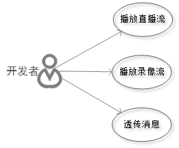

#羚羊云Windows SDK使用说明
##一、概述
本SDK可供Windows平台下的应用调用，为开发者提供接入羚羊视频云的开发接口，使开发者能够轻松实现视频相关的应用。羚羊视频云在视频传输和云存储领域有着领先的开发技术和丰富的产品经验,设计了高质量、宽适应性、分布式、模块化的音视频传输和存储云平台。SDK为上层应用提供简单的[API接口](http://doc.topvdn.com/api/#!public-doc/SDK-Windows/windows_api.md)，实现直播播放、云端录像播放、消息透传等功能。

##二、功能概要


- **播放器**：支持播放直播流和云端录像流，网络拉流采用羚羊云自主研发的基于UDP的QSUP协议和基于TCP的QSTP协议，能够达到快速开流、低延时、高清画质的播放效果。

- **消息透传**：提供客户端与客户端之间、客户端与服务端之间进行自定义消息格式通讯的能力。

##三、功能特性
| ID | 功能特性 |
|----|----|
| 1  | 支持羚羊云自定义网络协议QSUP进行播放 |
| 2  | 支持羚羊云自定义网络协议QSTP进行播放 |
| 3  | 支持羚羊云录像回放|
| 4  | 支持截图 |
| 5  | 支持本地录像 |
| 6  | 支持声音开启和关闭 |

##四、开发准备
###4.1 接入准备
如果您对我们的产品不熟悉，可通过阅读[《羚羊云SDK接入指南》](http://doc.topvdn.com/api/#!public-doc/integration.md)了解SDK和羚羊云之间的整体服务架构以及如何接入到羚羊云。[点击这里](http://doc.topvdn.com/api/#!public-doc/integration.md)即可进入。

###4.2 SDK的获取
[点击这里获取](https://github.com/AntelopeExpress/public-doc/tree/master/SDK-Windows "获取SDK")

###4.3 SDK支持的系统版本
Windows 7及以上版本。

###4.4 SDK库结构
 
- <u>lib</u>          包含羚羊云windows sdk生成dll动态库时生成的lib文件，可以静态加载动态库。(此静态库并非真正意义上的静态库，只供静态加载动态库时使用，运行时仍需要将动态库放入运行时文件夹)
- <u>bin</u>		    包含羚羊云windows sdk运行时所需的动态库。
- <u>win_sdk_demo</u>	包含有Visual Studio2012创建的例子工程，可供用户参考。
 
SDK包内的文件如下：
 
avcodec-55.dll、avdevice-55.dll、avfilter-3.dll、avformat-55.dll、avutil-52.dll、swresample-0.dll、swscale-2.dll为音视频编解码以及渲染等相关的动态库；
avutil-52.dll、libeay32.dll、libiconv-2.dll、postproc-52.dll、pthreadGC2.dll为封装羚羊云播放器时使用到的相关工具库；
TopvdnPlayer.dll为羚羊云播放器动态库;
WindowsSDK.dll为羚羊云C层SDK动态库；
Windows_SDK_OPEN_API.dll为羚羊云提供给用户真正使用的C++动态库。

###4.5 SDK的集成
Windows平台开发语言推荐使用C++，IDE推荐Visual Studio，界面推荐使用MFC，若用户擅长Windows下的编程可使用VC等其它IDE。这里以Visual Studio2012为例。

####4.5.1 Visual Studio环境
打开Visual Studio，选择“文件-新建-项目”，选择新建“MFC应用程序”，输入工程名并选择好新建的工程路径，点击“确定”，并在弹出的对话框中选择“下一步”，选择“基于对话框”，如下图所示， 
 

 

 


点击“完成”，完成工程创建。

####4.5.2 工程属性设置
直接将LY_Windows_SDK文件夹拷贝到工程目录下(熟悉Windows开发的用户可忽略，包含引用路径和链接路径即可)，在VS解决方案中右键“工程名”，选择“属性”，配置“C/C++”常规一项中”附加包含目录“，填入“LY_Windows_SDK\include;”，在“链接器”的“常规”一项中填入库路径，并将目录下所有静态库的名称引用进去。

##五、开发示例
本章节介绍如何调用[SDK的API接口](http://doc.topvdn.com/api/#!public-doc/SDK-Windows/windows_api.md)来实现播放器、消息透传的功能。

##5.1 &nbsp;启动云服务
启动羚羊云服务，该接口函数分配并初始化本地系统资源，登录到羚羊云平台，在平台端进行安全认证。

```
class PlatMsgHandler : public antelopecloud::PlatformMsgCallBack
{
public:
    //监听平台消息
	void handleMsg(const char* aMessage)
	{
		if(NULL == aMessage)
		{
			return ;
		}

		//处理平台消息
		//…
	};
};

//...

#include "CloudPlatformAPI.h"
PlatMsgHandler MsgHandle;
CloudPlatform * pPlatform = CloudPlatform::getInstance();
pPlatform-startCloudService(token,config,MsgHandler,"");
```
传入startCloudService的参数详见[API手册](http://doc.topvdn.com/api/index.html#!public-doc/SDK-Windows/windows_api.md#2.1_%E5%90%AF%E5%8A%A8%E4%BA%91%E6%9C%8D%E5%8A%A1)。

**注意**：其他接口必须在此接口被调用成功之后才能调用。

##5.2 &nbsp;停止云服务
 在应用退出的时候调用，释放系统资源。可以在窗体的析构函数中调用:
```
CloudPlatform * pPlatform = CloudPlatform::getInstance();
pPlatform-stopCloudService();
```

##5.3 &nbsp;消息透传
当应用客户端使用SDK接入到羚羊云后，可以向同样接入到羚羊云的另外一端的应用客户端，互相传递他们之间协定的网络消息。这些消息对于羚羊云来说是透明的，羚羊云只提供消息传递的通道。

该功能可以有如下应用场景：
(1)在移动终端的应用中读取或更改接入到羚羊云中的私人摄像设备的参数。
(2)在移动终端的应用中监听各个摄像设备的在线状态变化。

```
class PlatMsgHandler : public antelopecloud::PlatformMsgCallBack
{
public:
    //监听平台消息
	void handleMsg(const char* aMessage)
	{
		if(NULL == aMessage)
		{
			return ;
		}

		//处理平台消息
	};
};
```
**注意**：
(1)消息最大长度为256个字节;
(2)本SDK只提供了监听消息的功能，当对方有消息到来的时候，本方会通过回调函数通知到应用层的SDK调用者，应用层可以对该消息进行处理以及回应该消息至对端的客户端。
推送消息或者回应消息并不属于本SDK的功能范畴，需要调用羚羊云提供的[Web API接口-设备推送消息](http://doc.topvdn.com/api/index.html#!web_api_v2.md#2.3.1_%E8%AE%BE%E5%A4%87%E6%8E%A8%E9%80%81%E6%B6%88%E6%81%AF)。

##5.4 &nbsp;播放器

 
####5.4.1 创建播放界面
用户绘制好自己的界面，推荐新建一个无边框、无标题栏和工具栏的对话框，将CDialog的属性Border置为false,属性Title Bar置为false，属性Tool Windows置为false，属性Style置为Child，以主窗体作为父窗口。将该对话框移动到用户设计的位置，将该窗体的HANDLE值传入StreamPlayer进行初始化。若用户熟悉MFC，也可使用CWnd等其它窗体类实现，将窗体HANDLE值传入播放器进行初始化即可。下面为CDialog的例子：

```
class PlayWindowDialog :public CDialog
{
public:
	PlayWindowDialog(void);
	~PlayWindowDialog(void);

public:
	bool init();

public:
	int startPlay(const std::string & url);
	void stopPlay();
	void mute();
	void unmute();
	int snapshot();
	int startLocalRecord();
	void stopLocalRecord();

private:
	StreamPlayer		m_objStreamPlayer;
	PlayerMsgNotify		m_objMsgHandler;
};
```
在主窗体的调用：
```
CRect rect_sub;
rect_sub.left = 0;
rect_sub.top = 0;
rect_sub.right = 720;
rect_sub.bottom = 480;
m_objPlayHwnd.Create(IDD_DIALOG_PLAY, this);
m_objPlayHwnd.MoveWindow(&rect_sub);
m_objPlayHwnd.ShowWindow(SW_SHOW);
m_objPlayHwnd.init();
```
在PlayWindowDialog的init()方法中，调用StreamPlayer的initPlayer方法：
```
m_objStreamPlayer.initPlayer(m_hWnd,true);
```

####5.4.2 开始播放
调用StreamPlayer对象的open方法，如下：
```
m_objStreamPlayer.open(url , true , (antelopecloud::PlayerMsgCallBack)m_objMsgHandler)；
```
该接口可以播放直播流，也可以播放历史流，主要在url上区分，根据传入的url类型的不同会播放不同的流。url格式请参照[API手册](http://doc.topvdn.com/api/#!public-doc/SDK-Windows/windows_api.md)中的“开始播放”功能接口的详细介绍。

####5.4.3 结束播放
调用StreamPlayer对象的close方法，如下：
```
m_objStreamPlayer.close();
```

####5.4.4 播放控制
#####视频截图
```
std::string strFilePath =”D:\\snapshot_201605201330.jpg";
int nRet = m_objStreamPlayer.snapshot(strFilePath);
```
#####视频录制
```
std::string strFilePath = "D:\\record_201605201330.h264";
int nRet = m_objStreamPlayer.startLocalRecord(path);
```
#####声音开关
```
//静音
m_objStreamPlayer.mute();
//播放声音
m_objStreamPlayer.unmute();
```

#####获取流媒体参数
```
std::string strDownloadSpeed = getStreamInfo(STREAMINFO_VIDEO_DOWNLOAD_SPEED);
```

##六、注意事项
 
1. 播放器中open等方法需要连接服务器，会耗时比较久，请不要将该方法放在UI线程中调用，会阻塞调用；
2. 若对界面对响应时间有要求，请另开线程对播放器进行初始化和打开操作；
3. 此版本解码采用软解，可能对机器性能有一定的要求，图像绘制需要DirectX支持；

##七、常见问题
 
(1)此版本的SDK是否支持在推流的过程中动态更改码率？
答：暂不支持动态切换码率。不能动态切换分辨率
 
(2)SDK判断设备是否在线的依据是什么？
答：设备是否在线2分钟更新一次，平台2分钟内检测不到设备在线的心跳，则判断为离线。
 
(3)SDK中有播放云端录像的接口(和播放直播流是一个接口)，但是没发现查询录像列表的功能。
答：播放云端录像时，录像列表信息由[Web API接口](http://doc.topvdn.com/api/#!web_api_v2.md)提供，SDK不提供。
 
(4)QSTP协议和QSUP协议分别是什么？
答：QSTP全称quick streaming tcp  protocol，QSUP全称quick streaming udp protocol，是羚羊云针对网络音视频媒体流自主研发的流媒体传协议，具有充分利用节点带宽资源达到高效快速传输的特点。

##八、更新历史
V1.3.1 SDK更新日期 2016.5.20
1. 新增CloudPlatformAPI模块，提供基础服务。

V1.2.1 SDK更新日期 2016.5.6
1. 底层C接口重构，增加对QSTP的支持，增加对录像回放的支持；

V1.1.1  SDK更新日期 2016.4.29
1. 修改播放器，将C接口废除，使用C++接口；

## 相关链接
[羚羊云SDK-Windows版API](http://doc.topvdn.com/api/index.html#!public-doc/SDK-Windows/windows_api.md)
[羚羊云SDK接入指南](http://doc.topvdn.com/api/index.html#!public-doc/integration.md)
[羚羊云token认证机制](http://doc.topvdn.com/api/index.html#!public-doc/token_format.md)
[羚羊云推拉流URL格式解析](http://doc.topvdn.com/api/index.html#!public-doc/url_format.md)
[羚羊云WebAPI使用指南](http://doc.topvdn.com/api/#!web_api_v2.md)
