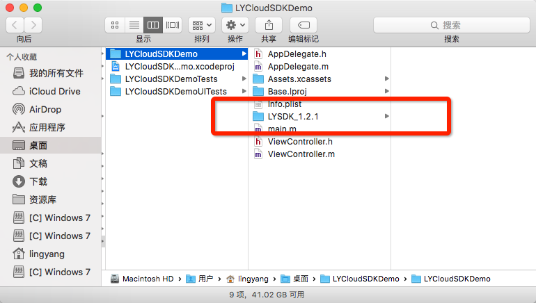

#羚羊云iOS SDK使用说明
##一、概述
本SDK可供iOS平台下的应用调用，为开发者提供接入羚羊视频云的开发接口，使开发者能够轻松实现视频相关的应用。羚羊视频云在视频传输和云存储领域有着领先的开发技术和丰富的产品经验,设计了高质量、宽适应性、分布式、模块化的音视频传输和存储云平台。SDK为上层应用提供简单的[API接口](http://doc.topvdn.com/api/#!public-doc/SDK-iOS/ios_api.md)，实现直播推流、直播播放、云端录像播放、消息透传、视频通话等功能。

##二、功能概要


- **直播推流**：将iOS系统设备采集到的音视频数据进行编码，通过羚羊云自主研发的QSTP网络协议推送到羚羊云，以供终端用户观看直播或云端存储录像。支持自主设置分辨率、码率、帧率、编码类型等视频参数。

- **播放器**：支持播放直播流和云端录像流，网络拉流采用羚羊云自主研发的基于UDP的QSUP协议和基于TCP的QSTP协议，能够达到快速开流、低延时、高清画质的播放效果。

- **消息透传**：提供客户端与客户端之间、客户端与服务端之间进行自定义消息格式通讯的能力。

- **视频通话**：客户端之间通过羚羊云自主研发的QSUP协议建立连接，相互发送接收数据进行视频通话。

##三、功能特性
| ID | 功能特性 |
|----|----|
| 1  | 支持 H.264 和 OPUS硬编(推荐) |
| 2  | 支持 H.264 和 AAC 软编 |
| 3  | 支持 H.264 和 AAC 硬编 |
| 4  | 支持羚羊云自定义网络协议QSTP进行推流 |
| 5  | 支持羚羊云自定义网络协议QSUP进行推流 |
| 6  | 支持带存储的直播 |
| 7  | 支持自主设置分辨率、码率、帧率 |
| 8  | 支持手机摄像头推流 |
| 9  | 支持手机前置摄像头和后置摄像头切换 |
| 10 | 支持手机闪光灯的开启 |
| 11 | 支持获取实时采集帧数据和图片 |
| 12 | 支持羚羊云自定义网络协议QSUP进行播放 |
| 13 | 支持羚羊云自定义网络协议QSTP进行播放 |
| 14 | 支持实时获取流媒体信息参数 |
| 15 | 支持实时获取播放流截图 |
| 16 | 支持本地录制播放流并保存为视频 |
| 17 | 支持云存储录像点播 |
| 18 | 支持录像点播实时定位播放 |
| 19 | 支持录像点播获取实时播放时间 |

##四、开发准备
###4.1 接入准备
如果您对我们的产品不熟悉，可通过阅读[《羚羊云SDK接入指南》](http://doc.topvdn.com/api/#!public-doc/integration.md)了解SDK和羚羊云之间的整体服务架构以及如何接入到羚羊云。[点击这里](http://doc.topvdn.com/api/#!public-doc/integration.md)即可进入。

###4.2 SDK的获取
[点击这里获取](https://github.com/AntelopeExpress/public-doc/tree/master/SDK-iOS "获取SDK")

###4.3 SDK支持的系统版本
支持的IOS 8.0以上版本。

###4.4 SDK库结构
SDK包内的文件简要说明如下： 
libLYCloudSDK.a整个SDK静态库文件，包含所有SDK功能；
include文件夹：SDK所需要导入的头文件目录；
Version.txt 更新日志文件。

###4.5 SDK的集成
 
####4.5.1 拖拽方式
将下载好的SDK文件夹(LYSDK_X.X.X)拖入到项目中，并勾选上Destination：


####4.5.2 拷贝方式
1、首先拷贝SDK到所需项目目录下：



2、然后 Xcode左侧右键点击


3、最后选择目录下SDK文件夹点击Add


####4.5.3 添加依赖库


说明：SDK底层是C++实现，所以需要添加libstdc++.tbd文件(如果使用的是xcode7以下版本，后缀为dylib)；VideoToolbox.framework是硬编解码所需要，如果不使用硬编解码可不添加。
####4.5.4 修改Enable BitCode
SDK暂不支持bitcode，所以需要设置Enabel BitCode为NO：


####4.5.5 其他设置
1)在 Build Settings - Other Linker Flags 里，添加选项 -ObjC。
2)如果您的工程需要使用 C++ ，在 Build Setting - Apple LLVM 7.0 - Language - C++ - C++ Standard Library 里， 设置值为 libstdc++ (GNU C++ standard library)。
3)在工程配置infof.plist文件中，添加条目 NSAppTransportSecurity ，属性设为 Dictionary。在此条目下添加键值对，key 为 NSAllowsArbitraryLoads, 值为 YES。
 
####4.5.6 编译工程
以上步骤进行完成以后，编译工程，如果没有报错，恭喜你！集成羚羊云iOS SDK成功！接下来可以开启炫酷的视频播放操作。

##五、功能集成
本章节介绍如何调用[SDK的API接口](http://doc.topvdn.com/api/#!public-doc/SDK-iOS/ios_api.md)来实现直播推流、播放器、消息透传的功能。

##5.1 &nbsp;启动云服务
启动羚羊云服务，该接口函数分配并初始化本地系统资源，登录到羚羊云平台，在平台端进行安全认证。

```
[[LYCloudService sharedLYCloudService] startCloudService: m_token
                                                  config: m_config
                                              startBlock: ^(LYstatusCode statusCode, NSString *errorString)
                                                        {
                                                            //启动云服务的成功与否状态回调
                                                        }
                                         popMessageBlock: ^(NSDictionary *dictionary)
                                                        {
                                                            //平台透传的所有消息都从这回调出来
                                                        }
];
```
**注意**：其他接口必须在此接口被调用成功之后才能调用。

##5.2 &nbsp;停止云服务
 
```
[[LYCloudService sharedLYCloudService] stopCloudService];
```
在应用退出的时候调用，释放系统资源。

##5.3 &nbsp;消息透传
当应用客户端使用SDK接入到羚羊云后，可以向同样接入到羚羊云的另外一端的应用客户端，互相传递他们之间协定的网络消息。这些消息对于羚羊云来说是透明的，羚羊云只提供消息传递的通道。

该功能可以有如下应用场景：
(1)在移动终端的应用中读取或更改接入到羚羊云中的私人摄像设备的参数。
(2)在移动终端的应用中监听各个摄像设备的在线状态变化。

在启动云服务时设置popMessageBlock回调，可以监听从云平台传送过来的消息，在popMessageBlock回调函数中您可以处理消息并选择是否回应消息给对方。
```
popMessageBlock:^(NSDictionary *dictionary) {
    //处理平台消息
    //…
}
```
**注意**：
(1)消息最大长度为256个字节;
(2)本SDK只提供了监听消息的功能，当对方有消息到来的时候，本方会通过回调函数通知到应用层的SDK调用者，应用层可以对该消息进行处理以及回应该消息至对端的客户端。
推送消息或者回应消息并不属于本SDK的功能范畴，需要调用羚羊云提供的[Web API接口](http://doc.topvdn.com/api/#!web_api_v2.md)“设备推送消息”。

##5.4 &nbsp;直播推流


`注`：直播推流支持云存储功能：在推流的过程中将音视频流存储在羚羊云，以供用户回放录像。 具体方法参照[推流API](http://doc.topvdn.com/api/#!public-doc/SDK-iOS/ios_api.md#3.3_%E5%BC%80%E5%A7%8B%E7%9B%B4%E6%92%AD)。
 
####5.4.1 设置流参数

```
//该方法生成一个默认的视频采集配置
videoSize = (640, 480);
frameRate = 30fps, bitrate = 512kbps;
LYVideoStreamingConfiguration *mVideoConfig = [LYVideoStreamingConfiguration defaultConfiguration];
    
//该方法生成一个默认的音频采集配置。
sampleRate = 11025, channle = 1, birrate = 128kpbs;
LYAudioStreamingConfiguration *mAudioConfig = [LYAudioStreamingConfiguration defaultConfiguration];
```
Configuration类配置直播推流的参数，包括是否使用音、视频，是否使用硬编码，视频旋转角度等多种配置，用户可根据需要查看更多进行配置。
**注意**：更多的参数配置详见[API手册](http://doc.topvdn.com/api/#!public-doc/SDK-iOS/ios_api.md)中的数据类型-直播推流相关属性配置。

####5.4.2 初始化直播类
```
//初始化直播类:如果不采集音频，则audioConfiguration传nil即可
LYLiveBroadcast *mLiving = [[LYLiveBroadcast alloc] initWithVideoConfiguration:mVideoConfig audioConfiguration:mAudioConfig]; 
```

####5.4.3 设置本地预览视图
```
//设置采集视频预览view
[mLiving setPreview:self.preview frame:CGRectMake(0, 0, kScreenWidth, kScreenHeight)];
```

####5.4.4 开始直播
```
//直播资源的准备，返回 statusCode == LYstatusCodeSuccess 才可以推流
[mLiving startLiveBroadcast:LYLiveBroadcastModeLiving token:mLiveAddress startBlock:^(LYstatusCode statusCode, NSString *errorString) {
    if (LYstatusCodeSuccess == statusCode) {
        //直播资源准备完成，可以开始推流；
    }
}];
```

####5.4.5 开始推流直播
```
[mLiving startSendVideoData];
[mLiving startSendAudioData];
```
**注意**：直播推流暂不支持单独推音频流，开始推流的时候一定要音视频流一起开启，否则播放端拉不到视频流无法播放

####5.4.6 结束推流直播
```
[mLiving stopLiveBroadcast];
```

####5.4.7 释放资源
```
[mLiving destroy];
```

##5.5 &nbsp;播放器

 
####5.5.1 创建播放器类
```
LYPlayer *m_player = [[LYPlayer alloc] init];
```

####5.5.2 创建播放配置
```
LYPlayerConfiguration *m_playerConfig = [[LYPlayerConfiguration alloc] initWithPlayView:playview
                                                                                  frame:CGRectMake(0, 0, 640  , 480)
                                                                             decodeMode:LYPlayerDecodeModeHard];
```

####5.5.3 设置播放配置
```
[m_player setViewWithConfiguration:m_playerConfig];
```

####5.5.4 打开播放器
```
[m_player open: @"topvdn://203.195.157.248:80?protocolType=1&token=1003182_3222536192_1467302400_b862e6a09c7c12022794a18aa61e71bb"
    openStatus: ^(LYstatusCode statusCode, NSString *errorString) {
        //打开播放器的状态回调
    }
  playerStatus: ^(NSDictionary *playerMessageDic) {
        //播放过程中的状态回调
    }
];

```
播放地址由应用向应用后台获取。
应用后台生成播放源url的方法和步骤如下：

(1)调用[Web API的'查询设备状态'接口](http://doc.topvdn.com/api/#!web_api_v2.md#2.1.1_%E6%9F%A5%E8%AF%A2%E8%AE%BE%E5%A4%87%E7%8A%B6%E6%80%81)获取羚羊云的tracker ip/port或者relay ip/port；

(2)根据[羚羊云token格式](http://doc.topvdn.com/api/#!public-doc/token_format.md)生成token；

(3)按照[羚羊云URL格式解析](http://doc.topvdn.com/api/#!public-doc/url_format.md)生成羚羊云格式的URL。

####5.5.5 关闭播放器
```
[m_player close];
```

####5.5.6 播放控制
#####视频截图
```
[m_player snapshot: m_path
            status: ^(LYstatusCode statusCode, NSString *errorString) {}
];
```
#####视频录制
```
//开始录制
[m_player startLocalRecord:m_path status:^(LYstatusCode statusCode, NSString *errorString) {
    
}];

//结束录制
[m_player stopLocalRecord];
```
#####声音开关
```
//开启声音
[m_player unmute];
//关闭声音
[m_player mute];
```

#####对讲开关
```
//开启对讲
- (void)startTalkWithSampleRate: (NSInteger)sampleRate channel: (NSInteger)channel;
//停止对讲
- (void)stopTalk;
```

#####获取流媒体参数
```
[m_player getMediaParam:LYStreamMediaParamVideoAverageDownloadSpeed];
```

##5.6 &nbsp;视频通话

 
####5.6.1 设置流参数

```
//该方法生成一个默认的视频采集配置
videoSize = (640, 480);
frameRate = 15fps, bitrate = 400kbps;
LYVideoStreamingConfiguration *mVideoConfig = [LYVideoStreamingConfiguration defaultConfiguration];
    
//该方法生成一个默认的音频采集配置。
sampleRate = 16000, channle = 1;
LYAudioStreamingConfiguration *mAudioConfig = [LYAudioStreamingConfiguration defaultConfiguration];
```
Configuration类配置视频通话推流的参数，包括是否使用音、视频，是否使用硬编码，视频旋转角度等多种配置，用户可根据需要查看更多进行配置。
**注意**：更多的参数配置详见[API手册](http://doc.topvdn.com/api/#!public-doc/SDK-iOS/ios_api.md)中的数据类型-视频通话推流相关属性配置。

####5.6.2 初始化视频通话类
```
//初始化直播类:如果不采集音频，则audioConfiguration传nil即可
LYFaceTime * mFaceTime = [[LYFaceTime alloc] initWithVideoConfiguration:mVideoConfig audioConfiguration:mAudioConfig]; 
```

####5.6.3 设置播放参数
```
//如果不需要播放对方视频则不设置该参数
LYPlayerConfiguration *mPlayerConfig = [[LYPlayerConfiguration alloc] initWithPlayView:mPlayView frame:CGRectMake(0, 0, kScreenWidth, kScreenHeight) decodeMode:LYPlayerDecodeModeHard];
[mFaceTime setPlayView:mFaceTimeAddress playerConfiguration:mPlayerConfig]; 
```

####5.6.4 设置本地预览视图
```
//设置采集视频预览view：如果不预览自己视频则不设置
[mFaceTime setPreview:self.preview frame:CGRectMake(0, 0, kScreenWidth, kScreenHeight)];
```

####5.6.5 建立连接
发起视频通话的一方不需要调用建立连接接口，5.6.4步骤完成即可；以下连接步骤针对于收到连接地址的一方
**注意**：连接地址第三方后台透传或者推送得到。

```
[mFaceTime open: mFaceTimeAddress openStatus:^(LYstatusCode statusCode, NSString *errorString) {
    NSLog(@"open statusCode = %d, errorString = %@", statusCode, errorString);
    //连接是否成功的状态回调，只有statusCode == LYstatusCodeSuccess才可以进行推流等操作。
    //开始推流
} playerStatus:^(NSDictionary *playerMessageDic) {
    NSLog(@"playerMessageDic = %@", playerMessageDic);
    //该回调目前无回调信息。
}];
```

####5.6.6 开始推流
```
[mFaceTime startSendVideoData];
[mFaceTime startSendAudioData];
```

####5.6.7 改变码率
```
//视频通话过程中可以根据当前带宽设置合适的推流码率，下行码率需要消息告诉通话对方降低码率。
[mFaceTime setVideoEncodeBitrateLevel: LYVideoStreamingQualityModeLevelMedium];
```

####5.6.8 关闭通话
```
//主被叫关闭通话都要调用该方法！！！！！！
[mFaceTime close:mFaceTimeAddress];
```

####5.6.9 释放资源
```
[mFaceTime destroy];
```

##六、注意事项
 
1. sdk只支持iOS 8.0以上的版本； 
2. 播放器打开之后就不能重新设置解码方式；
3. 音视频流配置类生产的类方法均不是单例，每次调用都会生成一个新的配置；
4. 直播推流暂不支持单独推音频流，开始推流的时候一定要音视频流一起开启，否则播放端拉不到视频流无法播放；
5. 功能模块代码务必按照使用说明流程中的进行，否则会不能正常实现；
6. 推流暂不支持动态切换分辨率，可支持动态切换码率。

##七、常见问题
 
1. 我调用了SDK的接口，但是始终无法实现该接口的功能。
答:请检查平台是否启动。

2. 成功启动云服务，调用推流接口成功，但是无音视频数据采集。
答:请检查摄像头已经麦克风权限是否得到授权。

3. 启动云服务、播放器接口异常返回。
答:请检查参数的正确性。

##八、更新历史


2.0.12 sdk更新日期20160705 11：35
更新说明：1、解决直播进入后台崩溃；

2.0.11 sdk更新日期20160701 17：00
更新说明：1、增加视频监控支持IPV6；
        2、解决摄像头切换分辨率花屏的问题；
        3、解决部分录像下载失败的问题；
        4、录像下载增加身份验证。

2.0.9 sdk更新日期20160629 11：07
更新说明：1、适配开始视频通话之后才设置播放view的展示；
        2、修改历史播放的卡顿问题。

2.0.7 sdk更新日期20160628 17：07
更新说明：1、解决私有播放已经优化细节问题；


2.0.6 sdk更新日期20160622 15：49
更新说明：1、解决Rokid编译不通过的问题；


2.0.4 sdk更新日期20160617 11：30
更新说明：1、优化视频通话；


2.0.3 sdk更新日期20160616 11：00
更新说明：1、解决视频通话音频采集导致应用音频播放失败；
        2、其他优化。

2.0.2 sdk更新日期20160615 17：00
更新说明：1、解决视频通话被叫断开再次视频通话失败的问题；
        2、解决上一版本重复进入视频通话和直播崩溃的问题；
        3、历史播放增加Seek实现。
该版本特别注意：直播和视频通话过程中不支持分辨率参数的切换；(即reset接口无效)。

2.0.1 sdk更新日期20160608 16：23
更新说明：1、增加视频通话本地录像功能；
        2、修复观看直播断流情况下还播放的问题；


2.0.0 sdk更新日期20160607 11：00
更新说明：1、修复音频回传问题；
        2、修复摄像头切换预览消失的问题；
        3、修复播放器close不移除GLKView的问题。

1.2.3 sdk更新日期20160531 11：20
更新说明：解决播放器有的回调不在主线程的问题。

1.2.2 sdk更新日期20160530 16：00
更新说明：修改手机直播编码为硬编。
 
V1.2.1 sdk更新日期2016.05.16 17：00
  1. 修改视频通话播放器设置为配置类形式；
  2. 修改互联发起方调用流程：
    2.1 进入互联发起方控制器类之后获取默认音视频配置类对象；
    2.2 创建互联类对象：传入参数为2.1获取到的音视频类对象；
    2.3 设置预览view接口调用显示预览画面；(如果不需要预览跳过此步)
    2.4 创建播放器配置类对象；(一定要传入正确的参数，否则观看不到对方视频)；
    2.5 调用设置播放器配置的接口；(可以在界面交互逻辑之后调用)
    2.6 上述步骤完成主动方操作就完成。当连接成功被动方时画面就主动显示出来。
  3. 修改打开视频通话播放器接口：去除参数中的解码方式；
  4. 加视频通话过程中动态切换传输码率接口：可设置(普通、标清、高清三个等级)
  5. 增加打开闪光灯接口；
  6. 该版本视频通话播放器截图、录像以及获取流媒体信息接口暂时不作用；采集重设音视频采集参数暂时不作用。请熟知！

**特别说明**
启动云服务的config串用下面的串：
[Config]\r\nIsDebug=1\r\nIsCaptureDev=1\r\nIsPlayDev=1\r\nIsSendBroadcast=0\r\nUdpSendInterval=2\r\nSendPacketBufferLength=1408\r\nRecvPacketBufferLength=1408\r\n[Tracker]\r\nCount=3\r\nIP1=121.42.156.148\r\nPort1=80\r\nIP2=182.254.149.39\r\nPort2=80\r\nIP3=203.195.157.248\r\nPort3=80\r\n[RealtimeModeConfig]\r\nLongConncettionServerIP=223.202.103.146\r\nLongConncettionServerPort=8088\r\nDebugServerIP=120.24.56.51\r\nDebugServerPort=41234\r\nRealtimeModeConfigString=00000000000000\r\nPlayerDataBufferDelayLength=6

V1.1.2 sdk更新日期2016.5.5 18：05
  1. 修改不启动预览自动开启采集；
  2. 修改切换前后置摄像头问题。

V1.1.1 sdk更新日期2016.4.29 17:00
  1. 改版后的第一版SDK。


## 相关链接
[羚羊云SDK-iOS版API](http://doc.topvdn.com/api/index.html#!public-doc/SDK-iOS/ios_api.md)
[羚羊云SDK接入指南](http://doc.topvdn.com/api/index.html#!public-doc/integration.md)
[羚羊云token认证机制](http://doc.topvdn.com/api/index.html#!public-doc/token_format.md)
[羚羊云推拉流URL格式解析](http://doc.topvdn.com/api/index.html#!public-doc/url_format.md)
[羚羊云WebAPI使用指南](http://doc.topvdn.com/api/#!web_api_v2.md)
