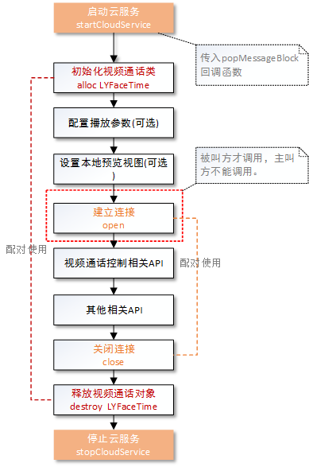

#羚羊云iOS SDK示例-视频通话

声明：本示例仅仅展示了SDK视频通话接口的调用方法和示例，若想实现完整的视频通话应用请参考[羚羊云视频通话应用开发](http://doc.topvdn.com/api/index.html#!public-doc/appfunc_facetime.md)。

## 接口调用流程
在使用本示例实现视频通话的功能之前，必须先完成[开启羚羊云服务](http://doc.topvdn.com/api/#!public-doc/SDK-iOS/ios_guide_cloudservice.md)接口的调用。


 
##1. 创建并初始化视频通话对象
```
//该方法生成一个默认的视频采集配置
videoSize = (640, 480);
frameRate = 15fps, bitrate = 400kbps;
LYVideoStreamingConfiguration *mVideoConfig = [LYVideoStreamingConfiguration defaultConfiguration];
    
//该方法生成一个默认的音频采集配置。
sampleRate = 16000, channle = 1;
LYAudioStreamingConfiguration *mAudioConfig = [LYAudioStreamingConfiguration defaultConfiguration];

//初始化直播类:如果不采集音频，则audioConfiguration传nil即可
LYFaceTime * mFaceTime = [[LYFaceTime alloc] initWithVideoConfiguration:mVideoConfig audioConfiguration:mAudioConfig]; 
```
Configuration类配置视频通话推流的参数，包括是否使用音、视频，是否使用硬编码，视频旋转角度等多种配置，用户可根据需要查看更多进行配置。
**注意**：更多的参数配置详见[API手册](http://doc.topvdn.com/api/#!public-doc/SDK-iOS/ios_api.md)中的数据类型-视频通话推流相关属性配置。

##2. 设置播放参数
```
//如果不需要播放对方视频则不设置该参数
LYPlayerConfiguration *mPlayerConfig = [[LYPlayerConfiguration alloc] initWithPlayView:mPlayView frame:CGRectMake(0, 0, kScreenWidth, kScreenHeight) decodeMode:LYPlayerDecodeModeHard];
[mFaceTime setPlayView:mFaceTimeAddress playerConfiguration:mPlayerConfig]; 
```

##3. 设置本地预览视图
```
//设置采集视频预览view：如果不预览自己视频则不设置
[mFaceTime setPreview:self.preview frame:CGRectMake(0, 0, kScreenWidth, kScreenHeight)];
```

##4. 建立通话连接
发起视频通话的一方不需要调用建立连接接口，5.6.4步骤完成即可；以下连接步骤针对于收到连接地址的一方
**注意**：连接地址第三方后台透传或者推送得到。

```
[mFaceTime open: mFaceTimeAddress openStatus:^(LYstatusCode statusCode, NSString *errorString) {
    NSLog(@"open statusCode = %d, errorString = %@", statusCode, errorString);
    //连接是否成功的状态回调，只有statusCode == LYstatusCodeSuccess才可以进行推流等操作。
    //开始推流
} playerStatus:^(NSDictionary *playerMessageDic) {
    NSLog(@"playerMessageDic = %@", playerMessageDic);
    //该回调目前无回调信息。
}];
```

##5. 开始推流
```
[mFaceTime startSendVideoData];
[mFaceTime startSendAudioData];
```

##6. 改变码率
```
//视频通话过程中可以根据当前带宽设置合适的推流码率，下行码率需要消息告诉通话对方降低码率。
[mFaceTime setVideoEncodeBitrateLevel: LYVideoStreamingQualityModeLevelMedium];
```

##7. 关闭通话
```
//主被叫关闭通话都要调用该方法！！！！！！
[mFaceTime close:mFaceTimeAddress];
```

##8. 释放视频通话对象
```
[mFaceTime destroy];
```

#### 相关链接
[羚羊云SDK接入指南](http://doc.topvdn.com/api/index.html#!public-doc/start_joinup.md)
[羚羊云token认证机制](http://doc.topvdn.com/api/index.html#!public-doc/token_format.md)
[羚羊云推拉流URL格式解析](http://doc.topvdn.com/api/index.html#!public-doc/url_format.md)
[羚羊云WebAPI使用指南](http://doc.topvdn.com/api/#!web_api_v2.md)
