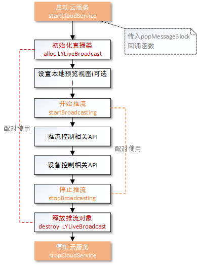

#羚羊云iOS SDK示例-直播推流

声明：本示例仅仅展示了SDK直播推流接口的调用方法和示例，若想实现完整的视频直播应用请参考[羚羊云视频直播应用开发](http://doc.topvdn.com/api/index.html#!public-doc/appfunc_livevideo.md)。

## 接口调用流程
在使用本示例实现直播推流的功能之前，必须先完成[开启羚羊云服务](http://doc.topvdn.com/api/#!public-doc/SDK-iOS/ios_guide_cloudservice.md)接口的调用。



`注`：直播推流支持云存储功能：在推流的过程中将音视频流存储在羚羊云，以供用户回放录像。 具体方法参照[推流API](http://doc.topvdn.com/api/#!public-doc/SDK-iOS/ios_api_livepush.md)。
 
##1. 设置流参数

```
//该方法生成一个默认的视频采集配置
videoSize = (640, 480);
frameRate = 30fps, bitrate = 512kbps;
LYVideoStreamingConfiguration *mVideoConfig = [LYVideoStreamingConfiguration defaultConfiguration];
    
//该方法生成一个默认的音频采集配置。
sampleRate = 11025, channle = 1, birrate = 128kpbs;
LYAudioStreamingConfiguration *mAudioConfig = [LYAudioStreamingConfiguration defaultConfiguration];
```
Configuration类配置直播推流的参数，包括是否使用音、视频，是否使用硬编码，视频旋转角度等多种配置，用户可根据需要查看更多进行配置。
**注意**：更多的参数配置详见[API手册](http://doc.topvdn.com/api/#!public-doc/SDK-iOS/ios_api.md)中的数据类型-直播推流相关属性配置。

##2. 初始化直播类
```
//初始化直播类:如果不采集音频，则audioConfiguration传nil即可
LYLiveBroadcast *mLiving = [[LYLiveBroadcast alloc] initWithVideoConfiguration:mVideoConfig audioConfiguration:mAudioConfig]; 
```

##3. 设置本地预览视图
```
//设置采集视频预览view
[mLiving setPreview:self.preview frame:CGRectMake(0, 0, kScreenWidth, kScreenHeight)];
```

##4. 开始直播
```
//直播资源的准备，返回 statusCode == LYstatusCodeSuccess 才可以推流
[mLiving startLiveBroadcast:LYLiveBroadcastModeLiving token:mLiveAddress startBlock:^(LYstatusCode statusCode, NSString *errorString) {
    if (LYstatusCodeSuccess == statusCode) {
        //直播资源准备完成，可以开始推流；
    }
}];
```

##5. 开始推流直播
```
[mLiving startSendVideoData];
[mLiving startSendAudioData];
```
**注意**：直播推流暂不支持单独推音频流，开始推流的时候一定要音视频流一起开启，否则播放端拉不到视频流无法播放

##6. 结束推流直播
```
[mLiving stopLiveBroadcast];
```

##7. 释放资源
```
[mLiving destroy];
```

#### 相关链接
[羚羊云SDK服务架构](http://doc.topvdn.com/api/index.html#!public-doc/start_archit.md)
[羚羊云SDK接入指南](http://doc.topvdn.com/api/index.html#!public-doc/start_joinup.md)
[羚羊云token认证机制](http://doc.topvdn.com/api/index.html#!public-doc/token_format.md)
[羚羊云推拉流URL格式](http://doc.topvdn.com/api/index.html#!public-doc/url_format.md)
