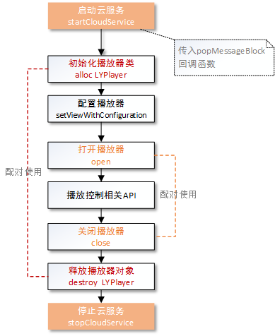

#羚羊云iOS SDK示例-播放器

声明：本示例仅仅展示了SDK播放器接口的调用方法和示例，若想实现完整的播放器应用请参考[羚羊云视频直播应用开发](http://doc.topvdn.com/api/index.html#!public-doc/appfunc_livevideo.md)。

##接口调用流程
在使用本示例实现播放器的功能之前，必须先完成[开启羚羊云服务](http://doc.topvdn.com/api/#!public-doc/SDK-iOS/ios_guide_cloudservice.md)接口的调用。


 
##1. 创建播放器类
```
LYPlayer *m_player = [[LYPlayer alloc] init];
```

##2. 设置播放配置
```
LYPlayerConfiguration *m_playerConfig = [[LYPlayerConfiguration alloc] initWithPlayView:playview
                                                                                  frame:CGRectMake(0, 0, 640  , 480)
                                                                             decodeMode:LYPlayerDecodeModeHard];
//配置播放器
[m_player setViewWithConfiguration:m_playerConfig];
```

##3. 打开播放器
```
[m_player open: @"topvdn://203.195.157.248:80?protocolType=1&token=1003182_3222536192_1467302400_b862e6a09c7c12022794a18aa61e71bb"
    openStatus: ^(LYstatusCode statusCode, NSString *errorString) {
        //打开播放器的状态回调
    }
  playerStatus: ^(NSDictionary *playerMessageDic) {
        //播放过程中的状态回调
    }
];

```
播放地址由应用向应用后台获取。应用后台生成播放源url的方法和步骤如下：
(1)调用[Web API的'查询设备状态'接口](http://doc.topvdn.com/api/index.html#!public-doc/Web-API/web_api_v2_deviceinfo.md)获取羚羊云的tracker ip/port或者relay ip/port；
(2)根据[羚羊云token格式](http://doc.topvdn.com/api/#!public-doc/token_format.md)生成token；
(3)按照[羚羊云URL格式解析](http://doc.topvdn.com/api/#!public-doc/url_format.md)生成羚羊云格式的URL。

##4. 关闭播放器
```
[m_player close];
```

##5. 播放控制
###5.1 视频截图
```
[m_player snapshot: m_path
            status: ^(LYstatusCode statusCode, NSString *errorString) {}
];
```
###5.2 视频录制
```
//开始录制
[m_player startLocalRecord:m_path status:^(LYstatusCode statusCode, NSString *errorString) {
    
}];

//结束录制
[m_player stopLocalRecord];
```
###5.3 声音开关
```
//开启声音
[m_player unmute];
//关闭声音
[m_player mute];
```

###5.4 对讲开关
```
//开启对讲
- (void)startTalkWithSampleRate: (NSInteger)sampleRate channel: (NSInteger)channel;
//停止对讲
- (void)stopTalk;
```

###5.5 获取流媒体参数
```
[m_player getMediaParam:LYStreamMediaParamVideoAverageDownloadSpeed];
```

#### 相关链接
[羚羊云SDK服务架构](http://doc.topvdn.com/api/index.html#!public-doc/start_archit.md)
[羚羊云SDK接入指南](http://doc.topvdn.com/api/index.html#!public-doc/start_joinup.md)
[羚羊云token认证机制](http://doc.topvdn.com/api/index.html#!public-doc/token_format.md)
[羚羊云推拉流URL格式](http://doc.topvdn.com/api/index.html#!public-doc/url_format.md)
