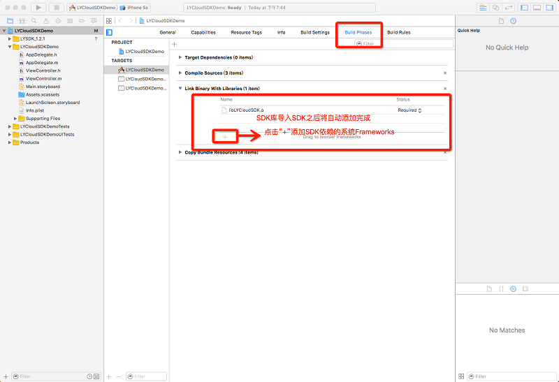
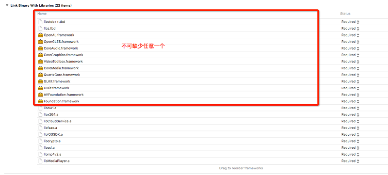

#羚羊云iOS SDK集成准备

##1. SDK的获取
[点击这里获取](http://doc.topvdn.com/api/public-doc/SDK-iOS/zipdown/ly_sdk_ios.zip "获取SDK")

##2. SDK支持的系统版本
支持的IOS 8.0以上版本。

##3. SDK库结构
SDK包内的文件简要说明如下： 
libLYCloudSDK.a整个SDK静态库文件，包含所有SDK功能；
include文件夹：SDK所需要导入的头文件目录；
Version.txt 更新日志文件。

##4. SDK的集成
 
###4.1 拖拽方式
将下载好的SDK文件夹(LYSDK_X.X.X)拖入到项目中，并勾选上Destination：

###4.2 拷贝方式
1、首先拷贝SDK到所需项目目录下：

2、然后 Xcode左侧右键点击

3、最后选择目录下SDK文件夹点击Add

###4.3 添加依赖库

说明：SDK底层是C++实现，所以需要添加libstdc++.tbd文件(如果使用的是xcode7以下版本，后缀为dylib)；VideoToolbox.framework是硬编解码所需要，如果不使用硬编解码可不添加。
###4.4 修改Enable BitCode
SDK暂不支持bitcode，所以需要设置Enabel BitCode为NO：

###4.5 其他设置
1)在 Build Settings - Other Linker Flags 里，添加选项 -ObjC。
2)如果您的工程需要使用 C++ ，在 Build Setting - Apple LLVM 7.0 - Language - C++ - C++ Standard Library 里， 设置值为 libstdc++ (GNU C++ standard library)。
3)在工程配置infof.plist文件中，添加条目 NSAppTransportSecurity ，属性设为 Dictionary。在此条目下添加键值对，key 为 NSAllowsArbitraryLoads, 值为 YES。
 
###4.6 编译工程
以上步骤进行完成以后，编译工程，如果没有报错，恭喜你！集成羚羊云iOS SDK成功！接下来可以开启炫酷的视频播放操作。
