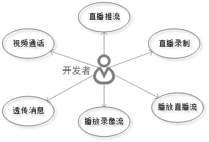

#羚羊云Web API功能概要
##1. 概述
本文档描述羚羊云Web接口，这些接口为视频相关的应用开发者提供设备在线信息查询服务、自定义消息推送服务、云端录像查询服务、云端录像剪辑服务、文件上传管理服务以及云端数据管理服务。

##2. 相关名词
- **`应用服务器`**
用户开发的服务端应用程序，为客户端程序提供后台数据、后台业务处理等服务。
- **`应用客户端`**
用户开发的客户端应用程序，如手机app、PC桌面应用、嵌入在智能硬件设备中的应用程序等等。
- **`设备`**
接入到羚羊云的程序化设备，承载着用户开发的`客户端应用程序`，从视频流向的角度不同可分为推流设备和拉流设备。
- **`设备token`**
本方设备所携带的token称为设备token。
- **`访问token`**
对端设备的token称为访问token。
- **`循环式录像`**
推流设备在推流到羚羊云的过程中，不间断循环将音视频流存储在羚羊云，存储期限可配置为7天、30天等，若超过存储期限，将会覆盖最旧的存储数据。录像的存在既有以时间轴形式体现，也有以录像文件列表形式体现。
- **`事件式录像`**
推流设备在推流到羚羊云的过程中，只在有外部产生某种事件时，才会触发将音视频数据存储在羚羊云，存储体现的形式为录像文件列表。

##3. 功能概要

- **设备在线信息查询**：获取指定设备的在线状态、内网ip、公网ip、流媒体转发服务ip及调度服务器ip、封面截图URL等网络节点地址信息。

- **自定义消息推送**：支持一个设备和多个设备之间的自定义消息推送，支持应用服务器推送消息至多个应用客户端。

- **云端录像查询**：获取设备存储在羚羊云的循环式录像时间轴、录像文件列表。

- **云端录像剪辑**：对云端的录像进行剪辑以及对剪辑任务的管理。

- **文件上传管理**：将文件上传羚羊云，可以上传图片、短视频文件等。

- **云端数据管理**：清理或删除指定设备存储在羚羊云的数据。这些数据包括录像文件、图片文件、短视频文件等。

##4. 功能特性
| ID | 功能特性 | 功能使用对象 |
|----|----|----|
| 1  | 获取指定设备的在线状态、内网ip、公网ip等地址信息 | 应用服务器 |
| 2  | 获取指定设备所在的流媒体转发服务器ip、调度服务器ip、封面截图URL等网络节点地址信息 | 应用服务器 |
| 3  | 获取设备存储在羚羊云的循环式录像时间轴、录像文件列表 | 应用客户端 |
| 4  | 获取设备因某个事件而存储至羚羊云的录像文件列表以及事件列表 | 应用客户端 |
| 5  | 新建对云端的录像进行剪辑的任务 | 应用客户端 |
| 6  | 查询已剪辑的任务列表 | 应用客户端 |
| 7  | 查询指定剪辑任务的任务状态 | 应用客户端 |
| 8  | 获取指定剪辑任务的录像地址 | 应用客户端 |
| 9  | 删除指定剪辑任务 | 应用客户端 |
| 10 | 支持一个设备和多个设备之间的自定义消息推送 | 应用客户端 |
| 11 | 支持应用服务器推送消息至多个应用客户端 | 应用服务器 |
| 12 | 支持羚羊云内部'设备推送消息成功'后会发送HTTP请求到Web API调用者事先指定的Http回调服务地址 | 应用服务器 |
| 13 | 支持羚羊云内部'录像剪辑完毕'后会发送HTTP请求到Web API调用者事先指定的Http回调服务地址 | 应用服务器 |
| 14 | 支持羚羊云内部'设备状态变化'后会发送HTTP请求到Web API调用者事先指定的Http回调服务地址 | 应用服务器 |
| 15 | 支持将图片上传至羚羊云 | 应用客户端 |
| 16 | 支持将短视频文件上传至羚羊云 | 应用客户端 |
| 17 | 支持清理指定设备存储在羚羊云的录像数据和图片数据 | 应用服务器 |
| 18 | 支持删除指定设备某时间段内存储在羚羊云的录像数据 | 应用服务器 |
| 19 | 支持删除指定设备某个事件触发的所有录像 | 应用服务器 |
| 20 | 支持删除指定设备某时间段因事件触发的所有录像 | 应用服务器 |
