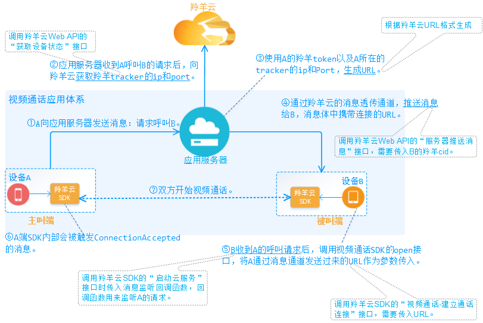

#羚羊云视频通话应用开发

##1. 视频通话应用接入
开发视频通话的应用之前，需将应用先接入羚羊云。(点击[这里](http://doc.topvdn.com/api/index.html#!public-doc/appfunc_joinup.md))

##2. 视频通话开发流程
 

| 步骤序号 | 步骤名称 | 调用接口 |
|:----:| ----    | ----     |
| 第1步   | A向应用服务器发送请求:呼叫B | 属应用层自己的业务，与羚羊云SDK无关，不需要调用接口。 |
| 第2步   | 获取羚羊tracker的ip和端口 | 调用羚羊云Web API的[获取设备状态](http://doc.topvdn.com/api/index.html#!web_api_v2.md#2.1.1_%E6%9F%A5%E8%AF%A2%E8%AE%BE%E5%A4%87%E7%8A%B6%E6%80%81)接口 |
| 第3步 | 生成A的URL | 根据[羚羊云推拉流URL格式-QSUP方式](http://doc.topvdn.com/api/index.html#!public-doc/url_format.md#6_%E6%8E%A8%E6%8B%89%E7%9B%B4%E6%92%AD%E6%B5%81%28QSUP%E6%96%B9%E5%BC%8F%29%E7%A4%BA%E4%BE%8B) |
| 第4步 | 推送消息给B | 调用羚羊云Web API的[服务器推送消息](http://doc.topvdn.com/api/index.html#!web_api_v2.md#2.3.2_%E6%9C%8D%E5%8A%A1%E5%99%A8%E6%8E%A8%E9%80%81%E6%B6%88%E6%81%AF)接口，接口参数需要传入B的羚羊cid。|
| 第5步 | 收到A的呼叫请求 | 在羚羊云SDK的[启动云服务](http://doc.topvdn.com/api/index.html#!public-doc/SDK-iOS/ios_api.md#2.2_%E5%90%AF%E5%8A%A8%E4%BA%91%E6%9C%8D%E5%8A%A1)接口时传入的`消息监听回调函数`来接收并响应处理消息，原理可参见[消息透传](http://doc.topvdn.com/api/index.html#!public-doc/SDK-iOS/ios_guide.md#5.3_%C2%A0%E6%B6%88%E6%81%AF%E9%80%8F%E4%BC%A0)。 |
| 第5步 | 建立通话连接 | 调用羚羊云SDK的"建立通话连接"接口，需要传入A发送过来的URL作为参数。[Android调用方法](http://doc.topvdn.com/api/index.html#!public-doc/SDK-Android/android_api.md#5.3_%E6%89%93%E5%BC%80%E9%93%BE%E6%8E%A5%E5%B9%B6%E6%8E%A8%E9%80%81%E6%95%B0%E6%8D%AE) [iOS调用方法](http://doc.topvdn.com/api/index.html#!public-doc/SDK-iOS/ios_api.md#5.14_%E5%BB%BA%E7%AB%8B%E9%80%9A%E8%AF%9D%E8%BF%9E%E6%8E%A5) |
| 第6步 | A内部触发连接建立成功的消息 | SDK内部自动触发，不需要调用接口。 |
| 第7步 | 双方开始视频通话 | A和B的使用者已经可以互相视频通话，不需要调用接口。 |

##3. 视频通话开发示例
本示例的前提：用户(即开发者)必须先将[应用接入](http://doc.topvdn.com/api/index.html#!public-doc/appfunc_joinup.md)到羚羊云。

###3.1 设备A发送'呼叫B'的消息
这一步是设备A向应用服务器发送'呼叫设备B'的请求，并未涉及到羚羊云SDK的调用，需要用户自己制定消息来完成。需要注意的是，`应用服务器`在这一步之前须存有设备A和设备B的`羚羊cid`以及`羚羊token`。

###3.2 应用服务器获取羚羊tracker的ip和port
应用服务器收到设备A发送的请求消息后，调用羚羊云Web API的'[获取设备状态](http://doc.topvdn.com/api/index.html#!web_api_v2.md#2.1.1_%E6%9F%A5%E8%AF%A2%E8%AE%BE%E5%A4%87%E7%8A%B6%E6%80%81)'接口，调用接口时传入`设备A`的`羚羊cid`，从接口的返回结果中获取到`设备A`所在的羚羊`tracker(调度服务器)的ip和port`。
以下仅展示`curl`方式的Web http请求示例，用户需根据自己应用服务器所采用的开发语言去完成http请求并解析返回的json数据。
```
curl -X POST -H "X-APP-ID: mock" -H "X-APP-Key: mock-app-key-use-your-own-pls" -H "Content-Type: application/json" -d '{
    "cids": [1003538]
}' "http://api.topvdn.com/v2/devices/state?page=1&size=20"
```
请求发送后将返回如下数据：
```
{
    "init_string": "[Config]\r\nIsDebug=1\r\nLocalBasePort=8200\r\nIsCaptureDev=1\r\nIsPlayDev=1\r\nUdpSendInterval=2\r\n[Tracker]\r\nCount=3\r\nIP1=121.42.156.148\r\nPort1=80\r\nIP2=182.254.149.39\r\nPort2=80\r\nIP3=203.195.157.248\r\nPort3=80\r\n[LogServer]\r\nCount=1\r\nIP1=223.202.103.147\r\nPort1=80",
    "devices": [
        {
            "cid": 1003538,
            "state": 4,
            "tracker_ip": "203.195.157.248",
            "tracker_port": 80,
            "public_ip": "14.215.177.37",
            "public_port": 8747,
            "local_ip": "192.168.2.222",
            "local_port": 8732,
            "config_type": 0,
            "conn_key": 1243,
            "relay_ip": "125.91.251.79",
            "relay_port": 80,
            "cover_url": "http://api.topvdn.com/v2/snapshots/1003775/cover?client_token=1003775_0_1452756453_0d78e95edab47e565010f47a0300de2d",
            "rtmp_url": "rtmp://rtmp0-9.public.topvdn.cn/",
            "hls": "http://hls0-9.public.topvdn.cn/hls/<cid>/index.m3u8"
        }
    ],
    "total": 145,
    "size": 20,
    "page": 1,
    "request_id": "2279fa57f4d644c1b333f5ff5ff7a2b7"
}
```
其中的`tracker_ip`和`tracker_port`即设备A的羚羊tracker的ip和port。

###3.3 应用服务器生成设备A的羚羊URL
设备A的羚羊URL用来建立A与B之间传输视频的连接，是实现视频通话的关键。该URL的生成规则参考[QSUP方式推拉流URL](http://doc.topvdn.com/api/index.html#!public-doc/url_format.md#6_%E6%8E%A8%E6%8B%89%E7%9B%B4%E6%92%AD%E6%B5%81%28QSUP%E6%96%B9%E5%BC%8F%29%E7%A4%BA%E4%BE%8B)。
```
topvdn://203.195.157.248:80?protocolType=1&token=1003469_3222536192_1493481600_5574318032e39b62063d98e6bff50069
```
`ip`为设备A的羚羊tracker_ip；
`port` 为设备A的羚羊tracker_port；
`protocolType`为必须为QSUP方式传输视频流；
`token`为设备A的羚羊token。

###3.4 应用服务器推送消息给设备B
应用服务器通过羚羊云的消息通道将设备A的羚羊URL传输给设备B，调用Web API的[服务器推送消息](http://doc.topvdn.com/api/index.html#!web_api_v2.md#2.3.2_%E6%9C%8D%E5%8A%A1%E5%99%A8%E6%8E%A8%E9%80%81%E6%B6%88%E6%81%AF)接口。
以下仅展示`curl`方式的Web http请求示例，用户需根据自己应用服务器所采用的开发语言去完成http请求并解析返回的json数据。
```
curl -X POST -H "Content-Type: application/json" -H "X-APP-ID: Test" -H "X-APP-Key: mock-app-key-use-your-own-pls" -H "Cache-Control: no-cache" -d '{
    "proxy": 0,
    "payload": {
        "msg": "aGVsbG8=",
        "flag": 3,
        "clients": [1003181]
    }
}' "http://api.topvdn.com/v2/message/server/push"
```
`clients`字段的值为**`设备B的羚羊cid`**；
`msg`字段为应用服务器发送的消息体，为base64的编码值，其中包含了`设备A的羚羊URL`。

###3.5 设备B收到设备A的呼叫请求
设备B在调用羚羊云SDK的启动云服务([iOS调用方法](http://doc.topvdn.com/api/index.html#!public-doc/SDK-iOS/ios_api.md#2.2_%E5%90%AF%E5%8A%A8%E4%BA%91%E6%9C%8D%E5%8A%A1) [Android调用方法](http://doc.topvdn.com/api/index.html#!public-doc/SDK-Android/android_api.md#2_%E4%BA%91%E6%9C%8D%E5%8A%A1%E6%8E%A5%E5%8F%A3))接口时传入"消息监听回调函数"，在回调函数中会收到设备A请求的消息，原理可参见[消息透传](http://doc.topvdn.com/api/index.html#!public-doc/SDK-iOS/ios_guide.md#5.3_%C2%A0%E6%B6%88%E6%81%AF%E9%80%8F%E4%BC%A0)。

###3.6 设备B使用设备A的羚羊URL建立视频通话连接
设备B在回调函数中收到设备A的呼叫请求消息，消息体中包含了设备A的羚羊URL，该消息是base64编码，需要解码。从消息体中拿到URL之后调用SDK的"建立通话连接"接口，需要传入设备A的URL作为参数。
[建立通话连接-Android调用方法](http://doc.topvdn.com/api/index.html#!public-doc/SDK-Android/android_api.md#5.3_%E6%89%93%E5%BC%80%E9%93%BE%E6%8E%A5%E5%B9%B6%E6%8E%A8%E9%80%81%E6%95%B0%E6%8D%AE)
[建立通话连接-iOS调用方法](http://doc.topvdn.com/api/index.html#!public-doc/SDK-iOS/ios_api.md#5.14_%E5%BB%BA%E7%AB%8B%E9%80%9A%E8%AF%9D%E8%BF%9E%E6%8E%A5)

###3.7 双方开始视频通话
在上一步设备B调用接口建立通话连接成功后，双方就可以开始视频通话了。

###3.8 结束视频通话连接
若通话的一方想主动停止视频通话则需要调用"关闭视频通话连接"方法；
当对方被动收到ConnectionClosed的消息时也必须调用"关闭视频通话连接"方法。该消息在应用层的"消息监听回调函数"中会被触发。
[关闭视频通话-Android调用方法](http://doc.topvdn.com/api/index.html#!public-doc/SDK-Android/android_api.md#5.4_%E6%96%AD%E5%BC%80%E8%BF%9E%E6%8E%A5)
[关闭视频通话-iOS调用方法](http://doc.topvdn.com/api/index.html#!public-doc/SDK-iOS/ios_api.md#5.15_%E5%85%B3%E9%97%AD%E9%80%9A%E8%AF%9D%E8%BF%9E%E6%8E%A5)

##4. 视频通话接口使用说明
若想详细了解羚羊云Android或iOS平台下的SDK所有视频通话相关接口，请参考以下文档：
[视频通话接口使用说明-Android](http://doc.topvdn.com/api/index.html#!public-doc/SDK-Android/android_guide.md#5.6_%C2%A0%E8%A7%86%E9%A2%91%E9%80%9A%E8%AF%9D)
[视频通话接口使用说明-iOS](http://doc.topvdn.com/api/index.html#!public-doc/SDK-iOS/ios_guide.md#5.6_%C2%A0%E8%A7%86%E9%A2%91%E9%80%9A%E8%AF%9D)
