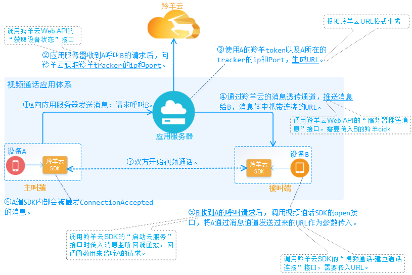

#羚羊云视频通话应用开发

##1. 视频通话应用接入
开发视频通话的应用之前，需将应用先接入羚羊云。(点击[这里](http://doc.topvdn.com/api/index.html#!public-doc/appfunc_joinup.md))

##2. 视频通话开发流程
 

| 序号 | 步骤名称 | 调用接口 |
| ----    | ----    | ----     |
| 第1步   | A向应用服务器发送请求:呼叫B | 属应用层自己的业务，与羚羊云SDK无关，不需要调用接口。 |
| 第2步   | 获取羚羊tracker的ip和端口 | 调用羚羊云Web API的[获取设备状态](http://doc.topvdn.com/api/index.html#!web_api_v2.md#2.1.1_%E6%9F%A5%E8%AF%A2%E8%AE%BE%E5%A4%87%E7%8A%B6%E6%80%81)接口 |
| 第3步 | 生成URL | 根据[羚羊云推拉流URL格式-QSUP方式](http://doc.topvdn.com/api/index.html#!public-doc/url_format.md#6_%E6%8E%A8%E6%8B%89%E7%9B%B4%E6%92%AD%E6%B5%81%28QSUP%E6%96%B9%E5%BC%8F%29%E7%A4%BA%E4%BE%8B) |
| 第4步 | 推送消息给B | 调用羚羊云Web API的[服务器推送消息](http://doc.topvdn.com/api/index.html#!web_api_v2.md#2.3.2_%E6%9C%8D%E5%8A%A1%E5%99%A8%E6%8E%A8%E9%80%81%E6%B6%88%E6%81%AF)接口，接口参数需要传入B的羚羊cid。|
| 第5步 | 收到A的呼叫请求 | 在羚羊云SDK的[启动云服务](http://doc.topvdn.com/api/index.html#!public-doc/SDK-iOS/ios_api.md#2.2_%E5%90%AF%E5%8A%A8%E4%BA%91%E6%9C%8D%E5%8A%A1)接口时传入的`消息监听回调函数`来接收并响应处理消息，原理可参见[消息透传](http://doc.topvdn.com/api/index.html#!public-doc/SDK-iOS/ios_guide.md#5.3_%C2%A0%E6%B6%88%E6%81%AF%E9%80%8F%E4%BC%A0)。 |
| 第5步 | 建立通话连接 | 调用羚羊云SDK的"建立通话连接"接口，需要传入A发送过来的URL作为参数。[Android调用方法](http://doc.topvdn.com/api/index.html#!public-doc/SDK-Android/android_api.md#5.3_%E6%89%93%E5%BC%80%E9%93%BE%E6%8E%A5%E5%B9%B6%E6%8E%A8%E9%80%81%E6%95%B0%E6%8D%AE) [iOS调用方法](http://doc.topvdn.com/api/index.html#!public-doc/SDK-iOS/ios_api.md#5.14_%E5%BB%BA%E7%AB%8B%E9%80%9A%E8%AF%9D%E8%BF%9E%E6%8E%A5) |

##3. 视频通话开发示例
###3.1 主叫端

####3.1.1 启动云服务
启动羚羊云服务，该接口函数分配并初始化本地系统资源，登录到羚羊云平台，在平台端进行安全认证。

```
[[LYCloudService sharedLYCloudService] startCloudService: m_token
                                                  config: m_config
                                              startBlock: ^(LYstatusCode statusCode, NSString *errorString)
                                                        {
                                                            //启动云服务的成功与否状态回调
                                                        }
                                         popMessageBlock: ^(NSDictionary *dictionary)
                                                        {
                                                            //平台透传的所有消息都从这回调出来
                                                        }
];
```

####3.1.2 设置流参数
```
//该方法生成一个默认的视频采集配置
videoSize = (640, 480);
frameRate = 15fps, bitrate = 400kbps;
LYVideoStreamingConfiguration *mVideoConfig = [LYVideoStreamingConfiguration defaultConfiguration];
    
//该方法生成一个默认的音频采集配置。
sampleRate = 16000, channle = 1;
LYAudioStreamingConfiguration *mAudioConfig = [LYAudioStreamingConfiguration defaultConfiguration];
```
Configuration类配置视频通话推流的参数，包括是否使用音、视频，是否使用硬编码，视频旋转角度等多种配置，用户可根据需要查看更多进行配置。
**注意**：更多的参数配置详见[API手册](http://doc.topvdn.com/api/#!public-doc/SDK-iOS/ios_api.md)中的数据类型-视频通话推流相关属性配置。

####3.1.3 初始化视频通话类
```
//初始化直播类:如果不采集音频，则audioConfiguration传nil即可
LYFaceTime * mFaceTime = [[LYFaceTime alloc] initWithVideoConfiguration:mVideoConfig audioConfiguration:mAudioConfig]; 
```

####3.1.4 设置播放参数
```
//如果不需要播放对方视频则不设置该参数
LYPlayerConfiguration *mPlayerConfig = [[LYPlayerConfiguration alloc] initWithPlayView:mPlayView frame:CGRectMake(0, 0, kScreenWidth, kScreenHeight) decodeMode:LYPlayerDecodeModeHard];
[mFaceTime setPlayView:mFaceTimeAddress playerConfiguration:mPlayerConfig]; 
```

####3.1.5 设置本地预览视图
```
//设置采集视频预览view：如果不预览自己视频则不设置
[mFaceTime setPreview:self.preview frame:CGRectMake(0, 0, kScreenWidth, kScreenHeight)];
```

####3.1.6 发送QSUP连接URL到被叫端
通过羚羊云提供的消息透传通道来发送QSUP连接URL到被叫端，您也通过自己的方式发送QSUP连接URL到被叫端。[羚羊云推拉流URL格式-QSUP方式](http://doc.topvdn.com/api/index.html#!public-doc/url_format.md#6_%E6%8E%A8%E6%8B%89%E7%9B%B4%E6%92%AD%E6%B5%81%28QSUP%E6%96%B9%E5%BC%8F%29%E7%A4%BA%E4%BE%8B)

#####3.1.7 关闭通话
最后若想主动停止视频通话则需要调用close方法；当收到ConnectionClosed时也必须调用close方法。
```
//主被叫关闭通话都要调用该方法！！！！！！
[mFaceTime close:mFaceTimeAddress];
```

###1.2 被叫端

####1.2.1 启动云服务
启动羚羊云服务，该接口函数分配并初始化本地系统资源，登录到羚羊云平台，在平台端进行安全认证。

```
[[LYCloudService sharedLYCloudService] startCloudService: m_token
                                                  config: m_config
                                              startBlock: ^(LYstatusCode statusCode, NSString *errorString)
                                                        {
                                                            //启动云服务的成功与否状态回调
                                                        }
                                         popMessageBlock: ^(NSDictionary *dictionary)
                                                        {
                                                            //平台透传的所有消息都从这回调出来
                                                        }
];
```

####1.2.2 设置流参数
```
//该方法生成一个默认的视频采集配置
videoSize = (640, 480);
frameRate = 15fps, bitrate = 400kbps;
LYVideoStreamingConfiguration *mVideoConfig = [LYVideoStreamingConfiguration defaultConfiguration];
    
//该方法生成一个默认的音频采集配置。
sampleRate = 16000, channle = 1;
LYAudioStreamingConfiguration *mAudioConfig = [LYAudioStreamingConfiguration defaultConfiguration];
```
Configuration类配置视频通话推流的参数，包括是否使用音、视频，是否使用硬编码，视频旋转角度等多种配置，用户可根据需要查看更多进行配置。
**注意**：更多的参数配置详见[API手册](http://doc.topvdn.com/api/#!public-doc/SDK-iOS/ios_api.md)中的数据类型-视频通话推流相关属性配置。

####1.2.3 初始化视频通话类
```
//初始化直播类:如果不采集音频，则audioConfiguration传nil即可
LYFaceTime * mFaceTime = [[LYFaceTime alloc] initWithVideoConfiguration:mVideoConfig audioConfiguration:mAudioConfig]; 
```

####1.2.4 设置播放参数
```
//如果不需要播放对方视频则不设置该参数
LYPlayerConfiguration *mPlayerConfig = [[LYPlayerConfiguration alloc] initWithPlayView:mPlayView frame:CGRectMake(0, 0, kScreenWidth, kScreenHeight) decodeMode:LYPlayerDecodeModeHard];
[mFaceTime setPlayView:mFaceTimeAddress playerConfiguration:mPlayerConfig]; 
```

####1.2.5 设置本地预览视图
```
//设置采集视频预览view：如果不预览自己视频则不设置
[mFaceTime setPreview:self.preview frame:CGRectMake(0, 0, kScreenWidth, kScreenHeight)];
```

####1.2.6 接收由主叫端发送的QSUP连接URL
监听由主叫端发送的QSUP连接URL。该URL可以通过羚羊云的消息透传通道接收，也可以通过自己的方式接收。

####1.2.7 建立连接
```
[mFaceTime open: mFaceTimeAddress openStatus:^(LYstatusCode statusCode, NSString *errorString) {
    NSLog(@"open statusCode = %d, errorString = %@", statusCode, errorString);
    //连接是否成功的状态回调，只有statusCode == LYstatusCodeSuccess才可以进行推流等操作。
    //开始推流
} playerStatus:^(NSDictionary *playerMessageDic) {
    NSLog(@"playerMessageDic = %@", playerMessageDic);
    //该回调目前无回调信息。
}];
```

####1.2.8 开始推流
```
[mFaceTime startSendVideoData];
[mFaceTime startSendAudioData];
```

####1.2.9 关闭通话
最后若想主动停止视频通话则需要调用close方法；当收到ConnectionClosed时也必须调用close方法。
```
//主被叫关闭通话都要调用该方法！！！！！！
[mFaceTime close:mFaceTimeAddress];
```
