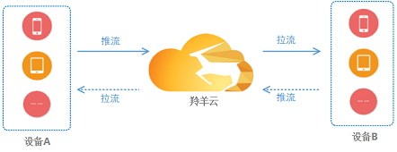
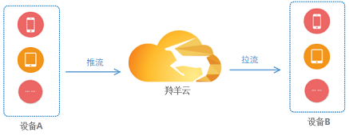
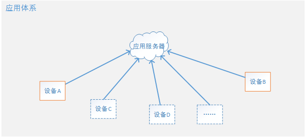
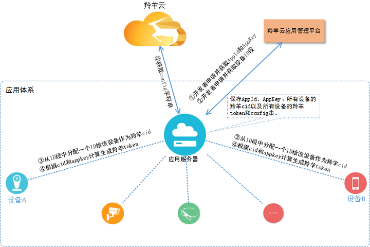
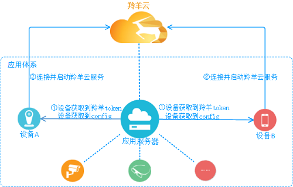

#羚羊云应用接入

羚羊云提供了一系列的功能接口供用户调用，用户按照不同的流程、调用不同的接口可以实现不同的应用场景和功能。

##1 应用场景
**视频通话**

 
  

**视频直播**

 
  

**手机直播**

 
 

##2 应用体系
 

羚羊云用户都有自己的一套应用体系和架构，通常体系中会含有应用服务器和设备终端(也称应用客户端)，所有的设备都会注册到应用服务器并由服务器来管理。

##3 应用接入
在集成SDK实现特定应用场景的应用功能之前，用户应用体系中的服务器和设备必须先接入羚羊云。

- `应用服务器`
和羚羊云没有视频流式的业务，仅仅按需调用羚羊云的Web API以请求数据。

- `设备(即应用客户端)`
接入过程相对复杂，其中很大一部分需要应用服务器来辅助完成。

###3.1 第1步
 

上图中1、2步是由开发者注册并登录[羚羊云应用管理平台](http://console.topvdn.com)完成，获取到`appid-appkey`和`id段`之后将其保存在应用服务器；
其他的3、4、5步全都是在应用服务器端完成。

**注**：
`token的生成方法`参考[羚羊云token认证机制](http://doc.topvdn.com/api/index.html#!public-doc/token_format.md)；
`config`可通过调用Web API的['查询设备状态接口'](http://doc.topvdn.com/api/index.html#!web_api_v2.md#2.1.1_%E6%9F%A5%E8%AF%A2%E8%AE%BE%E5%A4%87%E7%8A%B6%E6%80%81)获取，该接口返回的`init_string`字段即`config串`。

###3.2 第2步
 

`连接并启动云服务`需要调用**SDK的开启云服务接口**，该接口需要传入`羚羊token`和`config串`。
[启动云服务-iOS调用方法](http://doc.topvdn.com/api/index.html#!public-doc/SDK-iOS/ios_api.md#2.2_%E5%90%AF%E5%8A%A8%E4%BA%91%E6%9C%8D%E5%8A%A1)
[启动云服务-Android调用方法](http://doc.topvdn.com/api/index.html#!public-doc/SDK-Android/android_api.md#2.2_%E5%90%AF%E5%8A%A8%E4%BA%91%E6%9C%8D%E5%8A%A1)

至此，设备A和设备B就成功接入到羚羊云，然后根据自己的特定场景和需求来实现不同的功能。

### 相关链接
[Web API使用指南](http://doc.topvdn.com/api/public-doc/Web-API/#!web_api_v2.md "Web API")
[羚羊云token认证机制](http://doc.topvdn.com/api/index.html#!public-doc/token_format.md)
[羚羊云推拉流URL格式解析](http://doc.topvdn.com/api/index.html#!public-doc/url_format.md)

