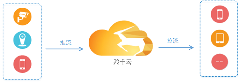
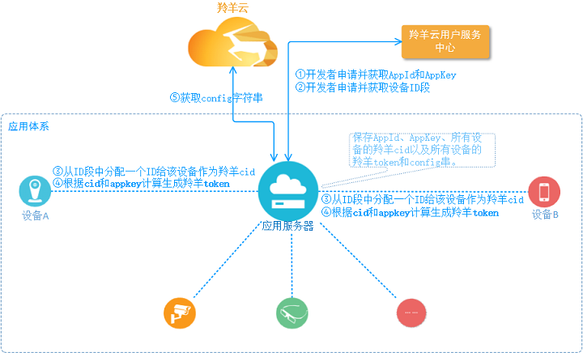

#应用接入羚羊云

##1 应用场景
羚羊云提供了一系列的功能接口供用户调用，用户按照不同的流程、调用不同的接口可以实现不同的应用场景和功能。

**视频通话：**

 
  

**视频直播：**

 
  

**手机直播：**

 
 

##2 应用体系
 

羚羊云用户都有自己的一套应用体系和架构，通常体系中会含有`应用服务器`和`设备`终端(也称`应用客户端`)，所有的设备都会注册到应用服务器并由服务器来管理。

##3 应用接入
用户在集成SDK实现特定应用场景的功能之前，应用体系中的服务器和设备必须先接入羚羊云。

- `应用服务器`
和羚羊云没有视频的流式业务交互，仅仅按需调用羚羊云的Web API以请求数据。

- `设备(即应用客户端)`
接入过程中有一部分工作需要应用服务器来协助完成。

###3.1 第1步
 

| 步骤序号 | 步骤名称 | 实现途径 |
|:-----:| ----- | ------ |
| 1 | 获取`appid`和`appkey` |注册并登录[羚羊云应用管理平台](http://console.topvdn.com)来完成，具体方法请参考[这里](http://doc.topvdn.com/api/index.html#!public-doc/createapp.md#5._%E8%8E%B7%E5%8F%96App%E7%9A%84%E7%BE%9A%E7%BE%8Aappid%E5%92%8Cappkey)。获取到的appid和appkey存放在应用服务器。 |
| 2 | 获取`id段` |注册并登录[羚羊云应用管理平台](http://console.topvdn.com)来完成，具体方法请参考[这里](http://doc.topvdn.com/api/index.html#!public-doc/createids.md)。获取到的id段存放在应用服务器。 |
| 3 | 获取`cid` |在应用服务器端完成。从id段中分配一个id值作为设备的羚羊cid。 |
| 4 | 计算`羚羊token` |在应用服务器端完成，按照[羚羊云token认证](http://doc.topvdn.com/api/index.html#!public-doc/token_format.md)规则生成设备的羚羊token，需要用到appkey和羚羊cid。 |
| 5 | 获取`羚羊config串` |在应用服务器端完成，调用Web API的[查询设备状态](http://doc.topvdn.com/api/index.html#!web_api_v2.md#2.1.1_%E6%9F%A5%E8%AF%A2%E8%AE%BE%E5%A4%87%E7%8A%B6%E6%80%81)接口，需要将设备的羚羊cid作为参数传入接口，接口返回的`init_string`字段即羚羊config串。 |

###3.2 第2步
 

`连接并启动云服务`需要调用**SDK的开启云服务接口**，该接口需要传入`羚羊token`和`config串`。
[启动云服务-iOS调用方法](http://doc.topvdn.com/api/index.html#!public-doc/SDK-iOS/ios_api.md#2.2_%E5%90%AF%E5%8A%A8%E4%BA%91%E6%9C%8D%E5%8A%A1)
[启动云服务-Android调用方法](http://doc.topvdn.com/api/index.html#!public-doc/SDK-Android/android_api.md#2.2_%E5%90%AF%E5%8A%A8%E4%BA%91%E6%9C%8D%E5%8A%A1)

至此，设备A和设备B就成功接入到羚羊云。接下来就是如何调用不同的接口来实现不同场景的应用了。
[视频通话](http://doc.topvdn.com/api/index.html#!public-doc/appfunc_facetime.md)
[视频直播](http://doc.topvdn.com/api/index.html#!public-doc/case_livevideo.md)
[手机直播](http://doc.topvdn.com/api/index.html#!public-doc/case_livephone.md)

##4. 常见问题

1. 什么是`appid`？怎么获取`appid`？
答：`appid`是用户(开发者)在羚羊云创建应用后，由羚羊云分配的唯一字符串，是该应用在羚羊云中的唯一标识。用户拿到appid后才能有效调用羚羊云SDK提供的接口。获取appid请参考本文前面的'[拥有自己的应用](http://doc.topvdn.com/api/index.html#!public-doc/createapp.md)'。

2. 什么是`cid`？怎么获取？
答：`cid`是一个4个字节长度的无符号整型数，是羚羊云用来标识唯一的用户终端设备。获取的方式请参照'[申请应用的ID段](http://doc.topvdn.com/api/index.html#!public-doc/createids.md)'，从获取到的ID段中分配一个id值作为设备在羚羊云的cid。

3. 羚羊云提供了`设备端SDK`吗？`设备端SDK`的功能包含哪些？
答：设备端就是本文所说的应用客户端，所谓的设备分为推流设备和播放设备。客户端的功能包含了推流和播放，设备可以具备推流或播放中的一种功能，也可同时具备两种功能。比如：设备没有显示屏，则没有播放功能；设备既有视频采集器又有显示屏，则同时具备推流和播放的功能。客户端SDK按照平台的不同类型分为C(Linux)、iOS、Android几种版本，设备按照自己所属的系统平台使用相应类别的SDK。

### 相关链接
[Web API使用指南](http://doc.topvdn.com/api/public-doc/Web-API/#!web_api_v2.md "Web API")
[羚羊云token认证机制](http://doc.topvdn.com/api/index.html#!public-doc/token_format.md)
[羚羊云推拉流URL格式解析](http://doc.topvdn.com/api/index.html#!public-doc/url_format.md)

