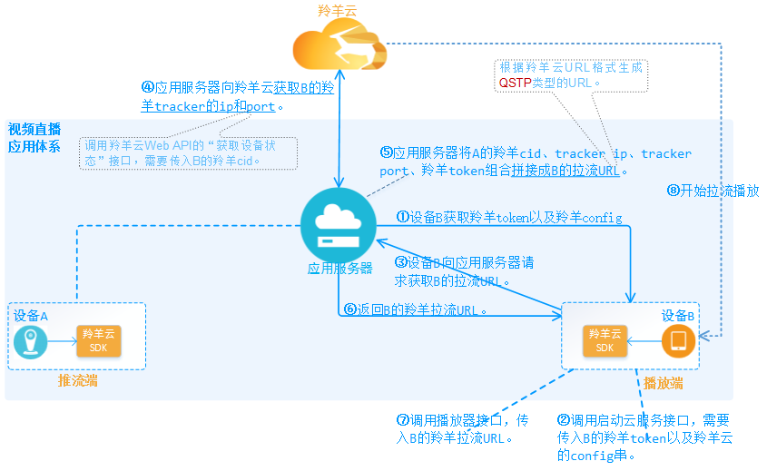

#羚羊云视频直播应用开发

## 视频直播应用

##1. 应用接入
开发视频直播的应用之前，需将应用先接入羚羊云。(点击[这里](http://doc.topvdn.com/api/index.html#!public-doc/appfunc_joinup.md))
完成应用的接入后，应用服务器端会保存应用的`config`字符串、所有设备的羚羊`cid`、`token`。

视频直播应用有不同的应用场景：[QSUP](http://doc.topvdn.com/api/#!public-doc/url_format.md)方式(一对一)直播和[QSTP](http://doc.topvdn.com/api/#!public-doc/url_format.md)方式(一对多)直播。这两种场景在应用开发流程上也是不同的。

##2 QSUP直播(一对一)
在[QSUP](http://doc.topvdn.com/api/#!public-doc/url_format.md)方式的直播应用场景下，源端设备推送的视频内容同时只能供一台播放设备而观看。

###2.1 开发流程

 

| 步骤序号 | 步骤名称 | 调用接口 |
|:----:| ----    | ----     |
| 第1步 | 设备获取羚羊云的token和config | 属应用层自己的业务，与羚羊云SDK无关，不需要调用接口。 |
| 第2步 | 调用启动云服务接口 | 调用羚羊云SDK的启动云服务接口，需要传入A的羚羊token以及羚羊config。 |
| 第3步 | 设备B请求观看A的视频直播 | 属应用层自己的业务，与羚羊云SDK无关，不需要调用接口。 |
| 第4步 | 获取羚羊tracker的ip和port | 在应用服务器端完成。调用羚羊云Web API的[获取设备状态](http://doc.topvdn.com/api/index.html#!web_api_v2.md#2.1.1_%E6%9F%A5%E8%AF%A2%E8%AE%BE%E5%A4%87%E7%8A%B6%E6%80%81)接口。|
| 第5步 | 生成A的羚羊URL | 在应用服务器端完成。根据[羚羊云推拉流URL格式-QSUP方式](http://doc.topvdn.com/api/index.html#!public-doc/url_format.md#6_%E6%8E%A8%E6%8B%89%E7%9B%B4%E6%92%AD%E6%B5%81%28QSUP%E6%96%B9%E5%BC%8F%29%E7%A4%BA%E4%BE%8B)。 |
| 第6步 | 设备B获取A的羚羊URL | 属应用层自己的业务，与羚羊云SDK无关，不需要调用接口。 |
| 第7步 | 调用播放器接口 |  调用羚羊云SDK的播放器接口，需要传入连接A的羚羊URL。 |
| 第8步 | 开始拉流播放 | SDK内部执行，不需要调用接口。 |

###2.2 开发示例
本示例的前提：用户(即开发者)必须先将[应用接入](http://doc.topvdn.com/api/index.html#!public-doc/appfunc_joinup.md)到羚羊云。
假设推流端为：嵌入式Linux视频采集设备；播放端为：Android设备。

####2.2.1 设备获取羚羊云的token和config
开发视频直播的应用之前，需将应用先接入羚羊云(点击[这里](http://doc.topvdn.com/api/index.html#!public-doc/appfunc_joinup.md))。最终会获取到设备A和B的羚羊`cid`、`token`以及`config`。

####2.2.2 设备调用启动云服务接口
需要调用羚羊云SDK的**启动云服务**接口：

详细接口方法调用示例请参考：
[SDK基础云服务接口调用示例-C(Linux)](http://doc.topvdn.com/api/index.html#!public-doc/SDK-C/c_guide_cloudservice.md)
[SDK基础云服务接口调用示例-Android](http://doc.topvdn.com/api/index.html#!public-doc/SDK-Android/android_guide_cloudservice.md)
[SDK基础云服务接口调用示例-iOS](http://doc.topvdn.com/api/index.html#!public-doc/SDK-iOS/ios_guide_cloudservice.md)

详细接口方法介绍请参考：
[启动云服务API-C(Linux)](http://doc.topvdn.com/api/index.html#!public-doc/SDK-C/c_api_cloudservice.md)
[启动云服务API-Android](http://doc.topvdn.com/api/#!public-doc/SDK-Android/android_api_cloudservice.md)
[启动云服务API-iOS](http://doc.topvdn.com/api/#!public-doc/SDK-iOS/ios_api_cloudservice.md)

####2.2.3 设备B请求观看A的视频直播
设备B向应用服务器发出请求消息：观看A的视频直播。这一步是由用户在应用层完成，属于应用层自己的业务。

####2.2.4 应用服务器获取A的羚羊云tracker ip/port
应用服务器在收到上一步的消息后，通过调用调用羚羊云Web API的'[获取设备状态](http://doc.topvdn.com/api/index.html#!web_api_v2.md#2.1.1_%E6%9F%A5%E8%AF%A2%E8%AE%BE%E5%A4%87%E7%8A%B6%E6%80%81)'接口，调用接口时传入`设备A`的`羚羊cid`，从接口的返回结果中获取到`设备A`所在的羚羊`tracker(调度服务器)的ip和port`。
以下仅展示`curl`方式的Web http请求示例，用户需根据自己应用服务器所采用的开发语言去完成http请求并解析返回的json数据。
```
curl -X POST -H "X-APP-ID: mock" -H "X-APP-Key: mock-app-key-use-your-own-pls" -H "Content-Type: application/json" -d '{
    "cids": [1003538]
}' "http://api.topvdn.com/v2/devices/state?page=1&size=20"
```
请求发送后将返回如下数据：
```
{
    "init_string": "[Config]\r\nIsDebug=1\r\nLocalBasePort=8200\r\nIsCaptureDev=1\r\nIsPlayDev=1\r\nUdpSendInterval=2\r\n[Tracker]\r\nCount=3\r\nIP1=121.42.156.148\r\nPort1=80\r\nIP2=182.254.149.39\r\nPort2=80\r\nIP3=203.195.157.248\r\nPort3=80\r\n[LogServer]\r\nCount=1\r\nIP1=223.202.103.147\r\nPort1=80",
    "devices": [
        {
            "cid": 1003538,
            "state": 4,
            "tracker_ip": "203.195.157.248",
            "tracker_port": 80,
            "public_ip": "14.215.177.37",
            "public_port": 8747,
            "local_ip": "192.168.2.222",
            "local_port": 8732,
            "config_type": 0,
            "conn_key": 1243,
            "relay_ip": "125.91.251.79",
            "relay_port": 80,
            "cover_url": "http://api.topvdn.com/v2/snapshots/1003775/cover?client_token=1003775_0_1452756453_0d78e95edab47e565010f47a0300de2d",
            "rtmp_url": "rtmp://rtmp0-9.public.topvdn.cn/",
            "hls": "http://hls0-9.public.topvdn.cn/hls/<cid>/index.m3u8"
        }
    ],
    "total": 145,
    "size": 20,
    "page": 1,
    "request_id": "2279fa57f4d644c1b333f5ff5ff7a2b7"
}
```
其中的`tracker_ip`和`tracker_port`即设备A的羚羊tracker的ip和port。

####2.2.5 应用服务器生成B连接A的羚羊URL
此时，应用服务器存有A的羚羊cid、trakcer ip、tracker port和羚羊token，现在需要将这些值组合拼接成一个连接A和B的URL。该URL的生成规则参考[QSUP方式推拉流URL](http://doc.topvdn.com/api/index.html#!public-doc/url_format.md#6_%E6%8E%A8%E6%8B%89%E7%9B%B4%E6%92%AD%E6%B5%81%28QSUP%E6%96%B9%E5%BC%8F%29%E7%A4%BA%E4%BE%8B)。
```
topvdn://203.195.157.248:80?protocolType=1&token=1003469_3222536192_1493481600_5574318032e39b62063d98e6bff50069
```
`ip`为设备A的羚羊tracker_ip；
`port` 为设备A的羚羊tracker_port；
`protocolType`为必须为QSUP方式传输视频流；
`token`为设备A的羚羊token。

####2.2.5 应用服务器向设备B返回连接A的羚羊URL
应用服务器在生成了B连接A的URL之后，将URL返回给设备B。

####2.2.6 设备B调用SDK播放器接口
以Android的代码为例：

#####(1) 设置播放布局
我们将播放器封装成了界面控件，方便用户直接嵌入到app的主界面中，实现播放器的功能。
``` 
<com.lingyang.sdk.player.widget.LYPlayer
    android:id="@+id/ly_player"
    android:layout_width="match_parent"
    android:layout_height="match_parent" />

LYPlayer mPlayer = (LYPlayer)findViewById(R.id.ly_player);
```
#####(2) 设置播放源
``` 
//公众摄像机直播观看		
mPlayer.setDataSource("topvdn://203.195.157.248:80" +
                      "protocolType=1&token=1003136_3356753920_" +
                      "1492163431_cc3acc347784f3e30cd4713acec615b1");
```
播放源URL按照[羚羊云QSUP类型的URL格式](http://doc.topvdn.com/api/#!public-doc/url_format.md#6_%E6%8E%A8%E6%8B%89%E7%9B%B4%E6%92%AD%E6%B5%81%28QSUP%E6%96%B9%E5%BC%8F%29%E7%A4%BA%E4%BE%8B)生成。

#####(3) 设置播放连接状态监听
设置循环执行网络拉流、解码视频帧、及显示视频帧这些过程之前，连接到云服务器的状态监听函数；
```
/**
 * 所有连接完成，开始播放监听
 */
mPlayer.setOnPreparedListener(new OnPreparedListener() {
    @Override
    public void onPrepared(int time) {
        //time 连接过程所消耗的时间
        runOnUiThread(new Runnable() {
            public void run() {}
        }
        );
    }
});
```
OnPreparedListener被触发则表示连接至云服务器已经成功且播放器已经成功打开，在回调函数中，可以在播放控件界面上显示连接状态的变化。

#####(4) 开始播放
```
mPlayer.start();
```
开始播放后会触发OnPreparedListener回调函数;

#####(5) 结束播放
```
mPlayer.stop();
```

详细接口方法调用示例请参考：
[SDK播放器接口调用示例-Android](http://doc.topvdn.com/api/index.html#!public-doc/SDK-Android/android_guide_player.md)
[SDK播放器接口调用示例-iOS](http://doc.topvdn.com/api/index.html#!public-doc/SDK-iOS/ios_guide_player.md)

详细接口方法介绍请参考：
[播放器API-Android](http://doc.topvdn.com/api/index.html#!public-doc/SDK-Android/android_api_player.md)
[播放器API-iOS](http://doc.topvdn.com/api/index.html#!public-doc/SDK-iOS/ios_api_player.md)

##3 QSTP直播(一对多)
在[QSTP](http://doc.topvdn.com/api/#!public-doc/url_format.md)方式的直播应用场景下，源端设备推送的视频内容能同时供多台播放设备而观看，当然也可以同时只用一台设备观看视频。

##3.1 推流端

####3.1.1 开发流程

 

| 步骤序号 | 步骤名称 | 调用接口 |
|:----:| ----    | ----     |
| 第1步 | 设备A获取羚羊云的token和config | 属应用层自己的业务，与羚羊云SDK无关，不需要调用接口。 |
| 第2步 | 设备A调用启动云服务接口 | 调用羚羊云SDK的启动云服务接口，需要传入A的羚羊token以及羚羊config。 |
| 第3步 | 设备A向应用服务器请求推流URL | 属应用层自己的业务，与羚羊云SDK无关，不需要调用接口。 |
| 第4步 | 获取羚羊tracker的ip和port | 在应用服务器端完成。调用羚羊云Web API的[获取设备状态](http://doc.topvdn.com/api/index.html#!web_api_v2.md#2.1.1_%E6%9F%A5%E8%AF%A2%E8%AE%BE%E5%A4%87%E7%8A%B6%E6%80%81)接口。|
| 第5步 | 生成A的推流URL | 在应用服务器端完成。根据[羚羊云推拉流URL格式-QSTP方式](http://doc.topvdn.com/api/#!public-doc/url_format.md#3_%E6%8E%A8%E9%80%81%E7%9B%B4%E6%92%AD%E6%B5%81%E7%A4%BA%E4%BE%8B)。 |
| 第6步 | 设备A获取A的推流URL | 设备A从应用服务器接收推流URL。不需要调用羚羊云SDK接口。 |
| 第7步 | 设备A调用直播推流接口 | 设备A调用羚羊云SDK的直播推流接口，需要传入A的推流URL。 |

####3.1.2 开发示例
本示例的前提：用户(即开发者)必须先将[应用接入](http://doc.topvdn.com/api/index.html#!public-doc/appfunc_joinup.md)到羚羊云。
假设推流端为：嵌入式Linux视频采集设备。

####**第1步** 设备A获取羚羊云的token和config
开发视频直播的应用之前，需将应用先接入羚羊云(点击[这里](http://doc.topvdn.com/api/index.html#!public-doc/appfunc_joinup.md))。最终会获取到设备A和B的羚羊`cid`、`token`以及`config`。

####**第2步** 设备A调用启动云服务接口
需要调用羚羊云SDK的**启动云服务**接口：

详细接口方法调用示例请参考：
[SDK基础云服务接口调用示例-C(Linux)](http://doc.topvdn.com/api/index.html#!public-doc/SDK-C/c_guide_cloudservice.md)
[SDK基础云服务接口调用示例-Android](http://doc.topvdn.com/api/index.html#!public-doc/SDK-Android/android_guide_cloudservice.md)
[SDK基础云服务接口调用示例-iOS](http://doc.topvdn.com/api/index.html#!public-doc/SDK-iOS/ios_guide_cloudservice.md)

详细接口方法介绍请参考：
[启动云服务API-C(Linux)](http://doc.topvdn.com/api/index.html#!public-doc/SDK-C/c_api_cloudservice.md)
[启动云服务API-Android](http://doc.topvdn.com/api/#!public-doc/SDK-Android/android_api_cloudservice.md)
[启动云服务API-iOS](http://doc.topvdn.com/api/#!public-doc/SDK-iOS/ios_api_cloudservice.md)

####**第3步** 设备A向应用服务器请求推流URL
设备A向应用服务器发送消息：请求获取A的推流URL。

####**第4步** 应用服务器获取A的羚羊云tracker的ip和port
应用服务器在收到上一步的消息后，通过调用调用羚羊云Web API的'[获取设备状态](http://doc.topvdn.com/api/index.html#!web_api_v2.md#2.1.1_%E6%9F%A5%E8%AF%A2%E8%AE%BE%E5%A4%87%E7%8A%B6%E6%80%81)'接口，调用接口时传入`设备A`的`羚羊cid`，从接口的返回结果中获取到`设备A`所在的羚羊`tracker(调度服务器)的ip和port`。
以下仅展示`curl`方式的Web http请求示例，用户需根据自己应用服务器所采用的开发语言去完成http请求并解析返回的json数据。
```
curl -X POST -H "X-APP-ID: mock" -H "X-APP-Key: mock-app-key-use-your-own-pls" -H "Content-Type: application/json" -d '{
    "cids": [1003538]
}' "http://api.topvdn.com/v2/devices/state?page=1&size=20"
```
请求发送后将返回如下数据：
```
{
    "init_string": "[Config]\r\nIsDebug=1\r\nLocalBasePort=8200\r\nIsCaptureDev=1\r\nIsPlayDev=1\r\nUdpSendInterval=2\r\n[Tracker]\r\nCount=3\r\nIP1=121.42.156.148\r\nPort1=80\r\nIP2=182.254.149.39\r\nPort2=80\r\nIP3=203.195.157.248\r\nPort3=80\r\n[LogServer]\r\nCount=1\r\nIP1=223.202.103.147\r\nPort1=80",
    "devices": [
        {
            "cid": 1003538,
            "state": 4,
            "tracker_ip": "203.195.157.248",
            "tracker_port": 80,
            "public_ip": "14.215.177.37",
            "public_port": 8747,
            "local_ip": "192.168.2.222",
            "local_port": 8732,
            "config_type": 0,
            "conn_key": 1243,
            "relay_ip": "125.91.251.79",
            "relay_port": 80,
            "cover_url": "http://api.topvdn.com/v2/snapshots/1003775/cover?client_token=1003775_0_1452756453_0d78e95edab47e565010f47a0300de2d",
            "rtmp_url": "rtmp://rtmp0-9.public.topvdn.cn/",
            "hls": "http://hls0-9.public.topvdn.cn/hls/<cid>/index.m3u8"
        }
    ],
    "total": 145,
    "size": 20,
    "page": 1,
    "request_id": "2279fa57f4d644c1b333f5ff5ff7a2b7"
}
```
其中的`tracker_ip`和`tracker_port`即设备A的羚羊tracker的ip和port。

####**第5步** 应用服务器生成A的推流URL
此时，应用服务器存有A的羚羊cid、trakcer ip、tracker port和羚羊token，现在需要将这些值组合拼接成一个A的推流URL。该URL的生成规则参考[QSTP方式推流URL](http://doc.topvdn.com/api/#!public-doc/url_format.md#3_%E6%8E%A8%E9%80%81%E7%9B%B4%E6%92%AD%E6%B5%81%E7%A4%BA%E4%BE%8B)。
```
topvdn://183.57.151.161:1935?protocolType=2&connectType=1&token=1003469_3222536192_1493481600_5574318032e39b62063d98e6bff50069&mode=2
```
`ip`为设备A的羚羊tracker_ip；
`port` 为设备A的羚羊tracker_port；
`protocolType`为QSTP方式传输视频流；
`connectType`表示设备A为推流端；
`mode`表示使用QSTP协议推流，公众模式；
`token`为设备A的羚羊token。

####**第6步** 设备A获取推流URL
应用服务器在生成了A的推流URL之后，将URL返回给设备A。

####**第7步** 设备A调用SDK的直播推流接口
以C(设备为嵌入式Linux系统)代码为例：
首先需要建立连接，即创建传输通道，调用LY_connect创建传输通道，然后才能进行推流。
```
int fd;
int ret;
MediaFrame_t frame = {0};
char *url="topvdn://183.57.151.161:1935?protocolType=2&connectType=1&token=1003469_3222536192_1493481600_5574318032e39b62063d98e6bff50069&mode=2";
while(1)
{
	fd = LY_connect(url,NULL)//连接推流服务器，返回标识传输通道的fd
	if(fd< 0)
	{
		printf("connect to lingyang cloud relay server failed,retry...\n");
		usleep(300*1000);
		continue;
	} 
	break;
}
frame.frameType = frameType;//帧类型参考include目录下common_define.h
frame.frameBuffer = dataBuffer;//编码后的音频或视频数据
frame.frameLength = frameSize;
frame.frameTime = timeStamp;
ret = LY_sendMediaFrame(fd,&frame);//发送音视频数据，成功返回0，失败返回非0
if(ret != 0)
printf("send frame failed nal %d frameret:%d,frameSize=%d\n",frameType,ret,frameSize);
```
**URL的详细格式请参考[羚羊云URL格式解析](http://doc.topvdn.com/api/#!public-doc/url_format.md#3_%E6%8E%A8%E9%80%81%E7%9B%B4%E6%92%AD%E6%B5%81%E7%A4%BA%E4%BE%8B)。**

详细接口方法调用示例请参考：
[SDK直播推流接口调用示例-Android](http://doc.topvdn.com/api/index.html#!public-doc/SDK-Android/android_guide_livepush.md)
[SDK直播推流接口调用示例-iOS](http://doc.topvdn.com/api/index.html#!public-doc/SDK-iOS/ios_guide_livepush.md)
[SDK直播推流接口调用示例-C(Linux)](http://doc.topvdn.com/api/index.html#!public-doc/SDK-C/c_guide_livepush.md)

详细接口方法介绍请参考：
[直播推流API-Android](http://doc.topvdn.com/api/index.html#!public-doc/SDK-Android/android_api_livepush.md)
[直播推流API-iOS](http://doc.topvdn.com/api/index.html#!public-doc/SDK-iOS/ios_api_livepush.md)
[直播推流API-C(Linux)](http://doc.topvdn.com/api/index.html#!public-doc/SDK-C/c_api_livepush.md)

##3.2 播放端

####3.2.1 开发流程

 

| 步骤序号 | 步骤名称 | 调用接口 |
|:----:| ----    | ----     |
| 第1步 | 设备B获取羚羊云的token和config | 属应用层自己的业务，与羚羊云SDK无关，不需要调用接口。 |
| 第2步 | 设备B调用启动云服务接口 | 调用羚羊云SDK的启动云服务接口，需要传入B的羚羊token以及羚羊config。 |
| 第3步 | 设备B向应用服务器请求拉流URL | 属应用层自己的业务，与羚羊云SDK无关，不需要调用接口。 |
| 第4步 | 获取B的羚羊tracker的ip和port | 在应用服务器端完成。调用羚羊云Web API的[获取设备状态](http://doc.topvdn.com/api/index.html#!web_api_v2.md#2.1.1_%E6%9F%A5%E8%AF%A2%E8%AE%BE%E5%A4%87%E7%8A%B6%E6%80%81)接口。|
| 第5步 | 生成B的拉流URL | 在应用服务器端完成。根据[羚羊云推拉流URL格式-QSTP方式](http://doc.topvdn.com/api/#!public-doc/url_format.md#3_%E6%8E%A8%E9%80%81%E7%9B%B4%E6%92%AD%E6%B5%81%E7%A4%BA%E4%BE%8B)。 |
| 第6步 | 设备B获取拉流URL | 设备B从应用服务器接收拉流URL。不需要调用羚羊云SDK接口。 |
| 第7步 | 设备B调用播放器接口 | 设备B调用羚羊云SDK的直播推流接口，需要传入B的拉流URL。 |

####3.2.2 开发示例

本示例的前提：用户(即开发者)必须先将[应用接入](http://doc.topvdn.com/api/index.html#!public-doc/appfunc_joinup.md)到羚羊云。
假设推流端为：Android设备。

####**第1步** 设备B获取羚羊云的token和config
开发视频直播的应用之前，需将应用先接入羚羊云(点击[这里](http://doc.topvdn.com/api/index.html#!public-doc/appfunc_joinup.md))。最终会获取到设备A和B的羚羊`cid`、`token`以及`config`。

####**第2步** 设备B调用启动云服务接口
需要调用羚羊云SDK的**启动云服务**接口：
[启动云服务API-C(Linux)](http://doc.topvdn.com/api/index.html#!public-doc/SDK-C/c_api_cloudservice.md)
[启动云服务API-Android](http://doc.topvdn.com/api/#!public-doc/SDK-Android/android_api_cloudservice.md)
[启动云服务API-iOS](http://doc.topvdn.com/api/#!public-doc/SDK-iOS/ios_api_cloudservice.md)

####**第3步** 设备B向应用服务器请求拉流URL
设备B向应用服务器发送消息：请求获取B的拉流URL。

####**第4步** 应用服务器获取B的羚羊云tracker的ip和port
应用服务器在收到上一步的消息后，通过调用调用羚羊云Web API的'[获取设备状态](http://doc.topvdn.com/api/index.html#!web_api_v2.md#2.1.1_%E6%9F%A5%E8%AF%A2%E8%AE%BE%E5%A4%87%E7%8A%B6%E6%80%81)'接口，调用接口时传入`设备B`的`羚羊cid`，从接口的返回结果中获取到`设备B`所在的羚羊`tracker(调度服务器)的ip和port`。
以下仅展示`curl`方式的Web http请求示例，用户需根据自己应用服务器所采用的开发语言去完成http请求并解析返回的json数据。
```
curl -X POST -H "X-APP-ID: mock" -H "X-APP-Key: mock-app-key-use-your-own-pls" -H "Content-Type: application/json" -d '{
    "cids": [1003538]
}' "http://api.topvdn.com/v2/devices/state?page=1&size=20"
```
请求发送后将返回如下数据：
```
{
    "init_string": "[Config]\r\nIsDebug=1\r\nLocalBasePort=8200\r\nIsCaptureDev=1\r\nIsPlayDev=1\r\nUdpSendInterval=2\r\n[Tracker]\r\nCount=3\r\nIP1=121.42.156.148\r\nPort1=80\r\nIP2=182.254.149.39\r\nPort2=80\r\nIP3=203.195.157.248\r\nPort3=80\r\n[LogServer]\r\nCount=1\r\nIP1=223.202.103.147\r\nPort1=80",
    "devices": [
        {
            "cid": 1003538,
            "state": 4,
            "tracker_ip": "203.195.157.248",
            "tracker_port": 80,
            "public_ip": "14.215.177.37",
            "public_port": 8747,
            "local_ip": "192.168.2.222",
            "local_port": 8732,
            "config_type": 0,
            "conn_key": 1243,
            "relay_ip": "125.91.251.79",
            "relay_port": 80,
            "cover_url": "http://api.topvdn.com/v2/snapshots/1003775/cover?client_token=1003775_0_1452756453_0d78e95edab47e565010f47a0300de2d",
            "rtmp_url": "rtmp://rtmp0-9.public.topvdn.cn/",
            "hls": "http://hls0-9.public.topvdn.cn/hls/<cid>/index.m3u8"
        }
    ],
    "total": 145,
    "size": 20,
    "page": 1,
    "request_id": "2279fa57f4d644c1b333f5ff5ff7a2b7"
}
```
其中的`tracker_ip`和`tracker_port`即设备A的羚羊tracker的ip和port。

####**第5步** 应用服务器生成B的拉流URL
此时，应用服务器存有B的羚羊cid、trakcer ip、tracker port和羚羊token，现在需要将这些值组合拼接成一个B的拉流URL。该URL的生成规则参考[QSTP方式拉流URL](http://doc.topvdn.com/api/#!public-doc/url_format.md#4_%E6%8B%89%E5%8F%96%E7%9B%B4%E6%92%AD%E6%B5%81%E7%A4%BA%E4%BE%8B)。
```
topvdn://183.57.151.161:1935?protocolType=2&connectType=2 &token=1003469_3222536192_1493481600_5574318032e39b62063d98e6bff50069
```
`ip`为设备B的羚羊tracker_ip；
`port` 为设备B的羚羊tracker_port；
`protocolType`为QSTP方式传输视频流；
`connectType`表示设备B为拉流端；
`token`为设备B的羚羊token。

####**第6步** 设备B获取拉流URL
应用服务器在生成了B的拉流URL之后，将URL返回给设备B。

####**第7步** 设备B调用SDK的播放器接口
以Android的代码为例：

#####(1) 设置播放布局
我们将播放器封装成了界面控件，方便用户直接嵌入到app的主界面中，实现播放器的功能。
``` 
<com.lingyang.sdk.player.widget.LYPlayer
    android:id="@+id/ly_player"
    android:layout_width="match_parent"
    android:layout_height="match_parent" />

LYPlayer mPlayer = (LYPlayer)findViewById(R.id.ly_player);
```
#####(2) 设置播放源
``` 
//公众摄像机直播观看		
mPlayer.setDataSource("topvdn://203.195.157.248:80" +
                      "protocolType=1&token=1003136_3356753920_" +
                      "1492163431_cc3acc347784f3e30cd4713acec615b1");
```
播放源URL按照[羚羊云QSTP类型的拉流URL格式](http://doc.topvdn.com/api/#!public-doc/url_format.md#4_%E6%8B%89%E5%8F%96%E7%9B%B4%E6%92%AD%E6%B5%81%E7%A4%BA%E4%BE%8B)生成。

#####(3) 设置播放连接状态监听
设置循环执行网络拉流、解码视频帧、及显示视频帧这些过程之前，连接到云服务器的状态监听函数；
```
/**
 * 所有连接完成，开始播放监听
 */
mPlayer.setOnPreparedListener(new OnPreparedListener() {
    @Override
    public void onPrepared(int time) {
        //time 连接过程所消耗的时间
        runOnUiThread(new Runnable() {
            public void run() {}
        }
        );
    }
});
```
OnPreparedListener被触发则表示连接至云服务器已经成功且播放器已经成功打开，在回调函数中，可以在播放控件界面上显示连接状态的变化。

#####(4) 开始播放
```
mPlayer.start();
```
开始播放后会触发OnPreparedListener回调函数;

#####(5) 结束播放
```
mPlayer.stop();
```

详细接口方法调用示例请参考：
[SDK播放器接口调用示例-Android](http://doc.topvdn.com/api/index.html#!public-doc/SDK-Android/android_guide_player.md)
[SDK播放器接口调用示例-iOS](http://doc.topvdn.com/api/index.html#!public-doc/SDK-iOS/ios_guide_player.md)

详细接口方法介绍请参考：
[播放器API-Android](http://doc.topvdn.com/api/index.html#!public-doc/SDK-Android/android_api_player.md)
[播放器API-iOS](http://doc.topvdn.com/api/index.html#!public-doc/SDK-iOS/ios_api_player.md)

##4 直播录制
直播录制必须基于[QSTP](http://doc.topvdn.com/api/#!public-doc/url_format.md)方式的视频直播场景，其内部实现原理是在推流端向羚羊云推流后由羚羊存储服务将视频存储在羚羊云中。

对于应用层的开发者来说，想要实现该功能，须在上述的'QSTP直播'->'推流端'->'开发流程'图的第五步**拼接羚羊推流URL**时按照[羚羊云推拉流URL格式-QSTP方式](http://doc.topvdn.com/api/#!public-doc/url_format.md#2.1_url%E7%A4%BA%E4%BE%8B)来设置其中的`protocolType`字段和`mode`字段。例如：
```
topvdn://183.57.151.161:1935?protocolType=2&connectType=1&token=1003469_3222536192_1493481600_5574318032e39b62063d98e6bff50069&mode=4
```
其中：
- `protocolType` 必须为2，表示使用QSTP协议推流。
- `connectType` 必须为1，表示推流端。
- `mode` 值可为4，表示使用QSTP协议推流，私有模式，并开启云存储；也可为4，表示使用QSTP协议推流，公众模式，并开启云存储。
