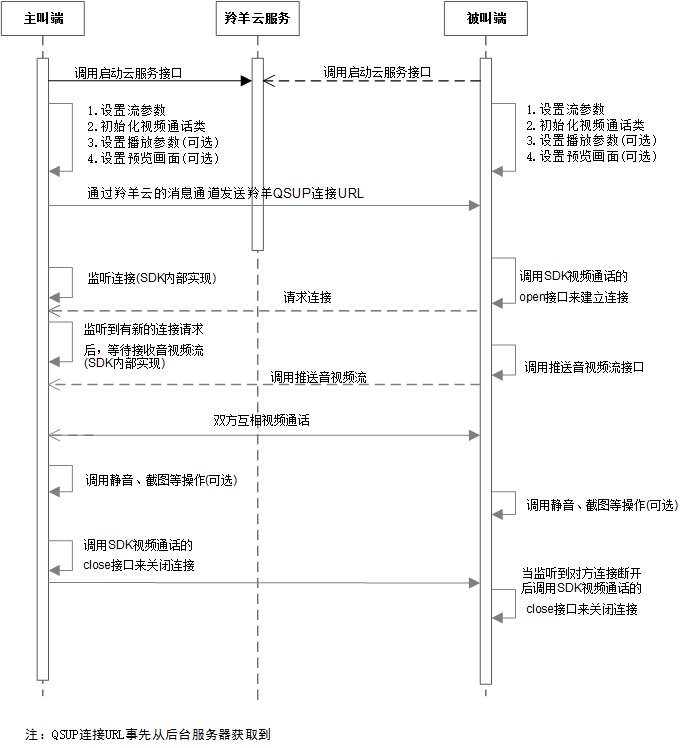

# 视频通话功能开发指南
以下展示iOS设备之间视频通话应用场景的例子。Android设备之间的视频通话流程与之一样，具体使用方法请参见[这里](http://doc.topvdn.com/api/index.html#!public-doc/SDK-Android/android_guide_facetime.md "Anroid版SDK")。

 

`注`：QSUP的连接URL事先从后台服务器获得，生成URL的方法请参考[羚羊云推拉流URL格式解析](http://doc.topvdn.com/api/index.html#!public-doc/url_format.md)。

##1 主叫端

###1.1 启动云服务
启动羚羊云服务，该接口函数分配并初始化本地系统资源，登录到羚羊云平台，在平台端进行安全认证。

```
[[LYCloudService sharedLYCloudService] startCloudService: m_token
                                                  config: m_config
                                              startBlock: ^(LYstatusCode statusCode, NSString *errorString)
                                                        {
                                                            //启动云服务的成功与否状态回调
                                                        }
                                         popMessageBlock: ^(NSDictionary *dictionary)
                                                        {
                                                            //平台透传的所有消息都从这回调出来
                                                        }
];
```

###1.2 设置流参数
```
//该方法生成一个默认的视频采集配置
videoSize = (640, 480);
frameRate = 15fps, bitrate = 400kbps;
LYVideoStreamingConfiguration *mVideoConfig = [LYVideoStreamingConfiguration defaultConfiguration];
    
//该方法生成一个默认的音频采集配置。
sampleRate = 16000, channle = 1;
LYAudioStreamingConfiguration *mAudioConfig = [LYAudioStreamingConfiguration defaultConfiguration];
```
Configuration类配置视频通话推流的参数，包括是否使用音、视频，是否使用硬编码，视频旋转角度等多种配置，用户可根据需要查看更多进行配置。
**注意**：更多的参数配置详见[API手册](http://doc.topvdn.com/api/index.html#!public-doc/SDK-iOS/ios_api_datatype.md)中的数据类型-视频通话推流相关属性配置。

###1.3 初始化视频通话类
```
//初始化直播类:如果不采集音频，则audioConfiguration传nil即可
LYFaceTime * mFaceTime = [[LYFaceTime alloc] initWithVideoConfiguration:mVideoConfig audioConfiguration:mAudioConfig]; 
```

###1.4 设置播放参数
```
//如果不需要播放对方视频则不设置该参数
LYPlayerConfiguration *mPlayerConfig = [[LYPlayerConfiguration alloc] initWithPlayView:mPlayView frame:CGRectMake(0, 0, kScreenWidth, kScreenHeight) decodeMode:LYPlayerDecodeModeHard];
[mFaceTime setPlayView:mFaceTimeAddress playerConfiguration:mPlayerConfig]; 
```

###1.5 设置本地预览视图
```
//设置采集视频预览view：如果不预览自己视频则不设置
[mFaceTime setPreview:self.preview frame:CGRectMake(0, 0, kScreenWidth, kScreenHeight)];
```

###1.6 发送QSUP连接URL到被叫端
通过羚羊云提供的消息透传通道来发送QSUP连接URL到被叫端，您也通过自己的方式发送QSUP连接URL到被叫端。

###1.7 关闭通话
最后若想主动停止视频通话则需要调用close方法；当收到ConnectionClosed时也必须调用close方法。
```
//主被叫关闭通话都要调用该方法！！！！！！
[mFaceTime close:mFaceTimeAddress];
```

##2 被叫端

###2.1 启动云服务
启动羚羊云服务，该接口函数分配并初始化本地系统资源，登录到羚羊云平台，在平台端进行安全认证。

```
[[LYCloudService sharedLYCloudService] startCloudService: m_token
                                                  config: m_config
                                              startBlock: ^(LYstatusCode statusCode, NSString *errorString)
                                                        {
                                                            //启动云服务的成功与否状态回调
                                                        }
                                         popMessageBlock: ^(NSDictionary *dictionary)
                                                        {
                                                            //平台透传的所有消息都从这回调出来
                                                        }
];
```

###2.2 设置流参数
```
//该方法生成一个默认的视频采集配置
videoSize = (640, 480);
frameRate = 15fps, bitrate = 400kbps;
LYVideoStreamingConfiguration *mVideoConfig = [LYVideoStreamingConfiguration defaultConfiguration];
    
//该方法生成一个默认的音频采集配置。
sampleRate = 16000, channle = 1;
LYAudioStreamingConfiguration *mAudioConfig = [LYAudioStreamingConfiguration defaultConfiguration];
```
Configuration类配置视频通话推流的参数，包括是否使用音、视频，是否使用硬编码，视频旋转角度等多种配置，用户可根据需要查看更多进行配置。
**注意**：更多的参数配置详见[API手册](http://doc.topvdn.com/api/index.html#!public-doc/SDK-iOS/ios_api_datatype.md)中的数据类型-视频通话推流相关属性配置。

###2.3 初始化视频通话类
```
//初始化直播类:如果不采集音频，则audioConfiguration传nil即可
LYFaceTime * mFaceTime = [[LYFaceTime alloc] initWithVideoConfiguration:mVideoConfig audioConfiguration:mAudioConfig]; 
```

###2.4 设置播放参数
```
//如果不需要播放对方视频则不设置该参数
LYPlayerConfiguration *mPlayerConfig = [[LYPlayerConfiguration alloc] initWithPlayView:mPlayView frame:CGRectMake(0, 0, kScreenWidth, kScreenHeight) decodeMode:LYPlayerDecodeModeHard];
[mFaceTime setPlayView:mFaceTimeAddress playerConfiguration:mPlayerConfig]; 
```

###2.5 设置本地预览视图
```
//设置采集视频预览view：如果不预览自己视频则不设置
[mFaceTime setPreview:self.preview frame:CGRectMake(0, 0, kScreenWidth, kScreenHeight)];
```

###2.6 接收由主叫端发送的QSUP连接URL
监听由主叫端发送的QSUP连接URL。该URL可以通过羚羊云的消息透传通道接收，也可以通过自己的方式接收。

###2.7 建立连接
```
[mFaceTime open: mFaceTimeAddress openStatus:^(LYstatusCode statusCode, NSString *errorString) {
    NSLog(@"open statusCode = %d, errorString = %@", statusCode, errorString);
    //连接是否成功的状态回调，只有statusCode == LYstatusCodeSuccess才可以进行推流等操作。
    //开始推流
} playerStatus:^(NSDictionary *playerMessageDic) {
    NSLog(@"playerMessageDic = %@", playerMessageDic);
    //该回调目前无回调信息。
}];
```

###2.8 开始推流
```
[mFaceTime startSendVideoData];
[mFaceTime startSendAudioData];
```

###2.9 关闭通话
最后若想主动停止视频通话则需要调用close方法；当收到ConnectionClosed时也必须调用close方法。
```
//主被叫关闭通话都要调用该方法！！！！！！
[mFaceTime close:mFaceTimeAddress];
```

<br />
#### 相关链接
[羚羊云token认证机制](http://doc.topvdn.com/api/index.html#!public-doc/token_format.md)
[羚羊云推拉流URL格式解析](http://doc.topvdn.com/api/index.html#!public-doc/url_format.md)

