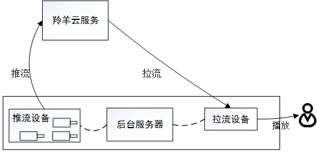

# 视频直播功能开发指南
以下展示视频直播应用场景的例子。

 


##1 推流端
这里推流端设备以嵌入式linux设备为例。需要调用羚羊云C版SDK，采集和编码需要设备端应用程序自己完成，推流可调用SDK接口来实现。

###1.1 启动云服务
启动羚羊云服务，该接口函数分配并初始化本地系统资源，登录到羚羊云平台，在平台端进行安全认证。
```
void popMessage(void *apData, const char *aMessage)
{
	if(!aMessage)
		return;
	cJSON* root = cJSON_Parse(aMessage);
	cJSON* name = cJSON_GetObjectItem(root,"name");
	cJSON* message;
	myMsg tmpMsg = {0,""};
	if(memcmp("ConnectionAcceptted",name->valuestring,strlen(name->valuestring)) == 0)
	{
		//QSUP协议开始推流
		printf("PopMessage ConnectionAcceptted\n");
	}
	//其他详细分支请参考demo
}
//...
char* deviceToken = "537067556_3222536192_1493481600_f0399b369aa760362ac4edd224bae23b";
char* configStr = "[Config]\r\nIsDebug=0\r\nLocalBasePort=8200\r\nIsCaptureDev=1\r\nIsPlayDev=1\r\nU 
dpSendInterval=2\r\nConnectTimeout=10000\r\nTransferTimeout=10000\r\n[Tracker]\r\nCount=3\r\nIP1=121.42.156.148\r\nPort1=80\r\nIP2=182.254.149.39\r\nPort2=80\r\nIP3=203.195.157.248\r\nPort3=80\r\n[LogServer]\r\nCount=1\r\nIP1=120.26.74.53\r\nPort1=80\r\n";
while(1)
{
	//开启云平台服务，并注册消息回调函数,调用此函数之后才能调用云平台的其他函数
	//此处deviceToken和configStr从羚羊云应用后台或者用户自己的应用服务器获取
	ret = LY_startCloudService(deviceToken,configStr,popMessage,NULL);
	if(ret == 0)//返回0表示开启成功
	{
		break;
	}
	printf("StartCloudService failed!  ret = %d  retry...\n",ret );
	sleep(1);
}
```

###1.2 建立传输通道
任何媒体数据的接收和发送，必须先建立传输通道。需要传入羚羊云自定义格式的URL作为参数进行通道的连接，成功建立连接后，即可通过LY_recvMediaFrame和LY_sendMediaFrame收发数据。
```
char *url="topvdn://203.195.157.248:80?protocolType=1&token=1003469_3222536192_1493481600_5574318032e39b62063d98e6bff50069";
int fd;
while(1)
{
	fd = LY_connect(url,NULL);
	if(fd< 0)
	{
		printf("connect to peer faild\n");
		usleep(300*1000);
		continue;
	}
	break;
}
//连接成功后即可调用接口收发数据
//...
```
URL格式：

  1,QSTP连接URL格式：topvdn://relay_ip:port?protocolType=[]&connectType=[]&token=[]&mode=[]
  2,QSUP连接URl格式：topvdn://traker_ip:port?protocolType=[]&token=[]
  3,云端录像下载URL格式：topvdn://topvdn.public.cn?protocolType=[]&token=[]&begin=[]&end=[]&play=[]

<u>protocolType</u>：协议类型，[1]QSUP,[2]QSTP,[3]云端录像下载
<u>connectType</u>：连接类型，[1]推流端,[2]拉流端
<u>begin、end、play</u>：下载录像需要用到，其他功能可不用，begin表示要下载录像的开始时间，end表示结束时间，play表示开始播放的时间，需要在begin和end的范围之内。时间单位为秒。
<u>token</u>：对端设备的访问token，具体内容格式请见[羚羊云token认证机制](http://doc.topvdn.com/api/#!public-doc/token_format.md)的详细介绍。

**URL的详细格式请参考[羚羊云URL格式解析](http://doc.topvdn.com/api/#!public-doc/url_format.md)。**

###1.3 推送媒体流
首先需要建立连接，即创建传输通道，调用LY_connect创建传输通道，然后才能进行推流。羚羊云支持多路推流，每一路流都有一个int类型的fd唯一标识。（一路即一个传输通道，每个传输通道都可以传输音视频数据）。直播推流使用QSUP协议还是QSTP协议是根据用户调用LY_connectr函数传入的参数决定的，用户在调用LY_sendMediaFrame发送数据的时候无需关心这些选项。
```
int fd;
int ret;
MediaFrame_tframe = {0};
char *url="topvdn://183.57.151.161:1935?protocolType=2&connectType=1&token=537067556_3222536192_1493481600_f0399b369aa760362ac4edd224bae23b&mode=2";
while(1)
{
	fd = LY_connect(url,NULL)//连接推流服务器，返回标识传输通道的fd
	if(fd< 0)
	{
		printf("connect to lingyang cloud relay server failed,retry...\n");
		usleep(300*1000);
		continue;
	} 
	break;
}
frame.frameType = frameType;//帧类型参考include目录下common_define.h
frame.frameBuffer = dataBuffer;
frame.frameLength = frameSize;
frame.frameTime = timeStamp;
ret = LY_sendMediaFrame(fd,&frame);//发送音视频数据，成功返回0，失败返回非0
if(ret != 0)
printf("send frame failed nal %d frameret:%d,frameSize=%d\n",frameType,ret,frameSize);
```
`注`:推流支持云存储功能：在推流的过程中将音视频流存储在羚羊云，以供用户下载并回放录像，只需将url按照[羚羊云URL格式协议](http://doc.topvdn.com/api/index.html#!public-doc/url_format.md)而设置即可实现。

###1.4 断开通道的连接
当不再继续推流时，需要断开之前已经建立的连接通道。

断开fd标识的传输通道 ，此时羚羊云服务还没有关闭。
```
if(LY_disconnect(fd) != 0)//这里的fd是调用函数LY_connect获取到的
{
	printf("disconnect server failed\n");
}
else
{
	printf("disconnect server success\n");
}
```

###1.5 停止云服务
```
//停止云平台服务，释放相关资源。
LY_stopCloudService();
```
在应用退出的时候调用，释放系统资源。

##2 播放端
以Android手机为例。需要调用羚羊云Android版SDK接口来实现播放功能。

###2.1 启动云服务
启动羚羊云服务，该接口函数分配并初始化本地系统资源，登录到羚羊云平台，在平台端进行安全认证。

    /**
     * 开启云服务
     */
    public void startCloudServiceWithFacetime(String userToken) {
        LYService.getInstance().startCloudService(
        	userToken
            , Const.CONFIG
            , new CallBackListener<Long>() {
                @Override
                public void onSuccess(Long aLong) {
                        CLog.v("long-" + aLong);
                        showToast("登录成功" );
                }
                
                @Override
                public void onError(LYException exception) {
                    CLog.v("exception-" + exception.toString());
                    showToast("登录失败"+exception.getMessage());
                }
            }
        );
    }

###2.2 设置播放布局
我们将播放器封装成了界面控件，方便用户直接嵌入到app的主界面中，实现播放器的功能。
 
    <com.lingyang.sdk.player.widget.LYPlayer
        android:id="@+id/ly_player"
        android:layout_width="match_parent"
        android:layout_height="match_parent" />

    LYPlayer mPlayer = (LYPlayer)findViewById(R.id.ly_player);


###2.3 设置播放源
 
    //公众摄像机直播观看		
    mPlayer.setDataSource("topvdn://topvdn.public.cn" +
	                      "protocolType=2&connectType=2&token=1003136_3356753920_" +
                          "1492163431_cc3acc347784f3e30cd4713acec615b1");

播放源格式：<br>
  1,QSTP连接URL格式：<br>
    topvdn://relay_ip:port?protocolType=[]&connectType=[]&token=[]<br>
  2,QSUP连接URl格式：<br>
    topvdn://traker_ip:port?protocolType=[]&token=[]<br>
  3,云存储下载URL格式：<br>
    topvdn://topvdn.public.cn?protocolType=[]&token=[]&begin=[]&end=[]&play=[]

<u>protocolType</u>：协议类型，[1]QSUP,[2]QSTP,[3]云存储录像下载<br>
<u>connectType</u>：连接类型，[1]推流端,[2]拉流端<br>
<u>begin、end、play</u>：下载录像需要用到，其他功能可不用，begin表示要下载录像的开始时间，end表示结束时间，play表示开始播放的时间，需要在begin和end的范围之内。时间单位为毫秒。<br>
<u>token</u>：对端设备的访问token，具体内容格式请见[羚羊云token认证机制](http://doc.topvdn.com/api/public-doc/#!token_format.md)的详细介绍。

播放源的URL地址由应用向应用后台获取。
应用后台生成播放源url的方法和步骤如下：

(1)调用[Web API的'查询设备在线信息'接口](http://doc.topvdn.com/api/index.html#!public-doc/Web-API/web_api_v2_deviceinfo.md)获取羚羊云的tracker ip/port或者relay ip/port；

(2)根据[羚羊云token格式](http://doc.topvdn.com/api/#!public-doc/token_format.md)生成token；

(3)按照[羚羊云URL格式解析](http://doc.topvdn.com/api/#!public-doc/url_format.md)生成羚羊云格式的URL。

###2.4 设置播放连接状态监听
设置循环执行网络拉流、解码视频帧、及显示视频帧这些过程之前，连接到云服务器的状态监听函数；
```
/**
 * 所有连接完成，开始播放监听
 */
mPlayer.setOnPreparedListener(new OnPreparedListener() {
    @Override
    public void onPrepared(int time) {
        //time 连接过程所消耗的时间
        runOnUiThread(new Runnable() {
            public void run() {}
        }
        );
    }
});
```
OnPreparedListener被触发则表示连接至云服务器已经成功，在回调函数中，可以在播放控件界面上显示连接状态的变化。

###2.5 开始播放
```
mPlayer.start();
```
开始播放后会触发OnPreparedListener回调函数;

注：该方法既可以播放直播流，也可以播放云端录像流。播放的类型根据上面所述 “设置播放源”小节的url地址内容来区分。

###2.6 结束播放
```
mPlayer.stop();
```

<br />
### 相关链接
[Web API查询设备在线信息](http://doc.topvdn.com/api/index.html#!public-doc/Web-API/web_api_v2_deviceinfo.md "Web API")
[羚羊云token认证机制](http://doc.topvdn.com/api/index.html#!public-doc/token_format.md)
[羚羊云推拉流URL格式解析](http://doc.topvdn.com/api/index.html#!public-doc/url_format.md)

