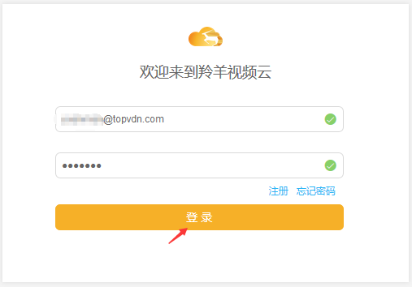
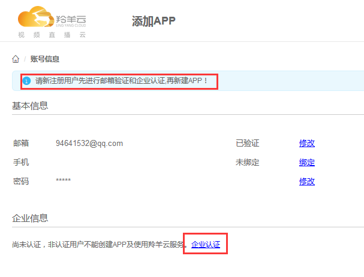
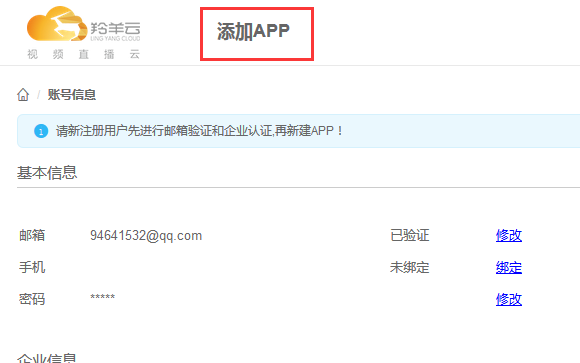
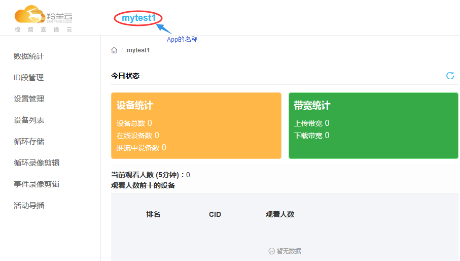

# 创建羚羊云应用

## 1. 登录羚羊云管理平台
使用已经注册过的羚羊云开发者账号进行登录到管理平台
 

## 2. 激活并认证账号信息
开发者注册成功后，会向注册邮箱账号发送一个激活链接，登录邮箱后点击该链接即可激活。
激活后还不能直接新建App，需要在账号管理中心进行企业认证。

 

## 3. 创建新的App
 

点击上图的"添加App"后，填写相关信息后确认提交。

## 4. 创建App成功
创建App成功后会出现该App的数据统计概况。
 
