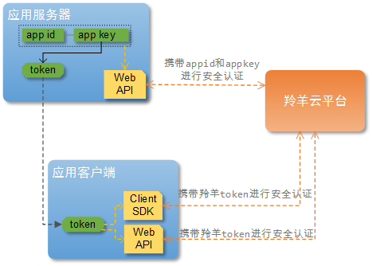
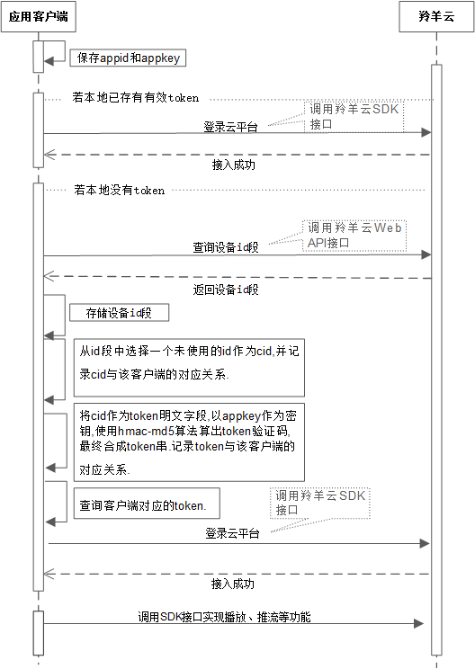

#羚羊云SDK接入指南

##1. 文档目的
为用户提供接入并使用羚羊云的总引导入口，介绍羚羊云的概况、服务架构、应用功能，以便用户能够快速理解羚羊云、顺利调用羚羊云接口、轻松实现所需的应用功能。建议新用户按照顺序阅读，这样有利于理解；老用户可按照内容导航选择性查阅所需了解的内容。

##2. 羚羊云是什么
羚羊云是服务于视频应用领域的云平台，它提供了云平台所需的基础设施，并且为客户提供一切和视频相关的应用和服务。

羚羊云SDK是羚羊云为用户提供的一套应用开发接口，通过这些接口，用户能够接入到羚羊云轻松实现一系列视频相关的应用。羚羊云SDK使得开发者们不必在视频相关的应用开发上耗费精力，只需调用SDK提供的接口，就能轻松实现他们想要的视频相关应用，这样开发者们就能专注在他们所需的其他业务功能。

##3. 相关术语和名词
- **羚羊云用户**：接入到羚羊云平台、调用羚羊云开发接口实现视频应用的客户群体，并非最终的个人终端用户。文档将以“用户”作为简称。
- **应用客户端**：用户开发的客户端应用程序，如手机app、PC桌面应用、嵌入在智能硬件设备中的应用程序、等等。
- **应用服务器**：用户开发的服务端应用程序，为客户端程序提供后台数据、后台业务处理等服务。
- **appid和appkey**：由羚羊云提供给用户的凭证，用户接入羚羊云平台时，平台会对id和key进行验证。
- **cid**：每个客户端第一次接入到羚羊云平台之前，会被分配一个羚羊id作为唯一的身份编号，羚羊云与客户端之间进行数据通信都只认这个id。
- **token**：应用客户端调用羚羊云SDK接口需要携带的凭证，羚羊云平台需要验证其安全性。
- **Web API**: 为开发者提供http接口，即开发者通过http形式发起数据请求，获取返回json或xml格式的数据。用户可以基于此开发JavaScript、C#、C++、Java、Objective-C等语言的应用。
.

##4. 羚羊云服务架构
 

##5. 羚羊云SDK的功能
从上面的整体架构中，可以看出羚羊云SDK可以分两大类:供应用服务器调用的Web API和供应用客户端调用的客户端SDK。以下是SDK的主要功能用例图：

注：以上图中仅仅列出了主要功能，更多具体的功能在各个SDK的开发文档中有详细介绍。

可以看出客户端SDK只为应用客户端提供功能，而Web API部分功能是提供给应用客户端，部分提供给应用服务器。以下功能列表简要描述了各个功能：

| ID | 功能名称 | 功能简要描述 |
|----|----|----|
| 1 | 获取设备ID段 | 向羚羊云获取用户所拥有的设备ID段，用户会在这个ID段内分配一个羚羊ID给用户的每个设备，这个羚羊ID也称CID. |
| 2 | 查询设备状态及信息 | 查询指定设备的状态，如：离线、就绪、转发中等，另外还可以查询设备的信息，如设备配置类型、公网ip、内网ip等。 |	
| 3 | 服务器推送消息 | 应用服务器推送消息给用户名下的多个设备。 |
| 4 | 客户端推送消息 | 客户端推送消息给用户名下的一个或多个设备，也可以向用户的http回调地址推送消息。 |
| 5 | 剪辑录像 | 该功能包含：创建剪辑任务、查询剪辑状态以及剪辑的视频信息、查询剪辑任务列表、以及删除指定的已剪辑数据。 |
| 6 | 查询录像 | 查询指定设备的录像时间轴，如哪些天哪些时段是有录像的。 |
| 7 | 直播播放 | 从羚羊云中拉取指定设备的音视频流，之后在本地进行解码播放。 |
| 8 | 直播推流 | 在本地采集音视频后编码，向羚羊云推送编码后的音视频流。 |
| 9 | 回放录像 | 拉取指定设备指定时间段的录像，在本地进行解码播放。 |
| 10 | 监听消息 | 持续接收任何远程应用客户端或服务器经过羚羊云推送过来的消息，并通知到本地上层应用。 |

##6. 如何接入羚羊云
###6.1 接入对象
所有需要使用羚羊云视频相关应用服务的用户，即羚羊云的接入对象。一般来讲，用户自己的应用通常包含客户端和服务器。

- 应用客户端 
无论是手机、平板电脑等这些视频展示端，还是家庭摄像机、行车记录仪等这类的视频采集端，对于羚羊云来说，这些设备都是客户端，并不区分类别。

- 应用服务器 
用来管理用户自己所属的设备信息、查询设备的状态、配置设备的参数等。

###6.2 接入凭证
这些设备想要接入羚羊云，首先必须获得app id和app key。进入[羚羊云用户管理平台](http://console.topvdn.com/)可申请app id和app key。

###6.3 认证机制
用户在接入到羚羊云平台时，无论是用户的服务器还是客户端，都必须通过平台的安全认证，才能使用接口以实现应用。服务器和客户端有着不同的认证机制，如下图所示：

- 应用服务器认证 
应用服务器直接携带app id和app key，通过调用羚羊云提供的Web API向羚羊云平台发送http请求，云平台会对id和key进行验证，验证通过将会返回该API对应的结果。

- 应用客户端认证 
(1)应用服务器根据拿到的app key，按照羚羊云的token生成算法规则，计算得出一个token；token的计算方法可参见本文下一章节的[羚羊云平台token验证机制](#token1)。 
(2)应用客户端向他们的应用服务器获取token，凭着这个token，才能成功调用羚羊云客户端SDK或Web API实现功能。

###6.4 用户接入
- 应用服务器接入 
携带appid和appkey，调用羚羊云Web API向云平台发送http请求，返回调用结果，即完成接入。

- 应用客户端接入 
客户端的接入过程就相对复杂一些，需要应用服务器的参与，如下图所示：

###6.5 另外一种接入方法
上面的“认证机制”和“用户接入”是我们建议的方法，也是用户通常的认证方法。但有些用户实际的应用体系架构中，没有设计应用服务器(也可以说将应用服务器的业务处理都放在了应用客户端，如一些嵌入在视频采集端的智能硬件设备端应用程序)。
####6.5.1 认证机制
这种用户应用体系架构的认证机制如下图所示：

 

####6.5.2 接入流程
 

##<a name="token1" id="token1">7. 羚羊云token认证机制</a>
###7.1 羚羊云的身份验证方式
