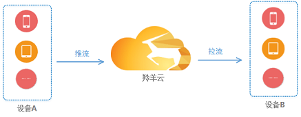

#羚羊云SDK集成示例

本文介绍在不同的应用场景下，推流端和播放端两端设备的SDK集成示例。

##1 应用场景
**视频通话**

 
  
**视频直播**

 
  
**手机直播**

 
 

##2 应用体系
 

羚羊云用户都有自己的一套应用体系和架构，通常体系中会含有的应用服务器和设备终端(也称应用客户端)，所有的终端设备都会由注册到应用服务器并由服务器来管理。

##2 应用接入
在集成SDK实现特定应用场景的应用功能之前，用户应用体系中的服务器和设备必须先接入羚羊云。
应用服务器和羚羊云没有视频流式的业务，仅仅根据需要调用羚羊云的Web API以请求所需数据。
设备(即应用客户端)的接入过程相对复杂，其中很大一部分需要应用服务器来辅助完成。

 

上图中1、2步是由开发者注册并登录羚羊云应用管理平台完成，获取到appid-appkey和id段之后将其保存在应用服务器；
其他的3、4、5步全都是在应用服务器端完成。

**注**：
`生成token的方法`参考[羚羊云token认证机制](http://doc.topvdn.com/api/index.html#!public-doc/token_format.md)，
`config`可通过调用Web API的['查询设备状态接口'](http://doc.topvdn.com/api/index.html#!web_api_v2.md#2.1.1_%E6%9F%A5%E8%AF%A2%E8%AE%BE%E5%A4%87%E7%8A%B6%E6%80%81)获取，该接口返回的`init_string`字段即`config串`。

 

`连接并启动云服务`需要调用**SDK的开启云服务接口**，该接口需要传入`羚羊token`和`config串`。[iOS调用示例](http://doc.topvdn.com/api/index.html#!public-doc/SDK-iOS/ios_api.md#2.2_%E5%90%AF%E5%8A%A8%E4%BA%91%E6%9C%8D%E5%8A%A1) [Android调用方法](http://doc.topvdn.com/api/index.html#!public-doc/SDK-Android/android_api.md#2.2_%E5%90%AF%E5%8A%A8%E4%BA%91%E6%9C%8D%E5%8A%A1)

至此，设备A和设备B就成功接入到羚羊云，然后根据自己的特定场景和需求来实现不同的功能。下面分别展示视频通话、视频直播、手机直播这几种应用场景的集成方法。

##3 视频通话应用
 

上图的流程中：
第2步“获取羚羊tracker的ip和端口”需要调用羚羊云Web API的[获取设备状态]()接口。
第3步“生成URL”需要根据[羚羊云推拉流URL格式]()。
第4步“推送消息给B”需要调用羚羊云Web API的[服务器推送消息]()接口，接口参数需要传入B的羚羊cid。
第5步“收到A的呼叫请求”，是在羚羊云SDK的[启动云服务]()接口时传入的`消息监听回调函数`来接收并响应处理消息，原理可参见[消息透传]()介绍。
第5步“建立双方的通话连接”需要调用羚羊云SDK的[视频通话-打开播放器]()接口，接口参数需要传入A发送过来的URL。

###4. 使用SDK
[Web API使用指南](http://doc.topvdn.com/api/public-doc/Web-API/#!web_api_v2.md "Web API")
[SDK使用说明-C版](http://doc.topvdn.com/api/#!public-doc/SDK-C/c_guide.md "C版SDK")
[SDK使用说明-iOS版](http://doc.topvdn.com/api/#!public-doc/SDK-iOS/ios_guide.md "iOS版SDK")
[SDK使用说明-Anroid版](http://doc.topvdn.com/api/#!public-doc/SDK-Android/android_guide.md "Anroid版SDK")
[SDK使用说明-Windows版](http://doc.topvdn.com/api/#!public-doc/SDK-Windows/windows_guide.md "Windows版SDK")

###5. Demo示例
[Demo-C版](http://doc.topvdn.com/api/public-doc/SDK-C/zipdown/ly_sdk_c.zip)
[Demo-iOS版](http://doc.topvdn.com/api/public-doc/SDK-iOS/zipdown/ly_sdk_ios.zip)
[Demo-Android版](http://doc.topvdn.com/api/public-doc/SDK-Android/zipdown/ly_sdk_android.zip)
[Demo-Windows版](http://doc.topvdn.com/api/public-doc/SDK-Windows/zipdown/ly_sdk_windows.zip)

###6. 常见问题

1. `视频监控`和`视频通话`调用哪些接口？
答：视频监控调用SDK的`播放器`接口，视频通话调用SDK的`视频通话`接口。播放器接口调用示例：[iOS版](http://doc.topvdn.com/api/#!public-doc/SDK-iOS/ios_guide.md#5.4_%E6%92%AD%E6%94%BE%E5%99%A8)、[Android版](http://doc.topvdn.com/api/#!public-doc/SDK-Android/android_guide.md#5.4_%E6%92%AD%E6%94%BE%E5%99%A8)；视频通话接口调用示例：[iOS版](http://doc.topvdn.com/api/#!public-doc/SDK-iOS/ios_guide.md#5.6_%E8%A7%86%E9%A2%91%E9%80%9A%E8%AF%9D)、[Android版](http://doc.topvdn.com/api/#!public-doc/SDK-Android/android_guide.md#5.6_%E8%A7%86%E9%A2%91%E9%80%9A%E8%AF%9D)。

2. 视频通话需要调用什么接口，传什么参数？
答：实现视频通话功能需要调用羚羊云SDK视频通话的接口，不同开发语言版本的SDK接口不一样。可参见[iOS视频通话接口调用示例](http://doc.topvdn.com/api/#!public-doc/SDK-iOS/ios_guide.md#5.6_%E8%A7%86%E9%A2%91%E9%80%9A%E8%AF%9D)、[Android视频通话接口调用示例](http://doc.topvdn.com/api/#!public-doc/SDK-Android/android_guide.md#5.6_%E8%A7%86%E9%A2%91%E9%80%9A%E8%AF%9D)。

3. 如何实现`录像回放`的功能？录像存在羚羊云端的列表我们如何查看？找到视频列表后又如何按指定时间点播放录像？
答：通过[Web API的查询设备录像时间轴接口](http://doc.topvdn.com/api/#!web_api_v2.md#2.2.1_%E8%AE%BE%E5%A4%87%E5%BD%95%E5%83%8F%E6%97%B6%E9%97%B4%E8%BD%B4)，可以查询到某个视频设备存放在羚羊云端的录像时间列表，然后调用羚羊云客户端SDK的播放器接口([iOS播放器接口调用示例](http://doc.topvdn.com/api/#!public-doc/SDK-iOS/ios_guide.md#5.4_%E6%92%AD%E6%94%BE%E5%99%A8)、[Android播放器接口调用示例](http://doc.topvdn.com/api/#!public-doc/SDK-Android/android_guide.md#5.4_%E6%92%AD%E6%94%BE%E5%99%A8))，传入指定格式的url参数，这个url参数需要通过应用服务器去获取。

### 相关链接
[Web API使用指南](http://doc.topvdn.com/api/public-doc/Web-API/#!web_api_v2.md "Web API")
[羚羊云token认证机制](http://doc.topvdn.com/api/index.html#!public-doc/token_format.md)
[羚羊云推拉流URL格式解析](http://doc.topvdn.com/api/index.html#!public-doc/url_format.md)

