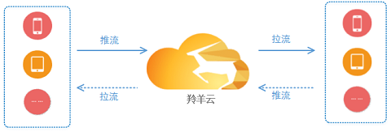
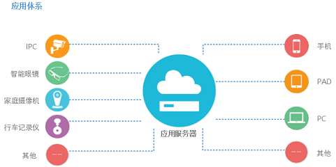
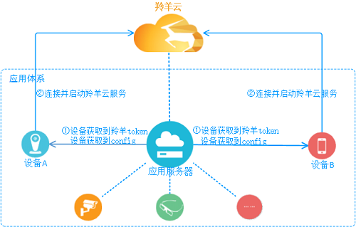

#羚羊云SDK集成示例

本文介绍在不同的应用场景下，推流端和播放端两端设备的SDK集成示例。

##1 应用场景
**视频通话**

 
<br /><br />
**视频直播**

 
<br /><br />
**手机直播**

 
<br />

##2 应用体系
 

羚羊云用户都有自己的一套应用体系和架构，通常体系中会含有的应用服务器和设备终端(也称应用客户端)，所有的终端设备都会由注册到应用服务器并由服务器来管理。

##2 应用接入
在集成SDK实现特定应用场景的应用功能之前，用户应用体系中的服务器和设备必须先接入羚羊云。
应用服务器和羚羊云没有视频流式的业务，仅仅根据需要调用羚羊云的Web API以请求所需数据。
设备(即应用客户端)的接入过程相对复杂，其中很大一部分需要应用服务器来辅助完成。

 

上图中1、2步是由开发者注册并登录羚羊云应用管理平台完成，获取到appid-appkey和id段之后将其保存在应用服务器；
其他的3、4、5步全都是在应用服务器端完成。

**注**：
`生成token的方法`参考[羚羊云token认证机制](http://doc.topvdn.com/api/index.html#!public-doc/token_format.md)，
`config`可通过调用Web API的['查询设备状态接口'](http://doc.topvdn.com/api/index.html#!web_api_v2.md#2.1.1_%E6%9F%A5%E8%AF%A2%E8%AE%BE%E5%A4%87%E7%8A%B6%E6%80%81)获取，该接口返回的`init_string`字段即`config串`。

 

`连接并启动云服务`需要调用**SDK的开启云服务接口**，该接口需要传入`羚羊token`和`config串`。[iOS调用示例](http://doc.topvdn.com/api/index.html#!public-doc/SDK-iOS/ios_api.md#2.2_%E5%90%AF%E5%8A%A8%E4%BA%91%E6%9C%8D%E5%8A%A1) [Android调用方法](http://doc.topvdn.com/api/index.html#!public-doc/SDK-Android/android_api.md#2.2_%E5%90%AF%E5%8A%A8%E4%BA%91%E6%9C%8D%E5%8A%A1)

至此，设备A和设备B就成功接入到羚羊云，然后根据自己的特定场景和需求来实现不同的功能。下面分别展示视频通话、视频直播、手机直播这几种应用场景的集成方法。

##3 视频通话应用
###3.1 第一步
###3.2 第二步
###3.3 第三步

##4 视频直播应用
###4.1 第一步
###4.2 第二步
###4.3 第三步

##5 手机直播应用
###5.1 第一步
###5.2 第二步
###5.3 第三步

##1 视频通话
以下展示iOS设备之间视频通话的例子，Android设备之间的视频通话流程与之一样，具体使用方法请参见[这里](http://doc.topvdn.com/api/#!public-doc/SDK-Android/android_guide.md "Anroid版SDK")。

 

`注`：QSUP的连接URL事先从后台服务器获得，生成URL的方法请参考[羚羊云推拉流URL格式解析](http://doc.topvdn.com/api/index.html#!public-doc/url_format.md)。

###1.1 主叫端

####1.1.1 启动云服务
启动羚羊云服务，该接口函数分配并初始化本地系统资源，登录到羚羊云平台，在平台端进行安全认证。

```
[[LYCloudService sharedLYCloudService] startCloudService: m_token
                                                  config: m_config
                                              startBlock: ^(LYstatusCode statusCode, NSString *errorString)
                                                        {
                                                            //启动云服务的成功与否状态回调
                                                        }
                                         popMessageBlock: ^(NSDictionary *dictionary)
                                                        {
                                                            //平台透传的所有消息都从这回调出来
                                                        }
];
```

####1.1.2 设置流参数
```
//该方法生成一个默认的视频采集配置
videoSize = (640, 480);
frameRate = 15fps, bitrate = 400kbps;
LYVideoStreamingConfiguration *mVideoConfig = [LYVideoStreamingConfiguration defaultConfiguration];
    
//该方法生成一个默认的音频采集配置。
sampleRate = 16000, channle = 1;
LYAudioStreamingConfiguration *mAudioConfig = [LYAudioStreamingConfiguration defaultConfiguration];
```
Configuration类配置视频通话推流的参数，包括是否使用音、视频，是否使用硬编码，视频旋转角度等多种配置，用户可根据需要查看更多进行配置。
**注意**：更多的参数配置详见[API手册](http://doc.topvdn.com/api/#!public-doc/SDK-iOS/ios_api.md)中的数据类型-视频通话推流相关属性配置。

####1.1.3 初始化视频通话类
```
//初始化直播类:如果不采集音频，则audioConfiguration传nil即可
LYFaceTime * mFaceTime = [[LYFaceTime alloc] initWithVideoConfiguration:mVideoConfig audioConfiguration:mAudioConfig]; 
```

####1.1.4 设置播放参数
```
//如果不需要播放对方视频则不设置该参数
LYPlayerConfiguration *mPlayerConfig = [[LYPlayerConfiguration alloc] initWithPlayView:mPlayView frame:CGRectMake(0, 0, kScreenWidth, kScreenHeight) decodeMode:LYPlayerDecodeModeHard];
[mFaceTime setPlayView:mFaceTimeAddress playerConfiguration:mPlayerConfig]; 
```

####1.1.5 设置本地预览视图
```
//设置采集视频预览view：如果不预览自己视频则不设置
[mFaceTime setPreview:self.preview frame:CGRectMake(0, 0, kScreenWidth, kScreenHeight)];
```

####1.1.6 发送QSUP连接URL到被叫端
通过羚羊云提供的消息透传通道来发送QSUP连接URL到被叫端，您也通过自己的方式发送QSUP连接URL到被叫端。

#####1.1.7 关闭通话
最后若想主动停止视频通话则需要调用close方法；当收到ConnectionClosed时也必须调用close方法。
```
//主被叫关闭通话都要调用该方法！！！！！！
[mFaceTime close:mFaceTimeAddress];
```

###1.2 被叫端

####1.2.1 启动云服务
启动羚羊云服务，该接口函数分配并初始化本地系统资源，登录到羚羊云平台，在平台端进行安全认证。

```
[[LYCloudService sharedLYCloudService] startCloudService: m_token
                                                  config: m_config
                                              startBlock: ^(LYstatusCode statusCode, NSString *errorString)
                                                        {
                                                            //启动云服务的成功与否状态回调
                                                        }
                                         popMessageBlock: ^(NSDictionary *dictionary)
                                                        {
                                                            //平台透传的所有消息都从这回调出来
                                                        }
];
```

####1.2.2 设置流参数
```
//该方法生成一个默认的视频采集配置
videoSize = (640, 480);
frameRate = 15fps, bitrate = 400kbps;
LYVideoStreamingConfiguration *mVideoConfig = [LYVideoStreamingConfiguration defaultConfiguration];
    
//该方法生成一个默认的音频采集配置。
sampleRate = 16000, channle = 1;
LYAudioStreamingConfiguration *mAudioConfig = [LYAudioStreamingConfiguration defaultConfiguration];
```
Configuration类配置视频通话推流的参数，包括是否使用音、视频，是否使用硬编码，视频旋转角度等多种配置，用户可根据需要查看更多进行配置。
**注意**：更多的参数配置详见[API手册](http://doc.topvdn.com/api/#!public-doc/SDK-iOS/ios_api.md)中的数据类型-视频通话推流相关属性配置。

####1.2.3 初始化视频通话类
```
//初始化直播类:如果不采集音频，则audioConfiguration传nil即可
LYFaceTime * mFaceTime = [[LYFaceTime alloc] initWithVideoConfiguration:mVideoConfig audioConfiguration:mAudioConfig]; 
```

####1.2.4 设置播放参数
```
//如果不需要播放对方视频则不设置该参数
LYPlayerConfiguration *mPlayerConfig = [[LYPlayerConfiguration alloc] initWithPlayView:mPlayView frame:CGRectMake(0, 0, kScreenWidth, kScreenHeight) decodeMode:LYPlayerDecodeModeHard];
[mFaceTime setPlayView:mFaceTimeAddress playerConfiguration:mPlayerConfig]; 
```

####1.2.5 设置本地预览视图
```
//设置采集视频预览view：如果不预览自己视频则不设置
[mFaceTime setPreview:self.preview frame:CGRectMake(0, 0, kScreenWidth, kScreenHeight)];
```

####1.2.6 接收由主叫端发送的QSUP连接URL
监听由主叫端发送的QSUP连接URL。该URL可以通过羚羊云的消息透传通道接收，也可以通过自己的方式接收。

####1.2.7 建立连接
```
[mFaceTime open: mFaceTimeAddress openStatus:^(LYstatusCode statusCode, NSString *errorString) {
    NSLog(@"open statusCode = %d, errorString = %@", statusCode, errorString);
    //连接是否成功的状态回调，只有statusCode == LYstatusCodeSuccess才可以进行推流等操作。
    //开始推流
} playerStatus:^(NSDictionary *playerMessageDic) {
    NSLog(@"playerMessageDic = %@", playerMessageDic);
    //该回调目前无回调信息。
}];
```

####1.2.8 开始推流
```
[mFaceTime startSendVideoData];
[mFaceTime startSendAudioData];
```

####1.2.9 关闭通话
最后若想主动停止视频通话则需要调用close方法；当收到ConnectionClosed时也必须调用close方法。
```
//主被叫关闭通话都要调用该方法！！！！！！
[mFaceTime close:mFaceTimeAddress];
```

##2. 视频直播
以下展示视频直播应用场景的例子。

 


###2.1 推流端
这里推流端设备以嵌入式linux设备为例。需要调用羚羊云C版SDK，采集和编码需要设备端应用程序自己完成，推流可调用SDK接口来实现。

####2.1.1 启动云服务
启动羚羊云服务，该接口函数分配并初始化本地系统资源，登录到羚羊云平台，在平台端进行安全认证。
```
void popMessage(void *apData, const char *aMessage)
{
	if(!aMessage)
		return;
	cJSON* root = cJSON_Parse(aMessage);
	cJSON* name = cJSON_GetObjectItem(root,"name");
	cJSON* message;
	myMsg tmpMsg = {0,""};
	if(memcmp("ConnectionAcceptted",name->valuestring,strlen(name->valuestring)) == 0)
	{
		//QSUP协议开始推流
		printf("PopMessage ConnectionAcceptted\n");
	}
	//其他详细分支请参考demo
}
//...
char* deviceToken = "537067556_3222536192_1493481600_f0399b369aa760362ac4edd224bae23b";
char* configStr = "[Config]\r\nIsDebug=0\r\nLocalBasePort=8200\r\nIsCaptureDev=1\r\nIsPlayDev=1\r\nU 
dpSendInterval=2\r\nConnectTimeout=10000\r\nTransferTimeout=10000\r\n[Tracker]\r\nCount=3\r\nIP1=121.42.156.148\r\nPort1=80\r\nIP2=182.254.149.39\r\nPort2=80\r\nIP3=203.195.157.248\r\nPort3=80\r\n[LogServer]\r\nCount=1\r\nIP1=120.26.74.53\r\nPort1=80\r\n";
while(1)
{
	//开启云平台服务，并注册消息回调函数,调用此函数之后才能调用云平台的其他函数
	//此处deviceToken和configStr从羚羊云应用后台或者用户自己的应用服务器获取
	ret = LY_startCloudService(deviceToken,configStr,popMessage,NULL);
	if(ret == 0)//返回0表示开启成功
	{
		break;
	}
	printf("StartCloudService failed!  ret = %d  retry...\n",ret );
	sleep(1);
}
```

####2.1.2 建立传输通道
任何媒体数据的接收和发送，必须先建立传输通道。需要传入羚羊云自定义格式的URL作为参数进行通道的连接，成功建立连接后，即可通过LY_recvMediaFrame和LY_sendMediaFrame收发数据。
```
char *peer="topvdn://203.195.157.248:80?protocolType=1&token=1003469_3222536192_1493481600_5574318032e39b62063d98e6bff50069";
intfd;
while(1)
{
	fd = LY_connect (url,NULL);
	if(fd< 0)
	{
		printf("connect to peer faild\n");
		usleep(300*1000);
		continue;
	}
	break;
}
//连接成功后即可调用接口收发数据
//...
```
URL格式：

  1,QSTP连接URL格式：topvdn://relay_ip:port?protocolType=[]&connectType=[]&token=[]&mode=[]
  2,QSUP连接URl格式：topvdn://traker_ip:port?protocolType=[]&token=[]
  3,云端录像下载URL格式：topvdn://topvdn.public.cn?protocolType=[]&token=[]&begin=[]&end=[]&play=[]

<u>protocolType</u>：协议类型，[1]QSUP,[2]QSTP,[3]云端录像下载
<u>connectType</u>：连接类型，[1]推流端,[2]拉流端
<u>begin、end、play</u>：下载录像需要用到，其他功能可不用，begin表示要下载录像的开始时间，end表示结束时间，play表示开始播放的时间，需要在begin和end的范围之内。时间单位为秒。
<u>token</u>：对端设备的访问token，具体内容格式请见[羚羊云token认证机制](http://doc.topvdn.com/api/#!public-doc/token_format.md)的详细介绍。

**URL的详细格式请参考[羚羊云URL格式解析](http://doc.topvdn.com/api/#!public-doc/url_format.md)。**

####2.1.3 推送媒体流
首先需要建立连接，即创建传输通道，调用LY_connect创建传输通道，然后才能进行推流。羚羊云支持多路推流，每一路流都有一个int类型的fd唯一标识。（一路即一个传输通道，每个传输通道都可以传输音视频数据）。直播推流使用QSUP协议还是QSTP协议是根据用户调用LY_connectr函数传入的参数决定的，用户在调用LY_sendMediaFrame发送数据的时候无需关心这些选项。
```
int fd;
int ret;
MediaFrame_tframe = {0};
char *url="topvdn://183.57.151.161:1935?protocolType=2&connectType=1&token=537067556_3222536192_1493481600_f0399b369aa760362ac4edd224bae23b&mode=2";
while(1)
{
	fd = LY_connect(url,NULL)//连接推流服务器，返回标识传输通道的fd
	if(fd< 0)
	{
		printf("connect to lingyang cloud relay server failed,retry...\n");
		usleep(300*1000);
		continue;
	} 
	break;
}
frame.frameType = frameType;//帧类型参考include目录下common_define.h
frame.frameBuffer = dataBuffer;
frame.frameLength = frameSize;
frame.frameTime = timeStamp;
ret = LY_sendMediaFrame(fd,&frame);//发送音视频数据，成功返回0，失败返回非0
if(ret != 0)
printf("send frame failed nal %d frameret:%d,frameSize=%d\n",frameType,ret,frameSize);
```
`注`:推流支持云存储功能：在推流的过程中将音视频流存储在羚羊云，以供用户下载并回放录像，只需将url按照[羚羊云URL格式协议](http://doc.topvdn.com/api/index.html#!public-doc/url_format.md)而设置即可实现。

####2.1.4 断开通道的连接
当不再继续推流时，需要断开之前已经建立的连接通道。

断开fd标识的传输通道 ，此时羚羊云服务还没有关闭。
```
if(LY_disconnect(fd) != 0)//这里的fd是调用函数LY_connect获取到的
{
	printf("disconnect server failed\n");
}
else
{
	printf("disconnect server success\n");
}
```

####2.1.5 停止云服务
```
//停止云平台服务，释放相关资源。
LY_stopCloudService();
```
在应用退出的时候调用，释放系统资源。

###2.2 播放端
以Android手机为例。需要调用羚羊云Android版SDK接口来实现播放功能。

####2.2.1 启动云服务
启动羚羊云服务，该接口函数分配并初始化本地系统资源，登录到羚羊云平台，在平台端进行安全认证。

    /**
     * 开启云服务
     */
    public void startCloudServiceWithFacetime(String userToken) {
        LYService.getInstance().startCloudService(
        	userToken
            , Const.CONFIG
            , new CallBackListener<Long>() {
                @Override
                public void onSuccess(Long aLong) {
                        CLog.v("long-" + aLong);
                        showToast("登录成功" );
                }
                
                @Override
                public void onError(LYException exception) {
                    CLog.v("exception-" + exception.toString());
                    showToast("登录失败"+exception.getMessage());
                }
            }
        );
    }

####2.2.2 设置播放布局
我们将播放器封装成了界面控件，方便用户直接嵌入到app的主界面中，实现播放器的功能。
 
    <com.lingyang.sdk.player.widget.LYPlayer
        android:id="@+id/ly_player"
        android:layout_width="match_parent"
        android:layout_height="match_parent" />

    LYPlayer mPlayer = (LYPlayer)findViewById(R.id.ly_player);


####2.2.3 设置播放源
 
    //公众摄像机直播观看		
    mPlayer.setDataSource("topvdn://topvdn.public.cn" +
	                      "protocolType=2&connectType=2&token=1003136_3356753920_" +
                          "1492163431_cc3acc347784f3e30cd4713acec615b1");

播放源格式：<br>
  1,QSTP连接URL格式：<br>
    topvdn://relay_ip:port?protocolType=[]&connectType=[]&token=[]<br>
  2,QSUP连接URl格式：<br>
    topvdn://traker_ip:port?protocolType=[]&token=[]<br>
  3,云存储下载URL格式：<br>
    topvdn://topvdn.public.cn?protocolType=[]&token=[]&begin=[]&end=[]&play=[]

<u>protocolType</u>：协议类型，[1]QSUP,[2]QSTP,[3]云存储录像下载<br>
<u>connectType</u>：连接类型，[1]推流端,[2]拉流端<br>
<u>begin、end、play</u>：下载录像需要用到，其他功能可不用，begin表示要下载录像的开始时间，end表示结束时间，play表示开始播放的时间，需要在begin和end的范围之内。时间单位为毫秒。<br>
<u>token</u>：对端设备的访问token，具体内容格式请见[羚羊云token认证机制](http://doc.topvdn.com/api/public-doc/#!token_format.md)的详细介绍。

播放源的URL地址由应用向应用后台获取。
应用后台生成播放源url的方法和步骤如下：

(1)调用[Web API的'查询设备状态'接口](http://doc.topvdn.com/api/#!web_api_v2.md#2.1.1_%E6%9F%A5%E8%AF%A2%E8%AE%BE%E5%A4%87%E7%8A%B6%E6%80%81)获取羚羊云的tracker ip/port或者relay ip/port；

(2)根据[羚羊云token格式](http://doc.topvdn.com/api/#!public-doc/token_format.md)生成token；

(3)按照[羚羊云URL格式解析](http://doc.topvdn.com/api/#!public-doc/url_format.md)生成羚羊云格式的URL。

####2.2.4 设置播放连接状态监听
设置循环执行网络拉流、解码视频帧、及显示视频帧这些过程之前，连接到云服务器的状态监听函数；
```
/**
 * 所有连接完成，开始播放监听
 */
mPlayer.setOnPreparedListener(new OnPreparedListener() {
    @Override
    public void onPrepared(int time) {
        //time 连接过程所消耗的时间
        runOnUiThread(new Runnable() {
            public void run() {}
        }
        );
    }
});
```
OnPreparedListener被触发则表示连接至云服务器已经成功，在回调函数中，可以在播放控件界面上显示连接状态的变化。

####2.2.5 开始播放
```
mPlayer.start();
```
开始播放后会触发OnPreparedListener回调函数;

注：该方法既可以播放直播流，也可以播放云端录像流。播放的类型根据上面所述 “设置播放源”小节的url地址内容来区分。

####2.2.6 结束播放
```
mPlayer.stop();
```

##3. 手机直播
以下展示手机直播应用场景的例子。

 

###3.1 推流端
以Android手机推流为例。需要调用羚羊云Android版SDK接口来实现直播推流的功能。

####3.1.1 启动云服务
启动羚羊云服务，该接口函数分配并初始化本地系统资源，登录到羚羊云平台，在平台端进行安全认证。

    /**
     * 开启云服务
     */
    public void startCloudServiceWithFacetime(String userToken) {
        LYService.getInstance().startCloudService(
        	userToken
            , Const.CONFIG
            , new CallBackListener<Long>() {
                @Override
                public void onSuccess(Long aLong) {
                        CLog.v("long-" + aLong);
                        showToast("登录成功" );
                }
                
                @Override
                public void onError(LYException exception) {
                    CLog.v("exception-" + exception.toString());
                    showToast("登录失败"+exception.getMessage());
                }
            }
        );
    }

####3.1.2 设置流参数
```
//音视频和摄像机的初始化配置，用户可根据实际需要进行配置。
mSessionConfig = new SessionConfig.Builder()
	.withVideoBitrate(512000)//码率
	.withVideoResolution(480, 640)//分辨率  默认480p
    .withDesireadCamera(Camera.CameraInfo.CAMERA_FACING_BACK)//摄像头类型
	.withCameraDisplayOrientation(90)//旋转角度
	.withAudioChannels(1)//声道 1单声道  2双声道
	.useHardAudioEncode(false)//是否音频硬编
	.useHardVideoEncode(false)//是否视频硬编
	.useAudio(true)//是否开启音频
    .useVideo(true)//是否开启视频
	.build();

```
SessionConfig类配置直播推流的参数，包括是否使用音、视频，是否使用硬编码，视频旋转角度等多种配置，用户可根据需要查看更多进行配置。<br>
**注意**：更多的参数配置详见[API手册](http://doc.topvdn.com/api/index.html#!public-doc/SDK-Android/android_api.md#1.3_SessionConfig%E9%85%8D%E7%BD%AE%E7%9B%B4%E6%92%AD%E6%8E%A8%E6%B5%81%E5%8F%82%E6%95%B0 "Android API")中的数据类型-直播推流相关属性配置。

####3.1.3 设置本地预览布局
```
<com.lingyang.sdk.view.LYGLCameraEncoderView
    android:id="@+id/ly_preview"
    android:layout_width="match_parent"
    android:layout_height="match_parent"/>

LYGLCameraEncoderView mPreview = (LYGLCameraEncoderView)findViewById(R.id.ly_preview);
```
我们对surfaceview封装了的自定义View，用来预览本地采集的图像。

####3.1.4 设置本地预览视图
```
//设置本地预览
mLiveBroadcast.setLocalPreview(mPreview);
####5.5.4 设置推流状态监听
mLiveBroadcast.setBroadcastListener(new BroadcastListener() {
	@Override
	public void onBroadcastStart() {
		showToast("马上开始直播");
	}
	@Override
	public void onBroadcastLive() {
		showToast("正在直播");
	}
	@Override
	public void onBroadcastStop() {
		showToast("停止直播");
	}
	@Override
	public void onBroadcastError(LYException exception) {
		showToast("直播出错" + exception.getCode() + "--"
				+ exception.getMessage());
	}
});
```
####3.1.5 开始推流直播
```
// 开始直播
//IBroadcastOpenAPI.MODE_LIVE  :直播
//IBroadcastOpenAPI.MODE_LIVE_AND_RECORD   :录像直播
			
mLiveBroadcast.startBroadcasting(ILiveBroadcast.MODE_LIVE,
	"3000000185_3356753920_1492163431_cc3acc347784f3e30cd4713acec615b1");
```

####3.1.6 结束推流直播
当不再推流时可以调用接口结束推流。
```
//结束直播
mLiveBroadcast.stopBroadcasting();
//资源释放
mLiveBroadcast.release();
```
**注意**：在调用stopBroadcasting 之后，必须调用release以释放系统资源。

###3.2 播放端
以iOS手机拉流播放为例。需要调用羚羊云iOS版SDK接口来完成播放功能。

####3.2.1 创建播放器类
```
LYPlayer *m_player = [[LYPlayer alloc] init];
```

####3.2.2 创建播放配置
```
LYPlayerConfiguration *m_playerConfig = [[LYPlayerConfiguration alloc] initWithPlayView:playview
                                                                                  frame:CGRectMake(0, 0, 640  , 480)
                                                                             decodeMode:LYPlayerDecodeModeHard];
```

####3.2.3 设置播放配置
```
[m_player setViewWithConfiguration:m_playerConfig];
```

####3.2.4 打开播放器
```
[m_player open: @"topvdn://203.195.157.248:80?protocolType=1&token=1003182_3222536192_1467302400_b862e6a09c7c12022794a18aa61e71bb"
    openStatus: ^(LYstatusCode statusCode, NSString *errorString) {
        //打开播放器的状态回调
    }
  playerStatus: ^(NSDictionary *playerMessageDic) {
        //播放过程中的状态回调
    }
];

```
播放地址由应用向应用后台获取。
应用后台生成播放源url的方法和步骤如下：

(1)调用[Web API的'查询设备状态'接口](http://doc.topvdn.com/api/#!web_api_v2.md#2.1.1_%E6%9F%A5%E8%AF%A2%E8%AE%BE%E5%A4%87%E7%8A%B6%E6%80%81)获取羚羊云的tracker ip/port或者relay ip/port；

(2)根据[羚羊云token格式](http://doc.topvdn.com/api/#!public-doc/token_format.md)生成token；

(3)按照[羚羊云URL格式解析](http://doc.topvdn.com/api/#!public-doc/url_format.md)生成羚羊云格式的URL。

####3.2.5 关闭播放器
```
[m_player close];
```

###4. 使用SDK
[Web API使用指南](http://doc.topvdn.com/api/public-doc/Web-API/#!web_api_v2.md "Web API")
[SDK使用说明-C版](http://doc.topvdn.com/api/#!public-doc/SDK-C/c_guide.md "C版SDK")
[SDK使用说明-iOS版](http://doc.topvdn.com/api/#!public-doc/SDK-iOS/ios_guide.md "iOS版SDK")
[SDK使用说明-Anroid版](http://doc.topvdn.com/api/#!public-doc/SDK-Android/android_guide.md "Anroid版SDK")
[SDK使用说明-Windows版](http://doc.topvdn.com/api/#!public-doc/SDK-Windows/windows_guide.md "Windows版SDK")

###5. Demo示例
[Demo-C版](http://doc.topvdn.com/api/public-doc/SDK-C/zipdown/ly_sdk_c.zip)
[Demo-iOS版](http://doc.topvdn.com/api/public-doc/SDK-iOS/zipdown/ly_sdk_ios.zip)
[Demo-Android版](http://doc.topvdn.com/api/public-doc/SDK-Android/zipdown/ly_sdk_android.zip)
[Demo-Windows版](http://doc.topvdn.com/api/public-doc/SDK-Windows/zipdown/ly_sdk_windows.zip)

###6. 常见问题

1. `视频监控`和`视频通话`调用哪些接口？
答：视频监控调用SDK的`播放器`接口，视频通话调用SDK的`视频通话`接口。播放器接口调用示例：[iOS版](http://doc.topvdn.com/api/#!public-doc/SDK-iOS/ios_guide.md#5.4_%E6%92%AD%E6%94%BE%E5%99%A8)、[Android版](http://doc.topvdn.com/api/#!public-doc/SDK-Android/android_guide.md#5.4_%E6%92%AD%E6%94%BE%E5%99%A8)；视频通话接口调用示例：[iOS版](http://doc.topvdn.com/api/#!public-doc/SDK-iOS/ios_guide.md#5.6_%E8%A7%86%E9%A2%91%E9%80%9A%E8%AF%9D)、[Android版](http://doc.topvdn.com/api/#!public-doc/SDK-Android/android_guide.md#5.6_%E8%A7%86%E9%A2%91%E9%80%9A%E8%AF%9D)。

2. 视频通话需要调用什么接口，传什么参数？
答：实现视频通话功能需要调用羚羊云SDK视频通话的接口，不同开发语言版本的SDK接口不一样。可参见[iOS视频通话接口调用示例](http://doc.topvdn.com/api/#!public-doc/SDK-iOS/ios_guide.md#5.6_%E8%A7%86%E9%A2%91%E9%80%9A%E8%AF%9D)、[Android视频通话接口调用示例](http://doc.topvdn.com/api/#!public-doc/SDK-Android/android_guide.md#5.6_%E8%A7%86%E9%A2%91%E9%80%9A%E8%AF%9D)。

3. 如何实现`录像回放`的功能？录像存在羚羊云端的列表我们如何查看？找到视频列表后又如何按指定时间点播放录像？
答：通过[Web API的查询设备录像时间轴接口](http://doc.topvdn.com/api/#!web_api_v2.md#2.2.1_%E8%AE%BE%E5%A4%87%E5%BD%95%E5%83%8F%E6%97%B6%E9%97%B4%E8%BD%B4)，可以查询到某个视频设备存放在羚羊云端的录像时间列表，然后调用羚羊云客户端SDK的播放器接口([iOS播放器接口调用示例](http://doc.topvdn.com/api/#!public-doc/SDK-iOS/ios_guide.md#5.4_%E6%92%AD%E6%94%BE%E5%99%A8)、[Android播放器接口调用示例](http://doc.topvdn.com/api/#!public-doc/SDK-Android/android_guide.md#5.4_%E6%92%AD%E6%94%BE%E5%99%A8))，传入指定格式的url参数，这个url参数需要通过应用服务器去获取。

### 相关链接
[Web API使用指南](http://doc.topvdn.com/api/public-doc/Web-API/#!web_api_v2.md "Web API")
[羚羊云token认证机制](http://doc.topvdn.com/api/index.html#!public-doc/token_format.md)
[羚羊云推拉流URL格式解析](http://doc.topvdn.com/api/index.html#!public-doc/url_format.md)

