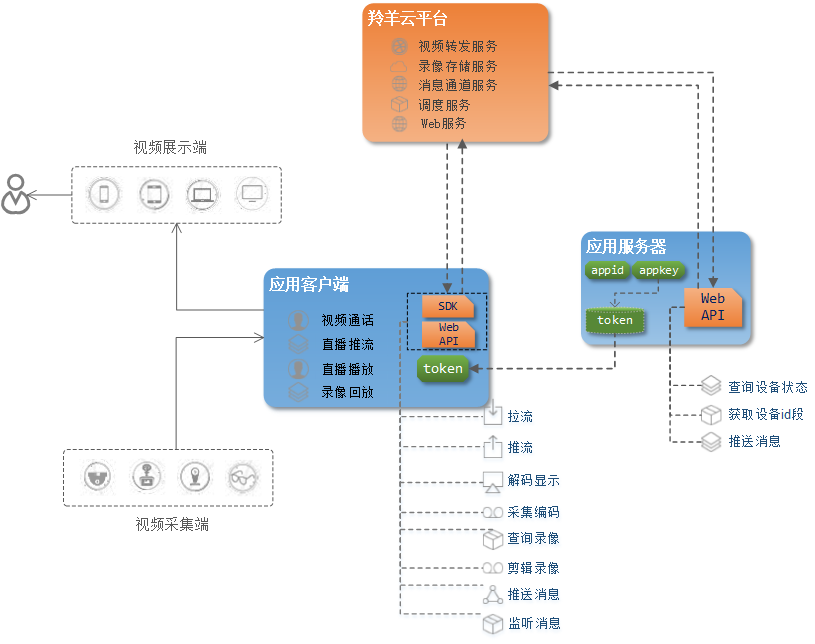
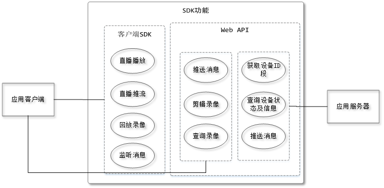
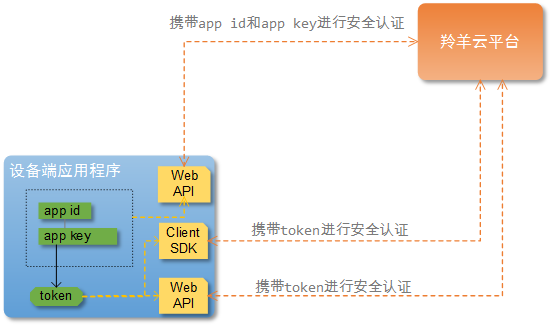
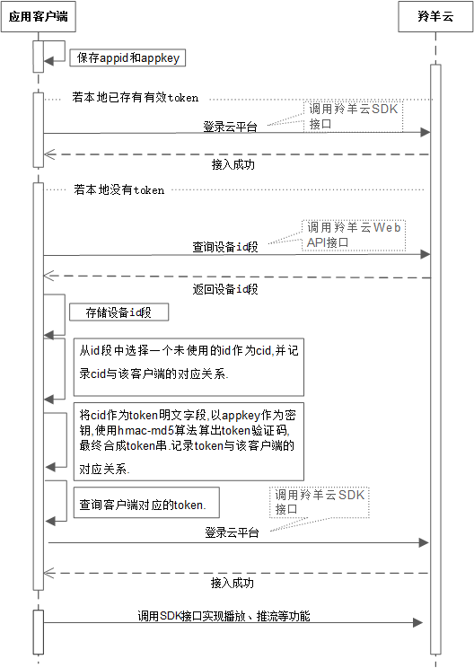

#羚羊云SDK接入指南

##1. 文档目的
为用户提供接入并使用羚羊云的总引导入口，介绍羚羊云的概况、服务架构、应用功能，以便用户能够快速理解羚羊云、顺利调用羚羊云接口、轻松实现所需的应用功能。建议新用户按照顺序阅读，这样有利于理解；老用户可按照内容导航选择性查阅所需了解的内容。

##2. 羚羊云是什么
羚羊云是服务于视频应用领域的云平台，它提供了云平台所需的基础设施，并且为客户提供一切和视频相关的应用和服务。

羚羊云SDK是羚羊云为用户提供的一套应用开发接口，通过这些接口，用户能够接入到羚羊云轻松实现一系列视频相关的应用。羚羊云SDK使得开发者们不必在视频相关的应用开发上耗费精力，只需调用SDK提供的接口，就能轻松实现他们想要的视频相关应用，这样开发者们就能专注在他们所需的其他业务功能。

##3. 相关术语和名词
- **羚羊云用户**：接入到羚羊云平台、调用羚羊云开发接口实现视频应用的客户群体，并非最终的个人终端用户。文档将以“用户”作为简称。
- **应用客户端**：用户开发的客户端应用程序，如手机app、PC桌面应用、嵌入在智能硬件设备中的应用程序、等等。
- **应用服务器**：用户开发的服务端应用程序，为客户端程序提供后台数据、后台业务处理等服务。
- **appid和appkey**：由羚羊云提供给用户的凭证，用户接入羚羊云平台时，平台会对id和key进行验证。
- **cid**：每个客户端第一次接入到羚羊云平台之前，会被分配一个羚羊id作为唯一的身份编号，羚羊云与客户端之间进行数据通信都只认这个id。
- **token**：应用客户端调用羚羊云SDK接口需要携带的凭证，羚羊云平台需要验证其安全性。
- **Web API**: 为开发者提供http接口，即开发者通过http形式发起数据请求，获取返回json或xml格式的数据。用户可以基于此开发JavaScript、C#、C++、Java、Objective-C等语言的应用。

##4. 羚羊云服务架构
 

##5. 羚羊云SDK的功能
从上面的整体架构中，可以看出羚羊云SDK可以分两大类:供应用服务器调用的Web API和供应用客户端调用的客户端SDK。以下是SDK的主要功能用例图：



注：以上图中仅仅列出了主要功能，更多具体的功能在各个SDK的开发文档中有详细介绍。

可以看出客户端SDK只为应用客户端提供功能，而Web API部分功能是提供给应用客户端，部分提供给应用服务器。以下功能列表简要描述了各个功能：

| ID | 功能名称 | 功能简要描述 |
|----|----|----|
| 1 | 获取设备ID段 | 向羚羊云获取用户所拥有的设备ID段，用户会在这个ID段内分配一个羚羊ID给用户的每个设备，这个羚羊ID也称CID. |
| 2 | 查询设备状态及信息 | 查询指定设备的状态，如：离线、就绪、转发中等，另外还可以查询设备的信息，如设备配置类型、公网ip、内网ip等。 |	
| 3 | 服务器推送消息 | 应用服务器推送消息给用户名下的多个设备。 |
| 4 | 客户端推送消息 | 客户端推送消息给用户名下的一个或多个设备，也可以向用户的http回调地址推送消息。 |
| 5 | 剪辑录像 | 该功能包含：创建剪辑任务、查询剪辑状态以及剪辑的视频信息、查询剪辑任务列表、以及删除指定的已剪辑数据。 |
| 6 | 查询录像 | 查询指定设备的录像时间轴，如哪些天哪些时段是有录像的。 |
| 7 | 直播播放 | 从羚羊云中拉取指定设备的音视频流，之后在本地进行解码播放。 |
| 8 | 直播推流 | 在本地采集音视频后编码，向羚羊云推送编码后的音视频流。 |
| 9 | 回放录像 | 拉取指定设备指定时间段的录像，在本地进行解码播放。 |
| 10 | 监听消息 | 持续接收任何远程应用客户端或服务器经过羚羊云推送过来的消息，并通知到本地上层应用。 |

##6. 如何接入羚羊云
###6.1 接入对象
所有需要使用羚羊云视频相关应用服务的用户，即羚羊云的接入对象。一般来讲，用户自己的应用通常包含客户端和服务器。

- 应用客户端<br>
无论是手机、平板电脑等这些视频展示端，还是家庭摄像机、行车记录仪等这类的视频采集端，对于羚羊云来说，这些设备都是客户端，并不区分类别。

- 应用服务器<br>
用来管理用户自己所属的设备信息、查询设备的状态、配置设备的参数等。

###6.2 接入凭证
这些设备想要接入羚羊云，首先必须获得app id和app key。获得方法：联系羚羊云负责对外接口的人员，申请app id和app key。给出联系方式

###6.3 认证机制
用户在接入到羚羊云平台时，无论是用户的服务器还是客户端，都必须通过平台的安全认证，才能使用接口以实现应用。服务器和客户端有着不同的认证机制，如下图所示：


- 应用服务器认证<br>
应用服务器直接携带app id和app key，通过调用羚羊云提供的Web API向羚羊云平台发送http请求，云平台会对id和key进行验证，验证通过将会返回该API对应的结果。

- 应用客户端认证<br>
(1)应用服务器根据拿到的app key，按照羚羊云的token生成算法规则，计算得出一个token；token的计算方法可参见《羚羊云平台token验证机制》。<br>
(2)应用客户端向他们的应用服务器获取token，凭着这个token，才能成功调用羚羊云客户端SDK或Web API实现功能。

###6.4 用户接入
- 应用服务器接入<br>
携带appid和appkey，调用羚羊云Web API向云平台发送http请求，返回调用结果，即完成接入。

- 应用客户端接入<br>
客户端的接入过程就相对复杂一些，需要应用服务器的参与，如下图所示：


###6.5 另外一种接入方法
上面的“认证机制”和“用户接入”是我们建议的方法，也是用户通常的认证方法。但有些用户实际的应用体系架构中，没有设计应用服务器(也可以说将应用服务器的业务处理都放在了应用客户端，如一些嵌入在视频采集端的智能硬件设备端应用程序)。
####6.5.1 认证机制
这种用户应用体系架构的认证机制如下图所示：

 

####6.5.2 接入流程
 

##7. 羚羊云token认证机制
###7.1 羚羊云的身份验证方式
羚羊云采用目前web领域普遍的认证方式：基于token的身份验证。

无论是调用羚羊云Web API或者客户端SDK的接口，需要将token作为参数传入，在羚羊云服务端进行身份验证。

###7.2 羚羊云token内容格式
>格式：{明文段}\_{验证码}

>样式：cid\_control\_expire\_\[vod\_time\]\_\[IP\]\_\[refer\]\_digest<br>

其中：<br>
**cid\_control\_expire\_\[vod\_time\]\_\[IP\]\_\[refer\]**为明文段，**[ ]**标记表示可选字段。<br>
**digest**为验证码

举例：<br>
**537067556_3222536192_1493481600**_**f0399b369aa760362ac4edd224bae23b**

###7.3 token明文段
token明文段包含以下字段：

|字段 | 含义|
|----|----|
|CID	| 设备ID，为访问云平台的设备ID，如摄像机或需要p2p通讯或直播的手机ID，在参与计算token时采用4字节整数方式；|
|Control	| 控制字段，表示此设备将使用的平台功能权限，在参与计算token时采用4字节整数方式；该字段各个字节和位所表达的意思请见下文的control字段介绍。|
|expire | 过期时间，指token的有效时间，为Unix时间戳（秒级精度，4字节）在参与计算token时采用4字节整数方式；|
|vod_time | 点播时间，指点播时对应的录制时间，同时也是点播文件的文件名部分，在参与计算token时采用4字节整数方式；|
|IP | 指设备的公网IP地址，在计算token时采用4字节整数方式；|
|refer | http请求时的refer地址中的域名部分，这个字段一般用来启用防盗链功能，在参与计算token时采用字符串方式；|

**注意：**<br>
除refer字段外，所有的字段都是主机字节序，无符号四字节整数类型；

###7.4 token明文段的control字段
>第一字节为int类型的低位，第四字节为int类型的高位

>第一字节（推送播放验证） |	第二字节（录制控制） | 第三字节（播放控制）| 第四字节（多码流保留）
>-- | -- 
>
第一字节（0-7位）：验证及推送控制字段<br>
0位：  是否开启rtmp直播<br>
1位：  是否开启hls直播<br>
2位：  是否验证推送IP<br>
3位：  是否验证refer<br>
4位：  UDP standby，是否可以接受UDP连接<br>
5-7位：保留
>
第二字节（0-7位）：录制控制<br>
0-3位: 存储时间权限, 0000=>没有存储权限, 0001=>存储7天, 0010=>存储30天,0011=>90天其他保留<br>
4位 : FLV 持久化开关，默认为 0 不打开<br>
5位 : HLS 持久化开关，默认为 0 不打开<br>
6-7位: 保留<br>
>
第三字节（0-7位）：播放控制<br>
0位：能否观看公众<br>
1位：能否观看私有<br>
2位：能否观看时移<br>
3位：能否观看录像<br>
4位：能否语音回传<br>
5位：能否视频回传<br>
6位：能否查看截图<br>
7位：能否收听声音<br>

###7.5 token验证码
由明文串配上羚羊云提供的密钥，通过HMAC-MD5标准算法，生成token的验证码部分。验证码为16个无符号的字节数组。<br>
- 明文串格式：各个字段按顺序无缝拼接而成，长度根据字段数目不同而不定。如：<br>
53706755632225361921493481600<br>
其中：<u>537067556</u>为**cid**字段，<u>3222536192</u>为**control**字段，<u>1493481600</u>为**expire**字段。
- 密钥：羚羊云提供给用户的appkey。
- 生成的验证码：16进制32个字符的字符串。
- 验证码生成的示例代码：<br>

```
    //C语言代码，并不完整，仅作为示例以供参考

    unsigned int cid = 537067556;
	unsigned int control = 3222536192;
	unsigned int expire = 1493481600;
	unsigned char src[12];
	char token[100];
	memcpy(src, &cid, 4);
	memcpy(src+4, &control, 4);
	memcpy(src+8, &expire, 4);
   char key[50] = "abcdefghijklmnopqrstuvwxyz123456";
	unsigned char digest[16];

	int ret = hmac_md5((unsigned char*)key,strlen(key),src,12,digest);
	if(ret != 0)
	{
		return -1;
	}

	snprintf(token, sizeof(token), “%u_%u_%u_%.2x%.2x%.2x%.2x%.2x%.2x%.2x%.2x%.2x%.2x%.2x%.2x%.2x%.2x%.2x%.2x, cid, control, expire, digest[0] , digest[1] , digest[2] , digest[3] , digest[4] , digest[5] , digest[6] , digest[7] , digest[8] , digest[9] , digest[10] , digest[11] , digest[12] , digest[13] , digest[14] , digest[15]”);

	return 0;
```


###7.6 羚羊云token类型
根据羚羊云接口功能的不同，token分为用户token和访问token。
- 用户token<br>
用于调用SDK接口执行进行推流、推送消息等动作。<br>
明文组成部分为CID + control + expire + \[IP]；<br>
\[IP]:可选项，如果control字段里面设置验证IP的标志位，则IP字段需要加入到用于token验证码计算的明文中。

- 访问token<br>
用于调用SDK接口执行播放媒体流。<br>
其明文组成部分为CID + control + expire + \[vod_time] + \[IP] + \[refer]；<br>
按照访问方式不同，[]中的可选项又分为以下几种情况：<br>
\[vod_time]:只有在看http点播时必须使用，其他情况不得添加；<br>
\[IP]:可选项，如果control字段里面设置验证IP的标志位，则IP字段需要加入到用于token验证码计算的明文中；<br>
\[refer]：可选项，并只有在http访问方式下使用，如果control里设置了验证refer标志位，则refer字段需要加入到用于token验证码计算的明文中。

##7. 如何使用羚羊云SDK
按照上面介绍的方法和步骤接入到羚羊云平台之后，就可以开始调用SDK接口实现视频应用的功能了。以下是每种SDK的调用方法。

给出以下传送链接：

[Web API](http://doc.topvdn.com/api/#!web_api_v2.md "Web API")

[C版SDK](http://doc.topvdn.com/api/#!c_guide.md "Web API")

[iOS版SDK](http://doc.topvdn.com/api/#!ios_guide.md "Web API")

[Anroid版SDK](http://doc.topvdn.com/api/#!android_guide.md "Web API")

[Windows版SDK](http://doc.topvdn.com/api/#!windows_guide.md "Web API")

##8. 常见问题

1. 什么是appid？怎么获取appid？<br>
答：appid是第三方友商和羚羊云建立合作关系后，由羚羊云分配的唯一标识第三方友商的4字节长度的字符串。第三方友商使用羚羊云SDK必须有appid才能正常使用。

2. 什么是cid？怎么获取？<br>
答：cid也叫hashid，是羚羊云这边唯一标识终端设备的16个字节长度的字符串，根据第三方友商提供设备的SN(必须唯一)由应用后台生成，第三方友商可使用羚羊云的应用后台，也可以使用自己的应用后台。

3. 羚羊云提供了设备端SDK吗？设备端SDK的功能包含哪些？<br>
答：设备端就是本文所说的应用客户端，我们在文中将它和移动手机端都归为客户端这一类。羚羊与提供了设备端SDK，就是C语言版的SDK，从文中的SDK功能用例图和功能列表中可以看到客户端的功能包含了推流和播放，对于设备端来讲，若没有显示屏，则没有播放功能。

4. 设备端的羚羊id是什么？如何获取？<br>
答：羚羊id就是文中所说的cid，获取方式也是文中提到的：先调用Web API获取羚羊云平台下该用户厂商所属的id段，然后由用户自己在这个id段内选择一个没有被分配的id作为这个设备的cid(也就是羚羊id)。

