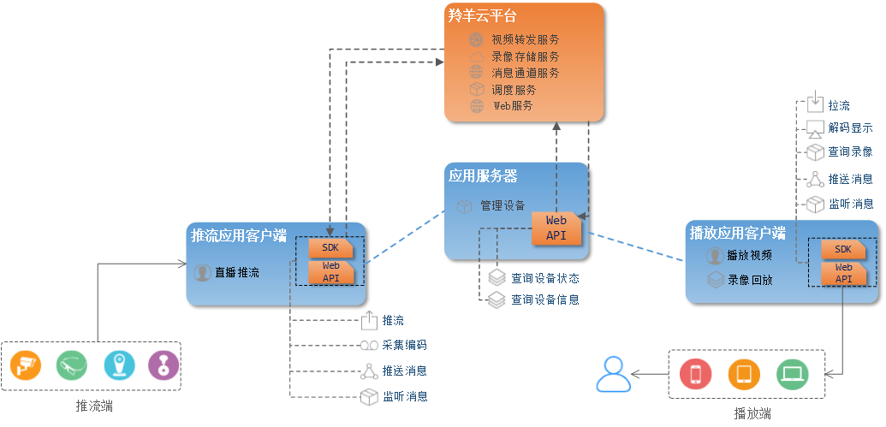

#羚羊云SDK接入指南

##1. 文档目的
为用户提供接入并使用羚羊云的总引导入口，介绍羚羊云的概况、服务架构、应用功能，以便用户能够快速理解羚羊云、顺利调用羚羊云接口、轻松实现所需的应用功能。建议新用户按照顺序阅读，这样有利于理解；老用户可按照内容导航选择性查阅所需了解的内容。

##2. 羚羊云是什么
羚羊云是服务于视频应用领域的云平台，它提供了云平台所需的基础设施，并且为客户提供一切和视频相关的应用和服务。

羚羊云SDK是羚羊云为用户提供的一套应用开发接口，通过这些接口，用户能够接入到羚羊云轻松实现一系列视频相关的应用。羚羊云SDK使得开发者们不必在视频相关的应用开发上耗费精力，只需调用SDK提供的接口，就能轻松实现他们想要的视频相关应用，这样开发者们就能专注在他们所需的其他业务功能。

##3. 相关术语和名词
- **羚羊云用户**：接入到羚羊云平台、调用羚羊云开发接口实现视频应用的客户群体，并非最终的个人终端用户。文档将以“用户”作为简称。
- **应用客户端**：用户开发的客户端应用程序，如手机app、PC桌面应用、嵌入在智能硬件设备中的应用程序等等。
- **应用服务器**：用户开发的服务端应用程序，为客户端程序提供后台数据、后台业务处理等服务。
- **设备**：接入到羚羊云的程序化设备，承载着用户开发的客户端应用程序，从视频流向的角度不同可分为推流设备和拉流设备。
- **appid和appkey**：由羚羊云提供给用户的凭证，用户接入羚羊云平台时，平台会对id和key进行验证。
- **cid**：每个客户端第一次接入到羚羊云平台之前，会由羚羊云分配一个id作为唯一的身份编号，羚羊云与客户端之间进行数据通信都只认这个id。
- **token**：应用客户端调用羚羊云SDK接口需要携带的凭证，羚羊云平台需要验证其安全性。
- **Web API**: 为开发者提供http接口，即开发者通过http形式发起数据请求，获取返回json或xml格式的数据。用户可以基于此开发JavaScript、C#、C++、Java、Objective-C等语言的应用。

##4. 羚羊云服务架构
 

##5. 羚羊云SDK的功能
从上面的整体架构中，可以看出羚羊云SDK可以分两大类:供应用服务器调用的Web API和供应用客户端调用的客户端SDK。以下是SDK的主要功能用例图：


注：以上图中仅仅列出了主要功能，更多具体的功能在各个SDK的开发文档中有详细介绍。

可以看出客户端SDK只为应用客户端提供功能，而Web API部分功能是提供给应用客户端，部分提供给应用服务器。以下功能列表简要描述了各个功能：

| ID | 功能名称 | 功能简要描述 |
|----|----|----|
| 1 | 获取设备id段 | 向羚羊云获取用户所拥有的设备id段，用户会在这个id段内分配一个羚羊id给用户的每个设备，这个羚羊id也称cid. |
| 2 | 查询设备状态及信息 | 查询指定设备的状态，如：离线、就绪、转发中等，另外还可以查询设备的信息，如设备配置类型、公网ip、内网ip等。 |	
| 3 | 服务器推送消息 | 应用服务器推送消息给用户名下的多个设备。 |
| 4 | 客户端推送消息 | 客户端推送消息给用户名下的一个或多个设备，也可以向用户的http回调地址推送消息。 |
| 5 | 剪辑录像 | 该功能包含：创建剪辑任务、查询剪辑状态以及剪辑的视频信息、查询剪辑任务列表、以及删除指定的已剪辑数据。 |
| 6 | 查询录像 | 查询指定设备的录像时间轴，例如哪些天哪些时段是有录像的。 |
| 7 | 直播播放 | 从羚羊云中拉取指定设备的音视频流，之后在本地进行解码播放。 |
| 8 | 直播推流 | 在本地采集音视频后编码，向羚羊云推送编码后的音视频流。 |
| 9 | 回放录像 | 拉取指定设备指定时间段的录像，在本地进行解码播放。 |
| 10 | 监听消息 | 持续接收任何远程应用客户端或服务器经过羚羊云推送过来的消息，并通知到本地上层应用。 |

##6. 羚羊云应用场景
羚羊云支持各种智能硬件设备的接入，包括智能手机、传统的监控摄像机、家庭摄像机、行车记录仪、智能眼镜等一切具备视频采集或展示的设备。利用羚羊云所提供的功能和服务，用户可应用于一切和视频应用相关的场景。例如：

- **视频直播**
为传统的监控摄像机、智能手机、智能眼镜、户外相机、无人机、户外机器人等提供高品质的视频传输、存储服务。

- **视频云存储**
为传统视频监控、手机视频直播、在线教育、在线医疗等行业提供视频流存储与回放服务。

- **视频通话**
为机器人、智能手机、电脑、智能硬件等设备等提供给高品质的视频传输服务和低延时的双向视频通话服务。

- **互联网视频分发**
羚羊视频云也能够为传统互联网视频分发应用提供低成本、高性能的视频传输服务。

##7. 如何接入羚羊云
###7.1 接入对象
所有需要使用羚羊云视频相关应用服务的用户，即羚羊云的接入对象。一般来讲，用户自己的应用通常包含客户端和服务器。

- 应用客户端
无论是手机、平板电脑等这些视频展示端，还是家庭摄像机、行车记录仪等这类的视频采集端，对于羚羊云来说，这些设备都是客户端，并不区分类别。

- 应用服务器
用来管理用户自己所属的设备信息、查询设备的状态、配置设备的参数等。

###7.2 接入凭证
这些设备想要接入羚羊云，首先必须获得app id和app key。进入[羚羊云用户管理平台](http://console.topvdn.com/)可申请app id和app key。

###7.3 认证机制
用户在接入到羚羊云平台时，无论是用户的服务器还是客户端，都必须通过平台的安全认证，才能使用接口以实现应用。服务器和客户端有着不同的认证机制，如下图所示：


- 应用服务器认证
应用服务器直接携带app id和app key，通过调用羚羊云提供的Web API向羚羊云平台发送http请求，云平台会对id和key进行验证，验证通过将会返回该API对应的结果。

- 应用客户端认证
(1)应用服务器根据拿到的app key，按照羚羊云的token生成算法规则，计算得出一个token；token的计算方法可参见本文下一章节的[羚羊云平台token验证机制](http://doc.topvdn.com/api/#!public-doc/token_format.md)。
(2)应用客户端向他们的应用服务器获取token，凭着这个token，才能成功调用羚羊云客户端SDK或Web API实现功能。

###7.4 用户接入
- 应用服务器接入
携带appid和appkey，调用羚羊云Web API向云平台发送http请求，返回调用结果，即完成接入。

- 应用客户端接入
客户端的接入过程就相对复杂一些，需要应用服务器的参与，如下图所示：


**注**：
上述接入流程中的`查询设备id段`需调用[Web-API的'查询设备id段'](http://doc.topvdn.com/api/#!web_api_v2.md#2.1.2_%E6%9F%A5%E8%AF%A2%E8%AE%BE%E5%A4%87_ID_%E6%AE%B5)接口；
`登录云平台`需要调用SDK的开启云服务接口。[iOS调用示例](http://doc.topvdn.com/api/public-doc/SDK-iOS/#!ios_guide.md#5.1_%E5%90%AF%E5%8A%A8%E4%BA%91%E6%9C%8D%E5%8A%A1) [Android调用示例](http://doc.topvdn.com/api/#!public-doc/SDK-Android/android_guide.md#5.1_%E5%90%AF%E5%8A%A8%E4%BA%91%E6%9C%8D%E5%8A%A1)

##8 羚羊云token认证机制
###8.1 羚羊云的身份验证方式
羚羊云采用目前web领域普遍的认证方式：基于token的身份验证。

无论是调用羚羊云Web API或者客户端SDK的接口，需要将token作为参数传入，在羚羊云服务端进行身份验证。

###8.2 羚羊云token内容格式
>格式：{明文段}\_{验证码}

>样式：cid\_control\_expire\_\[vod\_time\]\_\[ip\]\_\[refer\]\_digest

其中：
**cid\_control\_expire\_\[vod\_time\]\_\[ip\]\_\[refer\]**为明文段，**[ ]**标记表示可选字段。
**digest**为验证码

举例：
**537067556_3222536192_1493481600**_**f0399b369aa760362ac4edd224bae23b**

###8.3 token明文段
token明文段包含以下字段：

|字段| 数据类型 | 含义 |
|----|----|----|
|cid |4字节无符号整型| 详见[相关术语和名词](http://doc.topvdn.com/api/#!public-doc/integration.md#3._相关术语和名词)关于`cid`的名词解释。|
|control |4字节无符号整型| 控制字段，设备对视频流的推送、播放、云存储等功能的参数配置，各字节以及位的意义详见下文control字段介绍。|
|expire |4字节无符号整型| 过期时间，token的有效时间，为UTC时间戳（秒级精度，4字节）。|
|vod_time |4字节无符号整型| 点播时间，点播时对应的录制时间，同时也是点播文件的文件名部分。|
|ip |4字节无符号整型| 设备的公网ip地址。|
|refer |字符串| http请求时的refer地址中的域名部分，这个字段一般用来启用防盗链功能。|

**注意：**
除refer字段外，所有的字段都是主机字节序(Little-Endian小端存储)，无符号四字节整数类型；

###8.4 token明文段的control字段
第一字节为int类型的低位，第四字节为int类型的高位

| **第一字节**（推送播放验证） | **第二字节**（录制控制） | **第三字节**（播放控制）| **第四字节**（多码流保留）|

- **第一字节（0-7位）**：验证及推送控制字段
0位：  是否开启rtmp直播
1位：  是否开启hls直播
2位：  是否验证推送ip
3位：  是否验证refer
4位：  UDP standby，是否可以接受UDP连接
5-7位：保留

- **第二字节（0-7位）**：录制控制
0-3位: 存储时间权限, 0000=>没有存储权限, 0001=>存储7天, 0010=>存储30天,0011=>90天其他保留
4位 : FLV 持久化开关，默认为 0 不打开
5位 : HLS 持久化开关，默认为 0 不打开
6-7位: 保留

- **第三字节（0-7位）**：播放控制
0位：能否观看公众
1位：能否观看私有
2位：能否观看时移
3位：能否观看录像
4位：能否语音回传
5位：能否视频回传
6位：能否查看截图
7位：能否收听声音

###8.5 token验证码
由明文串配上羚羊云提供的密钥，通过HMAC-MD5标准算法，生成token的验证码部分。验证码为16个无符号的字节数组。

- 明文串格式：各个字段按顺序无缝拼接而成，长度根据字段数目不同而不定。例如：<u>537067556</u>3222536192<u>1493481600</u>
其中：<u>537067556</u>为**cid**字段，<u>3222536192</u>为**control**字段，<u>1493481600</u>为**expire**字段。
- 密钥：羚羊云提供给用户的appkey。
- 生成的验证码：16进制32个字符的字符串。
- 验证码生成的示例代码：

```
    //C语言代码，并不完整，仅作为示例以供参考

    unsigned int cid = 537067556;
	unsigned int control = 3222536192;
	unsigned int expire = 1493481600;
	unsigned char src[12];
	char token[100];
	memcpy(src, &cid, 4);
	memcpy(src+4, &control, 4);
	memcpy(src+8, &expire, 4);
    char key[50] = "abcdefghijklmnopqrstuvwxyz123456";
	unsigned char digest[16];

	int ret = hmac_md5((unsigned char*)key,strlen(key),src,12,digest);
	if(ret != 0)
	{
		return -1;
	}

	snprintf(token, sizeof(token), “%u_%u_%u_%.2x%.2x%.2x%.2x%.2x%.2x%.2x%.2x%.2x%.2x%.2x%.2x%.2x%.2x%.2x%.2x, cid, control, expire, digest[0] , digest[1] , digest[2] , digest[3] , digest[4] , digest[5] , digest[6] , digest[7] , digest[8] , digest[9] , digest[10] , digest[11] , digest[12] , digest[13] , digest[14] , digest[15]”);

	return 0;
```


###8.6 羚羊云token类型
根据设备(包括手机、摄像头等)所处于羚羊云端点的不同，token分为设备token和访问token。本方所携带的token称为设备token，对端设备的token称为访问token。

- **`设备token`**

明文组成部分为cid + control + expire + \[ip]；

\[ip]:可选项，如果control字段里面设置验证ip的标志位，则ip字段需要加入到用于token验证码计算的明文中。

- **`访问token`**

明文组成部分为cid + control + expire + \[vod_time] + \[ip] + \[refer]；

按照访问方式不同，[]中的可选项又分为以下几种情况：

\[vod_time]:只有在看http点播时必须使用，其他情况不得添加；

\[ip]:可选项，如果control字段里面设置验证ip的标志位，则IP字段需要加入到用于token验证码计算的明文中；

\[refer]：可选项，并只有在http访问方式下使用，如果control里设置了验证refer标志位，则refer字段需要加入到用于token验证码计算的明文中。

##9. 如何使用羚羊云SDK
按照上面介绍的方法和步骤接入到羚羊云平台之后，就可以开始调用SDK接口实现视频应用的功能了。以下是每种SDK的调用方法。

[Web API](http://doc.topvdn.com/api/public-doc/Web-API/#!web_api_v2.md "Web API")

[SDK使用说明-C版](http://doc.topvdn.com/api/#!public-doc/SDK-C/c_guide.md "C版SDK")
[SDK使用说明-iOS版](http://doc.topvdn.com/api/#!public-doc/SDK-iOS/ios_guide.md "iOS版SDK")
[SDK使用说明-Anroid版](http://doc.topvdn.com/api/#!public-doc/SDK-Android/android_guide.md "Anroid版SDK")
[SDK使用说明-Windows版](http://doc.topvdn.com/api/#!public-doc/SDK-Windows/windows_guide.md "Windows版SDK")

[API手册-C版](http://doc.topvdn.com/api/#!public-doc/SDK-C/c_api.md)
[API手册-iOS版](http://doc.topvdn.com/api/#!public-doc/SDK-iOS/ios_api.md)
[API手册-Android版](http://doc.topvdn.com/api/#!public-doc/SDK-Android/android_api.md)
[API手册-Windows版](http://doc.topvdn.com/api/#!public-doc/SDK-Windows/windows_api.md)

[Demo-C版](http://doc.topvdn.com/api/public-doc/SDK-C/zipdown/ly_sdk_c.zip)
[Demo-iOS版](http://doc.topvdn.com/api/public-doc/SDK-iOS/zipdown/ly_sdk_ios.zip)
[Demo-Android版](http://doc.topvdn.com/api/public-doc/SDK-Android/zipdown/ly_sdk_android.zip)
[Demo-Windows版](http://doc.topvdn.com/api/public-doc/SDK-Windows/zipdown/ly_sdk_windows.zip)

##10. 常见问题

1. 什么是`appid`？怎么获取`appid`？
答：`appid`是第三方友商和羚羊云建立合作关系后，由羚羊云分配的唯一标识第三方友商的4字节长度的字符串。第三方友商使用羚羊云SDK必须有appid才能正常使用。

2. 什么是`cid`？怎么获取？
答：`cid`是羚羊云这边唯一标识终端设备的4个字节长度的unsigned int，根据第三方友商提供设备的SN(必须唯一)由应用后台生成，第三方友商可使用羚羊云的应用后台，也可以使用自己的应用后台。

3. 羚羊云提供了`设备端SDK`吗？`设备端SDK`的功能包含哪些？
答：设备端就是本文所说的应用客户端，所谓的设备分为推流设备和播放设备。从文中的SDK功能用例图和功能列表中可以看到客户端的功能包含了推流和播放，设备可以具备推流或播放中的一种功能，也可同时具备两种功能。比如：设备没有显示屏，则没有播放功能；设备既有视频采集器又有显示屏，则同时具备推流和播放的功能。

4. `羚羊id`是什么？如何获取？
答：羚羊id就是文中所说的cid，获取方式也是文中提到的：先调用Web API获取羚羊云平台下该用户厂商所属的id段，然后由用户自己在这个id段内选择一个没有被分配的id作为这个设备的cid(也就是羚羊id)。

5. 用户应用客户端接入流程中，'记录`cid`与该客户端的对应关系'这句话，这个对应关系如何建立。是我们的用户体系跟`cid`绑定，还是`cid`跟客户端唯一标识绑定。
答：若应用客户端是给移动终端的用户所使用，则cid绑定的是该终端用户的唯一标识，如：手机号；若应用客户端是嵌入到视频采集设备的程序，则`cid`绑定的是该设备的唯一标识，如SN号。

6. `视频监控`和`视频通话`调用哪些接口？
答：视频监控调用SDK的`播放器`接口，视频通话调用SDK的`视频通话`接口。播放器接口调用示例：[iOS版](http://doc.topvdn.com/api/#!public-doc/SDK-iOS/ios_guide.md#5.4_%E6%92%AD%E6%94%BE%E5%99%A8)、[Android版](http://doc.topvdn.com/api/#!public-doc/SDK-Android/android_guide.md#5.4_%E6%92%AD%E6%94%BE%E5%99%A8)；视频通话接口调用示例：[iOS版](http://doc.topvdn.com/api/#!public-doc/SDK-iOS/ios_guide.md#5.6_%E8%A7%86%E9%A2%91%E9%80%9A%E8%AF%9D)、[Android版](http://doc.topvdn.com/api/#!public-doc/SDK-Android/android_guide.md#5.6_%E8%A7%86%E9%A2%91%E9%80%9A%E8%AF%9D)。

7. 每台设备都需要有一个羚羊云的id，需要在羚羊云注册，注册羚羊云需要调用什么接口，传入什么参数，以及回调是什么？.
答：由第三方友商应用服务器调用羚羊云[Web-API的获取设备id段接口](http://doc.topvdn.com/api/#!web_api_v2.md#2.1.2_%E6%9F%A5%E8%AF%A2%E8%AE%BE%E5%A4%87_ID_%E6%AE%B5)，获取到一个id段，然后从这个id段中各个id对应到不同的设备，应用后台服务器必须保证每台设备分配到唯一的id。

8. 视频通话需要调用什么接口，传什么参数？
答：实现视频通话功能需要调用羚羊云SDK视频通话的接口，不同开发语言版本的SDK接口不一样。可参见[iOS视频通话接口调用示例](http://doc.topvdn.com/api/#!public-doc/SDK-iOS/ios_guide.md#5.6_%E8%A7%86%E9%A2%91%E9%80%9A%E8%AF%9D)、[Android视频通话接口调用示例](http://doc.topvdn.com/api/#!public-doc/SDK-Android/android_guide.md#5.6_%E8%A7%86%E9%A2%91%E9%80%9A%E8%AF%9D)。

9. 如何实现`录像回放`的功能？录像存在羚羊云端的列表我们如何查看？找到视频列表后又如何按指定时间点播放录像？
答：通过[Web API的查询设备录像时间轴接口](http://doc.topvdn.com/api/#!web_api_v2.md#2.2.1_%E8%AE%BE%E5%A4%87%E5%BD%95%E5%83%8F%E6%97%B6%E9%97%B4%E8%BD%B4)，可以查询到某个视频设备存放在羚羊云端的录像时间列表，然后调用羚羊云客户端SDK的播放器接口([iOS播放器接口调用示例](http://doc.topvdn.com/api/#!public-doc/SDK-iOS/ios_guide.md#5.4_%E6%92%AD%E6%94%BE%E5%99%A8)、[Android播放器接口调用示例](http://doc.topvdn.com/api/#!public-doc/SDK-Android/android_guide.md#5.4_%E6%92%AD%E6%94%BE%E5%99%A8))，传入指定格式的url参数，这个url参数需要通过应用服务器去获取。
