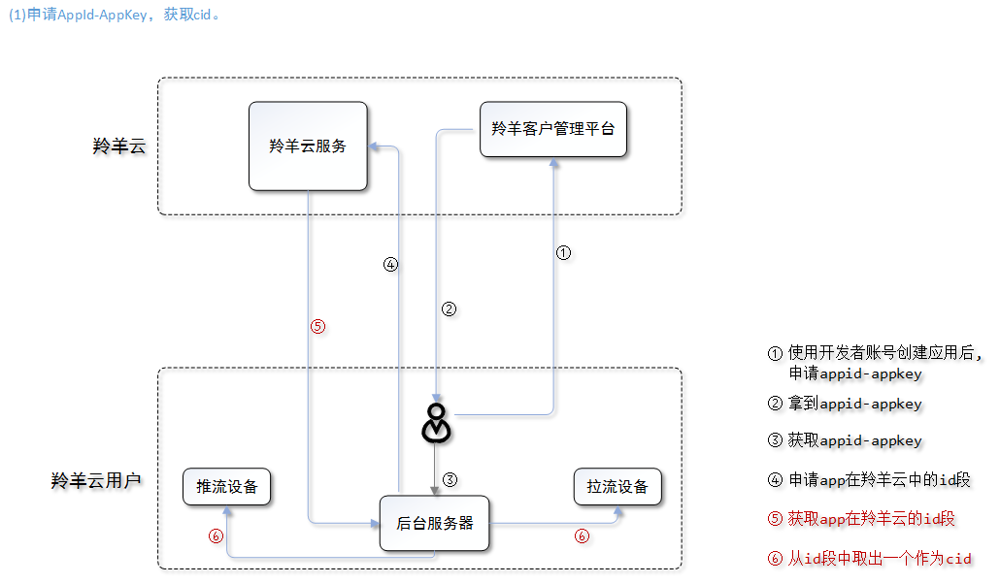
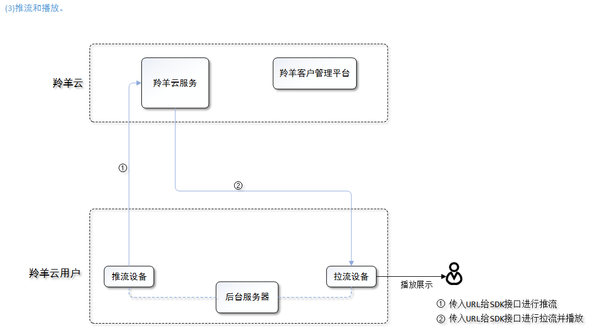

# 快速接入羚羊云

## 1.基础概念
- **羚羊云用户**
调用羚羊云开发接口接入到羚羊云，开发并实现视频应用的开发者，并非最终的个人终端用户。文档将以“用户”作为简称。

- **设备**
接入到羚羊云的程序化设备，承载着用户开发的客户端应用程序，从视频流向的角度不同可分为推流设备和拉流设备。

- **appid和appkey**
由羚羊云提供给用户的凭证，用户接入羚羊云平台时，平台会对id和key进行验证。

- **cid**
每个客户端第一次接入到羚羊云平台之前，会由羚羊云分配一个id作为唯一的身份编号，羚羊云与客户端之间进行数据通信都只认这个id。

- **token**
应用客户端调用羚羊云SDK接口需要携带的凭证，羚羊云平台需要验证其安全性。

- **Web API**
为开发者提供http接口，即开发者通过http形式发起数据请求，获取返回json或xml格式的数据。用户可以基于此开发JavaScript、C#、C++、Java、Objective-C等语言的应用。

##2. 接入对象
所有需要使用羚羊云视频相关应用服务的用户，即羚羊云的接入对象。一般来讲，用户自己的应用通常包含客户端和服务器。

- `应用客户端`
无论是手机、平板电脑等这些视频展示端，还是家庭摄像机、行车记录仪等这类的视频采集端，对于羚羊云来说，这些设备都是客户端，并不区分类别。

- `应用服务器`
用来管理羚羊云用户自己所属的设备信息、查询设备的状态、配置设备的参数等。也称`后台服务器`。

##3. 认证机制
用户在接入到羚羊云平台时，无论是用户的服务器还是客户端，都必须通过平台的安全认证，才能使用接口以实现应用。服务器和客户端有着不同的认证机制，如下图所示：

- 应用服务器认证
应用服务器直接携带app id和app key，通过调用羚羊云提供的Web API向羚羊云平台发送http请求，云平台会对id和key进行验证，验证通过将会返回该API对应的结果。

- 应用客户端认证
(1)应用服务器根据拿到的app key，按照羚羊云的token生成算法规则，计算得出一个token；token的计算方法可参见本文下一章节的[羚羊云平台token验证机制](http://doc.topvdn.com/api/#!public-doc/token_format.md)。
(2)应用客户端向他们的应用服务器获取token，凭着这个token，才能成功调用羚羊云客户端SDK或Web API实现功能。

##4. 接入流程概览

##5. 详细接入步骤
- 应用服务器接入
携带appid和appkey，调用羚羊云Web API向云平台发送http请求，返回调用结果，即完成接入。

- 应用客户端接入
客户端的接入过程就相对复杂一些，除了调用羚羊云客户端SDK外，还需要应用服务器的参与，如下图所示：

**注**：
上述接入流程中的`查询设备id段`需调用[Web-API的'查询设备id段'](http://doc.topvdn.com/api/#!web_api_v2.md#2.1.2_%E6%9F%A5%E8%AF%A2%E8%AE%BE%E5%A4%87_ID_%E6%AE%B5)接口；
`登录云平台`需要调用SDK的开启云服务接口。[iOS调用示例](http://doc.topvdn.com/api/public-doc/SDK-iOS/#!ios_guide.md#5.1_%E5%90%AF%E5%8A%A8%E4%BA%91%E6%9C%8D%E5%8A%A1) [Android调用示例](http://doc.topvdn.com/api/#!public-doc/SDK-Android/android_guide.md#5.1_%E5%90%AF%E5%8A%A8%E4%BA%91%E6%9C%8D%E5%8A%A1)
`生成token的方法`[羚羊云token认证机制](http://doc.topvdn.com/api/index.html#!public-doc/token_format.md)
`生成推拉流的URL`参考[羚羊云推拉流URL格式解析](http://doc.topvdn.com/api/index.html#!public-doc/url_format.md)

##6. 常见问题

1. 什么是`appid`？怎么获取`appid`？
答：`appid`是第三方友商和羚羊云建立合作关系后，由羚羊云分配的唯一标识第三方友商的4字节长度的字符串。第三方友商使用羚羊云SDK必须有appid才能正常使用。

2. 什么是`cid`？怎么获取？
答：`cid`是羚羊云这边唯一标识终端设备的4个字节长度的unsigned int，根据第三方友商提供设备的SN(必须唯一)由应用后台生成，第三方友商可使用羚羊云的应用后台，也可以使用自己的应用后台。

3. 羚羊云提供了`设备端SDK`吗？`设备端SDK`的功能包含哪些？
答：设备端就是本文所说的应用客户端，所谓的设备分为推流设备和播放设备。从文中的SDK功能用例图和功能列表中可以看到客户端的功能包含了推流和播放，设备可以具备推流或播放中的一种功能，也可同时具备两种功能。比如：设备没有显示屏，则没有播放功能；设备既有视频采集器又有显示屏，则同时具备推流和播放的功能。

4. `羚羊id`是什么？如何获取？
答：羚羊id就是文中所说的cid，获取方式也是文中提到的：先调用Web API获取羚羊云平台下该用户厂商所属的id段，然后由用户自己在这个id段内选择一个没有被分配的id作为这个设备的cid(也就是羚羊id)。

5. 用户应用客户端接入流程中，'记录`cid`与该客户端的对应关系'这句话，这个对应关系如何建立。是我们的用户体系跟`cid`绑定，还是`cid`跟客户端唯一标识绑定。
答：若应用客户端是给移动终端的用户所使用，则cid绑定的是该终端用户的唯一标识，如：手机号；若应用客户端是嵌入到视频采集设备的程序，则`cid`绑定的是该设备的唯一标识，如SN号。

6. 每台设备都需要有一个羚羊云的id，需要在羚羊云注册，注册羚羊云需要调用什么接口，传入什么参数，以及回调是什么？.
答：由第三方友商应用服务器调用羚羊云[Web-API的获取设备id段接口](http://doc.topvdn.com/api/#!web_api_v2.md#2.1.2_%E6%9F%A5%E8%AF%A2%E8%AE%BE%E5%A4%87_ID_%E6%AE%B5)，获取到一个id段，然后从这个id段中各个id对应到不同的设备，应用后台服务器必须保证每台设备分配到唯一的id。

## 相关链接
[Web API使用指南](http://doc.topvdn.com/api/public-doc/Web-API/#!web_api_v2.md "Web API")
[羚羊云token认证机制](http://doc.topvdn.com/api/index.html#!public-doc/token_format.md)
[羚羊云推拉流URL格式解析](http://doc.topvdn.com/api/index.html#!public-doc/url_format.md)

